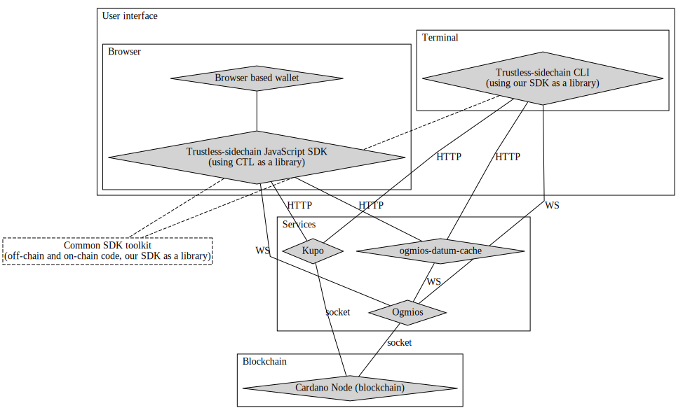
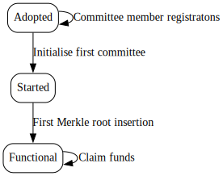
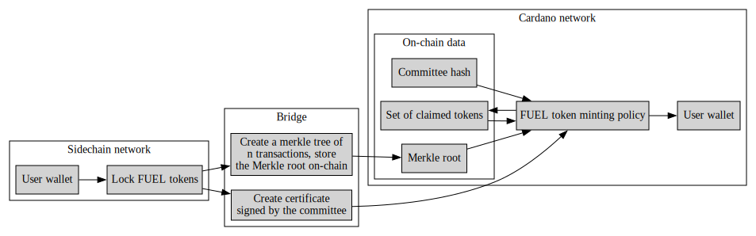
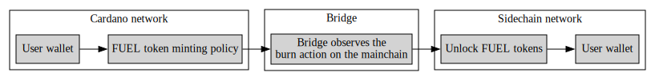
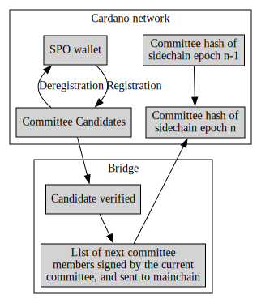

# Architecture of the Main Chain component

This document attempts to explain architecture of the components involved in the Main Chain component of
trustless sidechain.

## Nomenclature

_Plutus scripts_:
These scripts are the main part of the system, also called on-chain code, their role is to validate
some action on-chain. It can be either a **validator** or **minting policy**.

_Validator script_:
A validator has it's own validator address, and can be thought of as a programmed actor on-chain:
the script will decide if the values from the validator address can be spent or not.

_Minting policy_:
On the Cardano chain there exist so called native tokens. The rules for this token are programmed
in a minting policy, this script will decide who can mint or burn the given token.

_UTxO_ (Unspent transaction output):
Cardano uses extended UTxO model, a lot of information can be found on the Internet about the concept.
As a short and handwavy explanation, UTxO can be thought of as the container of value on the chain,
it can hold Ada (or test Ada), native tokens and datums (described below).

_Datum_:
A datum is an arbitrary data attached to UTxO. UTxOs at validator addresses must include a datum,
otherwise they are unspendable, for public key addresses datums are non-mandatory.

_Redeemer_:
Redeemers are similarly to a datum are arbitrary data, but they play a slightly different role:
when spending from a validator, or minting using a minting policy a redeemer must be applied to
the script.

_Transaction_:
Commonly abbreviated as `tx`, the main role of a transaction is to spend UTxOs from
certain address(es) and "send" them to somewhere else. Transactions can also mint tokens, if the
minting policy rules allow it. A transaction also has to declare its fees beforehand, and also
send back all unconsumed values to the sender's wallet (UTxO's cannot be split in half, so the change
will be a separate UTxO in the transaction outputs)

_off-chain code_:
While on-chain code is responsible for gatekeeping on-chain, ensuring that only permitted transactions
go through, off-chain code is the builder toolkit to construct these transactions. As briefly mentioned
above, fees, changes etc. must be calculated and balanced in these transactions before submitting
on chain. In summary, the off-chain code will:

- build the transaction (add inputs and outputs, add Plutus scripts or reference them)
- calculate fees, balance, and add required inputs
- sign the transaction, or delegate signing to a wallet
- submit the transaction

_cardano-transaction-lib (CTL)_:
CTL is our library of choice to handle the complex task of building
transactions. With the help of this library, we can write some simple declarative code to build, sign
and submit transactions. CTL is written in PureScript (a language that can compile to JavaScript)
and is capable of running in the browser.

_ogmios_:
Ogmios serves as a query layer directly communication with the cardano-node.

_ogmios-datum-cache_:
A cache layer, to make datum queries quicker (will be deprecated in later CTL versions)

_ctl-server (deprecated)_:
A helper service for some tasks that could not be implemented in CTL

_kupo_:
A chain-index tool, used to query data from the chain efficiently.

_CTL runtime_:
We call Ogmios, ogmios-datum-cache, ctl-server and Kupo together as CTL runtime, these are required
to run any contracts using CTL. More can be found at the [CTL official documentation](https://github.com/Plutonomicon/cardano-transaction-lib/blob/develop/doc/runtime.md).

## Architecture

Our current infrastructure (as of 2023-01-06) includes the following components:

- CLI tool to interact with our off-chain code (written in PureScript)
- common SDK, consisting of:
  - on-chain code (written in Haskell, using PlutusTx)
  - off-chain code (written in PureScript, using CTL)
- CTL runtime services

Please note that the diagram below debicts a future architecture, it includes the browser SDK which
is not implemented yet, and Kupo which is not a dependency of our currently used cardano-transaction-lib version.

<figcaption align = "center"><i>CLI tool and browser SDK architecture</i></figcaption> 

## High level conceptual map of our Plutus contracts

This section of the document will only serve as a high level guideline to understand the overall
interactions of components. For a more detailed explanation please refer to the [specification](../Specification.md).

### Sidechain lifecycle

The mainchain contracts of the system goes through the following lifecycle stages:
- _Adopted_: comittee member registration is open
- _Activated_: first committee is set, and the protocol has started
- _Functional_: first Merkle root is inserted, and end-users can claim their tokens

<figcaption align = "center"><i>Sidechain lifecycle</i></figcaption> 

1. _Adopted_

    The initial state of the chain, after a stakeholder of the chain adopts a codebase and initialises
    some contracts of the chain:
    - initalising the distributed set for double spending prevention
    - candidate permission tokens are minted (if required)
    - mint NFTs for the checkpoint and committee hash validators

    The above mentioned NFTs are stored in the wallet of the stakeholder, who ran the initialisation script, so it will
    be his responsibility to _Activate_ the sidechain in the next step.

    After this step committee candidate registration is open, and all validator addresses and currency policies of the
    protocol can be queried.

2. _Activated_

    When enough committee candidate registrations have accumulated to start the protocol, the sidechain
    has to be activated, using the aformentioned NFTs. Activation includes the following actions:
    - initialising the first committee (storing the first committee hash)
    - storing the initial checkpoint

    After this step, the sidechain is decentralised, any further action requires the consensus of the committee.
    Merkle root insertion and committee handover is open.

3. _Functional_

    Once the first Merkle root is inserted, end-users can claim their tokens with a sidechain certificate,
    and also burn these tokens to bridge them back to the sidechain.

### Claiming FUEL tokens (sidechain to mainchain)

The graph below explains the flow of data:

1. Locking FUEL tokens on the sidechain
2. Bridge collects all locked tokens, and generates a Merkle tree with them.
3. The root of the Merkle tree is stored on the Cardano network
4. A certificate is also generated
5. The certificate together with the Merkle root can be used to mint FUEL tokens on the mainchain
6. The idetifier of the transaction is stored in a distributed set, to avoid reusing of the same certificate

<figcaption align = "center"><i>FUEL claim flow</i></figcaption> 

### Returning FUEL tokens (mainchain to sidechain)

Compared to the claim action, returning tokens is much simpler from the perspective of mainchain contracts:

1. Burn FUEL token (only token owner can burn)
2. Bridge observes the burn action
3. Tokens unlocked

<figcaption align = "center"><i>FUEL return flow</i></figcaption> 

### Committee initialisation/handover

Committee is comprised of Cardano Stake Pool Operators (SPO), who register as candidates block producers.
In case of initialisation, the first committee can be defined by the person who is starting the
protocol. After that, after each sidechain epoch, committee members have to be elected by the committee
(the mechanism is encapsulated in the Bridge module, so we don't describe it here).

The flow of committee handover is the following:

1. SPOs send their registration to the CommitteeCandidateValidator
2. Registrations are verified on the Bridge
3. Next committee members elected, signed by the current committe, and sent to the Cardano network
4. Committee list hashed and stored on-chain

<figcaption align = "center"><i>Committee handover</i></figcaption> 
