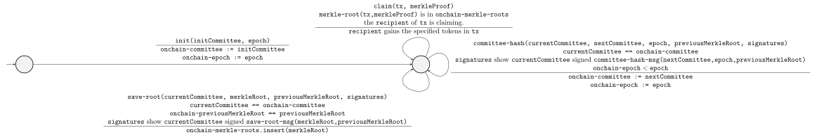

# 1 Discussion on the internal testing tool `trustless-sidechain-gen-signatures`
This document outlines using the CLI interface of the CTL project with the internal tool, `trustless-sidechain-gen-signatures`, to assist in generating CLI commands / signatures.

We will discuss:
- [Starting the runtime dependencies](#2-starting-the-runtime-dependencies)
- [High level overview of the workflow](#3-High-level-overview-of-the-workflow)
- [More environment setup](#4-More-environment-setup)
- [Initialising the sidechain](#5-Initialising-the-sidechain)
- [Saving a merkle root](#6-Saving-a-merkle-root)
- [Claiming FUEL tokens](#7-Claiming-FUEL-tokens)
- [Updating the committee hash](#8-Updating-the-committee-hash)
- [Registering a committee candidate](#9-Registering-a-committee-candidate)

# 2 Starting the runtime dependencies
In order to run the system, we require the following runtime dependencies.

- `cardano-node`
- `ogmios` which provides a WebSocket interface to interact with the `cardano-node`
- `ogmios-datum-cache` is used to query datums and confirm transactions[^1]
- `postgres` is the database backing `ogmios-datum-cache`
- `ctl-server` is used to apply arguments to Plutus scripts

[^1]: The CTL documentation doesn't specify this, but a laborious inspection of the code will reveal this fact. In particular, this was the root cause of the CTL project "hanging forever" waiting for transactions to be confirmed -- see issue [#234](https://github.com/mlabs-haskell/trustless-sidechain/issues/234).

We have provided a convenient way to launch the runtime dependencies in `docker` images for you.
In a separate terminal window in the project's root directory, execute the following command to launch the runtime dependences in `docker` images for the preview test net.
```
$ nix run .#ctl-runtime-preview
```

This will run
- `cardano-node` on the preview test net
- `ogmios` on port 1337
- `ctl-server` on port 8081
- `ogmios-datum-cache` on port 9999

An interested reader can find details in the [CTL project documentation](https://github.com/Plutonomicon/cardano-transaction-lib/blob/87233da45b7c433c243c539cb4d05258e551e9a1/doc/runtime.md).

# 3 High level overview of the workflow
We give a high level overview of the workflow. Consider the following state machine[^2].

[^2]: We ignore some technicalities for ensuring "uniqueness" of the sidechain.



The notation needs some explanation[^3]. The arrows indicate the transition from one state to another.
The event and preconditions causing the transition is shown above the horizontal line labeling the transition, and actions taken and side effects executed when the event occurs are shown below the line.
We assume that there are 4 global variables stored onchain called `onchain-committee` a representation of the committee, `onchain-previous-merkle-root` a representation of the previous merkle root (if it exists), `onchain-epoch` an integer, and `onchain-merkleroots` a collection storing merkle roots supporting an insertion and membership test operation.
Moreover, we assume that there are some public functions `committee-hash-msg` and `save-root-msg` which are used to help generate signatures.

[^3]: This notation is loosely based off of pp.218 of _Computer Networking: A Top-Down Approach (5th Edition)_ by James F. Kurose and Keith W. Ross.

We discuss the state transitions.

- `register` (not included in the state machine) allows one to register as a committee candidate.

- `init` initialises the sidechain. In particular this determines the `initial committee` stored onchain which has authority over what merkle roots get saved in the `save-root` command along with who the succeeding committee will be in the `committee-hash` command. Moreover, this initialises internal data structures used for the `claim` endpoint that will not be further discussed.

- `committee-hash` allows the `current committee` to sign off a `new committee` to replace them.

- `save-root` allows the `current committee` to sign a merkle root of transactions from the sidechain which may be claimed with the `claim` command.

- `claim` allows an individual who is the recipient of a transaction included in a merkle root from `save-root` to claim their tokens.

In the following sections, we will demonstrate how one may go through this workflow on the preview testnet.

# 4 More environment setup
We will assume that we have our own secret and public key on the preview testnet. We will also assume that we are in a `nix develop` shell in the project root i.e., we executed
```
nix develop
```
in the project root.

We will set the environment variable `PUBLIC_KEY` to our public key e.g., I have
```
PUBLIC_KEY="addr_test1vq9m0ma46xzspaq2jwdefuurt2zm2ct9yj495t22578p6xc7kgt8y"
```
Moreover, we will also assume that we have set the environment variable `SIGNING_KEY` to the absolute path of our secret key e.g., I have the following.
```
SIGNING_KEY=/home/jared/Documents/Work/cnode/address/test.skey
```

Also, we will need to interact with the `cardano-node` in the `docker` image which was launched in [#2](#2-Starting the-runtime-dependencies). So, to identify the `docker` image, run
```
$ docker ps
CONTAINER ID   IMAGE                                                 COMMAND                  CREATED      STATUS          PORTS                                       NAMES
4a49b57b2197   ogmios-datum-cache:4gfxgg73784vkiqs02w9vgm2iv8xmbxh   "/nix/store/p7bpdnxq…"   4 days ago   Up 19 minutes   0.0.0.0:9999->9999/tcp, :::9999->9999/tcp   store_ogmios-datum-cache_1
f6cdfabd6b4e   ogmios:h2rh7q74qffjcs8i6n4bpc7v3pr8fmjy               "/nix/store/p7bpdnxq…"   4 days ago   Up 19 minutes   0.0.0.0:1337->1337/tcp, :::1337->1337/tcp   store_ogmios_1
1c4b35d68669   inputoutput/cardano-node:1.35.4                       "entrypoint run --co…"   4 days ago   Up 19 minutes   0.0.0.0:3001->3001/tcp, :::3001->3001/tcp   store_cardano-node_1
b9e50dde2aab   postgres:13                                           "docker-entrypoint.s…"   4 days ago   Up 19 minutes   0.0.0.0:5432->5432/tcp, :::5432->5432/tcp   store_postgres-preview_1
b430e7900e12   ctl-server:iskx1y6l3nfab5bv6sdhl13csc756rax           "/nix/store/p7bpdnxq…"   4 days ago   Up 19 minutes   0.0.0.0:8081->8081/tcp, :::8081->8081/tcp   store_ctl-server_1
```
and make note of the docker image `store_cardano_node_1`.

# 5 Initialising the sidechain
We describe initialisation of the sidechain. As an overview, we will
- Generate an initial committee
- Find a UTxO a distinguished UTxO to spend (which is used to ensure that this sidechain is unique)
- Initialising the sidechain

1. Generating the initial committee using the `trustless-sidechain-gen-signatures`. In the root of the project directory, run
```
$ cabal run -v0 trustless-sidechain-gen-signatures -- fresh-sidechain-committee --size 10 > COMMITTEE1
```
which will create a JSON file of a fresh committee called `COMMITTEE1`. This may take some time if this is the first time running `trustless-sidechain-gen-signatures` as it may need to compile the project.

2. Finding a distinguished UTxO to spend. We can query the `cardano-node` for UTxOs we may spend with the following command

```
$ docker exec \
    -e CARDANO_NODE_SOCKET_PATH="/ipc/node.socket" store_cardano-node_1 \
    cardano-cli query utxo --testnet-magic 2 --address "$PUBLIC_KEY"
                           TxHash                                 TxIx        Amount
--------------------------------------------------------------------------------------
211a00e3ac8bebb1545f4d6855c5bbe281357ad8e580d72b1385080bc21445be     0        9908260657 lovelace + TxOutDatumNone
443346868f174378916e5426f8a14aeef31a64c2c8818f644cd65c7fe01242af     3        1344720 lovelace + 420 50fdad256d2fdaf0089915e81fbe0ff4fc4633eee3af8dc9a8111035.4655454c + TxOutDatumNone
5ecd30509c5e06bdf7efdef8f8da7b25b55becc6ca5dfde20ad9a577f50b1756     3        1344720 lovelace + 420 c5ae7e4af4502074687c642f9a6dd97e0ec328ec862d4b40cd87eeac.4655454c + TxOutDatumNone
b39b82f56be9f55af4d3b501ac084c2d2c5be3af8665f7a5bba53c63b0740021     3        1344720 lovelace + 69 c5ae7e4af4502074687c642f9a6dd97e0ec328ec862d4b40cd87eeac.4655454c + TxOutDatumNone
f06b5829a9e02f341e3267fe10bc97a5b9df095713102e4276f957c863213dd1     3        1344720 lovelace + 69 c5ae7e4af4502074687c642f9a6dd97e0ec328ec862d4b40cd87eeac.4655454c + TxOutDatumNone
```

I can choose any of these UTxOs to spend. In particular, I will choose the first one.

Then, for convenience, set the environment variable `GENESIS_UTXO` to the UTxO you choose to spend. For example, I will do
```
GENESIS_UTXO="211a00e3ac8bebb1545f4d6855c5bbe281357ad8e580d72b1385080bc21445be#0"
```
where we note that we use the notation `TxHash#TxIx`.

3. Initialising the sidechain. We will use `trustless-sidechain-gen-signatures` to help us generate the CLI command in order to initialise the committee.

Execute the following command
```
$ cabal run -v0 trustless-sidechain-gen-signatures -- init \
  `# Sidechain parameters` \
  --payment-signing-key-file "$SIGNING_KEY" \
  --genesis-committee-hash-utxo "$GENESIS_UTXO" \
  --sidechain-id 69 \
  --threshold 2/3 \
  --sidechain-genesis-hash 112233 \
  `# Init sidechain parameters` \
  --committee "./COMMITTEE1" \
  --sidechain-epoch 0
Please call ctl-main with the following arguments:
nix run .#ctl-main -- init \
--payment-signing-key-file /home/jared/Documents/Work/cnode/address/test.skey \
--genesis-committee-hash-utxo 211a00e3ac8bebb1545f4d6855c5bbe281357ad8e580d72b1385080bc21445be#0 \
--sidechain-id 69 \
--sidechain-genesis-hash 112233 \
--threshold 2/3 \
--committee-pub-key 0281158622b7d2eb738b885e1cca50218fb36ab4dc39014b83286b8ed95c78789d \
--committee-pub-key 036d5d80b82ec9b12f2d0c6c911b77d83591cc1e1ef94837500b65271ad60a44a2 \
--committee-pub-key 02cc398e06e48b99fce527c316ce3fe58499af66aea228719cd32b76da17d56c31 \
--committee-pub-key 03a3f6e9d74ad35680fe08f6ef9960146184288832cb0e7afb4b977bd4287fb90c \
--committee-pub-key 02f15ff9ac5e635c3a5d8135adc5292bac12868e4891a619f108f39e6815cc178a \
--committee-pub-key 0383a005ce1c831689f4d452bdb8c03c973384b4eed3ab443685962e1d6851f674 \
--committee-pub-key 020e59265bd92c3b144b5ebb9665b1d03ef35295d49d5699b16b7fe72eb2201d96 \
--committee-pub-key 03d910ff59e6d2369237d1e6cf42104629cb4d937217527725a639b8737acc72b5 \
--committee-pub-key 03c0c88203266adad23ba31b41283bd56121468421b1c8160f3eead01b9b087da2 \
--committee-pub-key 020c79d665e45ae0c9c7e7c192d47b7953679bc5a95f52e2052fb59d23e60005f6 \
--sidechain-epoch 0
```

It will tell us the command to execute with `ctl-main` to submit the transaction. Let's do what it says and execute that.
```
$ nix run .#ctl-main -- init \
--payment-signing-key-file /home/jared/Documents/Work/cnode/address/test.skey \
--genesis-committee-hash-utxo 211a00e3ac8bebb1545f4d6855c5bbe281357ad8e580d72b1385080bc21445be#0 \
--sidechain-id 69 \
--sidechain-genesis-hash 112233 \
--threshold 2/3 \
--committee-pub-key 0281158622b7d2eb738b885e1cca50218fb36ab4dc39014b83286b8ed95c78789d \
--committee-pub-key 036d5d80b82ec9b12f2d0c6c911b77d83591cc1e1ef94837500b65271ad60a44a2 \
--committee-pub-key 02cc398e06e48b99fce527c316ce3fe58499af66aea228719cd32b76da17d56c31 \
--committee-pub-key 03a3f6e9d74ad35680fe08f6ef9960146184288832cb0e7afb4b977bd4287fb90c \
--committee-pub-key 02f15ff9ac5e635c3a5d8135adc5292bac12868e4891a619f108f39e6815cc178a \
--committee-pub-key 0383a005ce1c831689f4d452bdb8c03c973384b4eed3ab443685962e1d6851f674 \
--committee-pub-key 020e59265bd92c3b144b5ebb9665b1d03ef35295d49d5699b16b7fe72eb2201d96 \
--committee-pub-key 03d910ff59e6d2369237d1e6cf42104629cb4d937217527725a639b8737acc72b5 \
--committee-pub-key 03c0c88203266adad23ba31b41283bd56121468421b1c8160f3eead01b9b087da2 \
--committee-pub-key 020c79d665e45ae0c9c7e7c192d47b7953679bc5a95f52e2052fb59d23e60005f6 \
--sidechain-epoch 0
[INFO] 2022-12-06T01:38:01.766Z InitSidechain.initSidechain: Submitted initialise sidechain tokens Tx: (TransactionHash (hexToByteArrayUnsafe "29de898e78ad97e64e9e6d04332bee424e3d910ab10303fd8c3008c2346c798b"))
[INFO] 2022-12-06T01:38:50.220Z InitSidechain.initSidechain: Initialise sidechain tokens transaction submitted successfully.
{"endpoint":"Init","transactionId":"29de898e78ad97e64e9e6d04332bee424e3d910ab10303fd8c3008c2346c798b","sidechainParams":{"chainId":69,"genesisHash":"112233","genesisMint":null,"genesisUtxo":"211a00e3ac8bebb1545f4d6855c5bbe281357ad8e580d72b1385080bc21445be#0","thresholdDenominator":3,"thresholdNumerator":2},"addresses":{"CommitteCandidateValidator":"addr_test1wrrj2c8hy023zgz92hsufk6ea3jdycu3g0lxp7j83947wcc3spekz"},"mintingPolicies":{"FuelMintingPolicyId":"e1869d5ce721db9e6b9ae21678ea15bc2630640728f345a46832c9da","MPTRootTokenMintingPolicyId":"eea539a42de0f2916e6f0df8fbf8542a2f2e61ce9f42031609177c10"}}
```
Hopefully, it will succeed -- meaning that we have initialised the sidechain. Note that it also outputs various addresses / minting policies related to the sidechain in JSON format. We can ignore this for now.

# 6 Saving a merkle root
We will demonstrate how to save a merkle root with the sidechain we have just initialised. As an overview, we will
- Create a merkle tree / merkle root of some transactions
- Save the merkle root.

1. Create a merkle tree / merkle root of some transactions. We will use `trustless-sidechain-gen-signatures` for this. Run the following commands to create a merkle tree.
```
$ cabal run -v0 trustless-sidechain-gen-signatures -- merkle-tree \
    --merkle-tree-entry="{\"index\":1 , \"amount\": 69,  \"recipient\":\"$PUBLIC_KEY\", \"previousMerkleRoot\": null }" \
    --merkle-tree-entry="{\"index\":2 , \"amount\": 420, \"recipient\":\"$PUBLIC_KEY\", \"previousMerkleRoot\": null }"
$ MERKLE_TREE_1_1=$(!!)
$ MERKLE_ROOT_1_1=$(cabal run -v0 trustless-sidechain-gen-signatures -- root-hash --merkle-tree $MERKLE_TREE_1_1)
```
Note we use `!!` to run the last command and store it to an environment variable. This merkle tree includes transactions to
- Pay 69 FUEL to myself, and
- Pay 420 FUEL to myself

We can also save another merkle root as follows.

```
$ cabal run -v0 trustless-sidechain-gen-signatures -- merkle-tree \
    --merkle-tree-entry="{\"index\":1 , \"amount\": 169,  \"recipient\":\"$PUBLIC_KEY\", \"previousMerkleRoot\": \"$MERKLE_ROOT_1_1\" }" \
    --merkle-tree-entry="{\"index\":2 , \"amount\": 420, \"recipient\":\"$PUBLIC_KEY\", \"previousMerkleRoot\": \"$MERKLE_ROOT_1_1\" }"
$ MERKLE_TREE_1_2=$(!!)
$ MERKLE_ROOT_1_2=$(cabal run -v0 trustless-sidechain-gen-signatures -- root-hash --merkle-tree $MERKLE_TREE_1_2)
```
which has transactions to
- Pay 169 FUEL to myself, and
- Pay 1420 FUEL to myself
Note that the `previousMerkleRoot` field was changed from `null` to `MERKLE_ROOT_1_1` -- this is for technical reasons.

2. Save a merkle root. We will use `trustless-sidechain-gen-signatures` to create the command to save the merkle root. Run the following command.
```
$ cabal run -v0 trustless-sidechain-gen-signatures -- save-root \
  `# Sidechain parameters` \
  --payment-signing-key-file "$SIGNING_KEY" \
  --genesis-committee-hash-utxo "$GENESIS_UTXO" \
  --sidechain-id 69 \
  --threshold 2/3 \
  --sidechain-genesis-hash 112233 \
  `# Current committee private keys (used for signing)` \
  --current-committee "./COMMITTEE1" \
  `# Parameters for the save-root` \
  --merkle-root $MERKLE_ROOT_1_1
  #  --previous-merkle-root
Please call ctl-main with the following arguments:
nix run .#ctl-main -- save-root \
--payment-signing-key-file /home/jared/Documents/Work/cnode/address/test.skey \
--genesis-committee-hash-utxo 211a00e3ac8bebb1545f4d6855c5bbe281357ad8e580d72b1385080bc21445be#0 \
--sidechain-id 69 \
--sidechain-genesis-hash 112233 \
--threshold 2/3 \
--committee-pub-key-and-signature 0281158622b7d2eb738b885e1cca50218fb36ab4dc39014b83286b8ed95c78789d:37e79947590df25ba46f05ee8341afbf3bf4db11cb2dff7ad04ca549bc83bce17683a5561029463b0827483547bbfa0a6a54cdbd199496277710a63078692205 \
--committee-pub-key-and-signature 036d5d80b82ec9b12f2d0c6c911b77d83591cc1e1ef94837500b65271ad60a44a2:5546a52b236542d98bc2b86964ab3eb44c6e2b9cdba42859c061d821360127784e1a83cafa4b1fd250a298a0466d911d4bd454a4d9a283e7c0307c059f7687d1 \
--committee-pub-key-and-signature 02cc398e06e48b99fce527c316ce3fe58499af66aea228719cd32b76da17d56c31:c33bd486cd6a857dbdf6476732f0238f3a09e1b126d710025853e82076690f7c745c6c1465a25217bebe3b0b76b114442c894a9032ee70574ef177519bbc84ba \
--committee-pub-key-and-signature 03a3f6e9d74ad35680fe08f6ef9960146184288832cb0e7afb4b977bd4287fb90c:125d4799e5622f322e334841aba5ee5ef928cd947b7e43c933f97cf1d624188069d5166d6764e83759daf1f8af78a1c2728a5186a3cf6da1211f1e43bdef965a \
--committee-pub-key-and-signature 02f15ff9ac5e635c3a5d8135adc5292bac12868e4891a619f108f39e6815cc178a:da0cfc0e709010986ff0768c9b107c025305f472c3539b1c1ae121d50d8757354a341a51359c9c65047b8b2327c1bd41cedc7fa22bd2b30cf90fcc28660a93db \
--committee-pub-key-and-signature 0383a005ce1c831689f4d452bdb8c03c973384b4eed3ab443685962e1d6851f674:e847e3a08cf1f8a9a90108434c87156ead73ada6be1d552a2bf10f822dd267fa584178608294cb5d7a18dbd8e75600ada07df007b9fda49f6bcee0f35618fb6a \
--committee-pub-key-and-signature 020e59265bd92c3b144b5ebb9665b1d03ef35295d49d5699b16b7fe72eb2201d96:4a7eaebe61efe3e568045af4bceab988f73cb39c56c1470fcfef2a6bd3540802328f026015b6e92a893744f73debdabb145f71685aa539e29a7ac5e5f820a0be \
--committee-pub-key-and-signature 03d910ff59e6d2369237d1e6cf42104629cb4d937217527725a639b8737acc72b5:8e76ef8a65c3598e7ba476f37d8eeea634c2785f79a50479e919a7dd3cae5de101949c51d95dec1bbedd78babd063e5ab55a07bd4758501ec5f71d993550a6cc \
--committee-pub-key-and-signature 03c0c88203266adad23ba31b41283bd56121468421b1c8160f3eead01b9b087da2:304ebd77521a851832c7b6de7bf556cca3a2a6cf2816451b0389d6a0cf6b5d111dfbe3f1d7983816da6d5726275251d491035e3940bec12fea661dced92f87fa \
--committee-pub-key-and-signature 020c79d665e45ae0c9c7e7c192d47b7953679bc5a95f52e2052fb59d23e60005f6:3fe4a2a859ce2a8247ae0da03b4ef0bcffe012880b8d08635a9a825edd036c405ac2d08348a3872c001750f4385b7e174269eff7497de05be2667787605c80af \
--merkle-root eed04d5f8c29240d92325f887a9d53883dfea50d364ae1633c651533b87a896f
```
It'll tell us how to call `ctl-main`. Let's do as it says
```
$ nix run .#ctl-main -- save-root \
--payment-signing-key-file /home/jared/Documents/Work/cnode/address/test.skey \
--genesis-committee-hash-utxo 211a00e3ac8bebb1545f4d6855c5bbe281357ad8e580d72b1385080bc21445be#0 \
--sidechain-id 69 \
--sidechain-genesis-hash 112233 \
--threshold 2/3 \
--committee-pub-key-and-signature 0281158622b7d2eb738b885e1cca50218fb36ab4dc39014b83286b8ed95c78789d:37e79947590df25ba46f05ee8341afbf3bf4db11cb2dff7ad04ca549bc83bce17683a5561029463b0827483547bbfa0a6a54cdbd199496277710a63078692205 \
--committee-pub-key-and-signature 036d5d80b82ec9b12f2d0c6c911b77d83591cc1e1ef94837500b65271ad60a44a2:5546a52b236542d98bc2b86964ab3eb44c6e2b9cdba42859c061d821360127784e1a83cafa4b1fd250a298a0466d911d4bd454a4d9a283e7c0307c059f7687d1 \
--committee-pub-key-and-signature 02cc398e06e48b99fce527c316ce3fe58499af66aea228719cd32b76da17d56c31:c33bd486cd6a857dbdf6476732f0238f3a09e1b126d710025853e82076690f7c745c6c1465a25217bebe3b0b76b114442c894a9032ee70574ef177519bbc84ba \
--committee-pub-key-and-signature 03a3f6e9d74ad35680fe08f6ef9960146184288832cb0e7afb4b977bd4287fb90c:125d4799e5622f322e334841aba5ee5ef928cd947b7e43c933f97cf1d624188069d5166d6764e83759daf1f8af78a1c2728a5186a3cf6da1211f1e43bdef965a \
--committee-pub-key-and-signature 02f15ff9ac5e635c3a5d8135adc5292bac12868e4891a619f108f39e6815cc178a:da0cfc0e709010986ff0768c9b107c025305f472c3539b1c1ae121d50d8757354a341a51359c9c65047b8b2327c1bd41cedc7fa22bd2b30cf90fcc28660a93db \
--committee-pub-key-and-signature 0383a005ce1c831689f4d452bdb8c03c973384b4eed3ab443685962e1d6851f674:e847e3a08cf1f8a9a90108434c87156ead73ada6be1d552a2bf10f822dd267fa584178608294cb5d7a18dbd8e75600ada07df007b9fda49f6bcee0f35618fb6a \
--committee-pub-key-and-signature 020e59265bd92c3b144b5ebb9665b1d03ef35295d49d5699b16b7fe72eb2201d96:4a7eaebe61efe3e568045af4bceab988f73cb39c56c1470fcfef2a6bd3540802328f026015b6e92a893744f73debdabb145f71685aa539e29a7ac5e5f820a0be \
--committee-pub-key-and-signature 03d910ff59e6d2369237d1e6cf42104629cb4d937217527725a639b8737acc72b5:8e76ef8a65c3598e7ba476f37d8eeea634c2785f79a50479e919a7dd3cae5de101949c51d95dec1bbedd78babd063e5ab55a07bd4758501ec5f71d993550a6cc \
--committee-pub-key-and-signature 03c0c88203266adad23ba31b41283bd56121468421b1c8160f3eead01b9b087da2:304ebd77521a851832c7b6de7bf556cca3a2a6cf2816451b0389d6a0cf6b5d111dfbe3f1d7983816da6d5726275251d491035e3940bec12fea661dced92f87fa \
--committee-pub-key-and-signature 020c79d665e45ae0c9c7e7c192d47b7953679bc5a95f52e2052fb59d23e60005f6:3fe4a2a859ce2a8247ae0da03b4ef0bcffe012880b8d08635a9a825edd036c405ac2d08348a3872c001750f4385b7e174269eff7497de05be2667787605c80af \
--merkle-root eed04d5f8c29240d92325f887a9d53883dfea50d364ae1633c651533b87a896f
[INFO] 2022-12-06T02:46:26.165Z MPTRoot.saveRoot: Submitted save root Tx: (TransactionHash (hexToByteArrayUnsafe "54200455ada3ed561d01b07c3cb3572b360202b4d07b2484b74ae0e8245d9cba"))
[INFO] 2022-12-06T02:46:46.366Z MPTRoot.saveRoot: Save root Tx submitted successfully!
{"endpoint":"SaveRoot","transactionId":"54200455ada3ed561d01b07c3cb3572b360202b4d07b2484b74ae0e8245d9cba"}
```

Now, let's save the other merkle root.
```
$ cabal run -v0 trustless-sidechain-gen-signatures -- save-root \
  `# Sidechain parameters` \
  --payment-signing-key-file "$SIGNING_KEY" \
  --genesis-committee-hash-utxo "$GENESIS_UTXO" \
  --sidechain-id 69 \
  --threshold 2/3 \
  --sidechain-genesis-hash 112233 \
  `# Current committee private keys (used for signing)` \
  --current-committee "./COMMITTEE1" \
  `# Parameters for the save-root` \
  --merkle-root $MERKLE_ROOT_1_2 \
  --previous-merkle-root $MERKLE_ROOT_1_1
Please call ctl-main with the following arguments:
nix run .#ctl-main -- save-root \
--payment-signing-key-file /home/jared/Documents/Work/cnode/address/test.skey \
--genesis-committee-hash-utxo 211a00e3ac8bebb1545f4d6855c5bbe281357ad8e580d72b1385080bc21445be#0 \
--sidechain-id 69 \
--sidechain-genesis-hash 112233 \
--threshold 2/3 \
--committee-pub-key-and-signature 0281158622b7d2eb738b885e1cca50218fb36ab4dc39014b83286b8ed95c78789d:887ec8587e7b87a986b15405545c3d9faec29aaa00a7eefabcd7a22d3b62a13f64a620c05cd989e765f04516b3c446e24e1f26edb81a62039ad8b102b73880d5 \
--committee-pub-key-and-signature 036d5d80b82ec9b12f2d0c6c911b77d83591cc1e1ef94837500b65271ad60a44a2:a9629fc335144c2c37b7f126df5ad82b4af7b374391c10f82ca20632989c5f271901404e319778a5cb5a8b246e12720004309249591f5d8846ef6e58385e49d0 \
--committee-pub-key-and-signature 02cc398e06e48b99fce527c316ce3fe58499af66aea228719cd32b76da17d56c31:9e8464c6dca26b61aeabbbfea6e51a5562b19ac876ecb283c5e7d0607b71d0cc58cd646f7ce3e954b57350274fc1f94fb50a2b421caa798c1eeec0f2a5df972e \
--committee-pub-key-and-signature 03a3f6e9d74ad35680fe08f6ef9960146184288832cb0e7afb4b977bd4287fb90c:c17fd8aac6e1c85ba8386a325934e3df42fa67591f33d58bb6660de8ab95c3557ed12d36cc31c88052bfea0dfc78962917f71f40104b2d1308b946ade4e4052d \
--committee-pub-key-and-signature 02f15ff9ac5e635c3a5d8135adc5292bac12868e4891a619f108f39e6815cc178a:726acf97cc07f29e14c440a90d41af367cdf9b6d5528c7c484fbd41008b6bef600e7bcdbf9c3c38a95a4c7c3a5c1320651f59e6b933b37589c96c0ab7348d888 \
--committee-pub-key-and-signature 0383a005ce1c831689f4d452bdb8c03c973384b4eed3ab443685962e1d6851f674:115cef4a798d7aa8328a8efd2ae72b3e2200a8fbbb94b01078bb0cd35de3e1220368211f4e97952e9cbac5814b3aee1bc1a86991f63da03f61ea0bc93ec51f95 \
--committee-pub-key-and-signature 020e59265bd92c3b144b5ebb9665b1d03ef35295d49d5699b16b7fe72eb2201d96:8ff2e4b26a99f61cdd1a6bca0aa7b904f0f43e5785d7fe40b9090758a45991371689e2eaaad12459735075e72229938e67d054489e7fec350fc44f6f7e70dc24 \
--committee-pub-key-and-signature 03d910ff59e6d2369237d1e6cf42104629cb4d937217527725a639b8737acc72b5:6d63e8a09dbb4804942c0c849497ebadddad57927c49ceb8095b91f69ef5182d6f007008edb3bd1d91ca75c64ea40c5ae98a1b425703061e73efba5dcc095662 \
--committee-pub-key-and-signature 03c0c88203266adad23ba31b41283bd56121468421b1c8160f3eead01b9b087da2:9cdb32f72d0e2876b5fe76367065d7f7893f09a3ffbff7fba4233222fc42e13d28e584bdaeed0ef6b42bc8da6d86204aef78ce9f82184b33cbf4ec6be4cf8915 \
--committee-pub-key-and-signature 020c79d665e45ae0c9c7e7c192d47b7953679bc5a95f52e2052fb59d23e60005f6:2ecc6b8b590a220b0508a352bd555d5a9df94309dc531ca443114998a281aaa90ca4a7b59f892b3fbf1a34e50dc2ee8c35824ba75aa9ae98e19de4d76376da23 \
--merkle-root fa43e2b2d66e4c4db3be723eb5a4e1ba718aca4a375139600b6f53de258e2bb3 \
--previous-merkle-root eed04d5f8c29240d92325f887a9d53883dfea50d364ae1633c651533b87a896f
```
Note that we include the flag `--previous-merkle-root` with `$MERKLE_ROOT_1_1`.

Then, let's do what it says and call `ctl-main` as given.
```
$ nix run .#ctl-main -- save-root \
--payment-signing-key-file /home/jared/Documents/Work/cnode/address/test.skey \
--genesis-committee-hash-utxo 211a00e3ac8bebb1545f4d6855c5bbe281357ad8e580d72b1385080bc21445be#0 \
--sidechain-id 69 \
--sidechain-genesis-hash 112233 \
--threshold 2/3 \
--committee-pub-key-and-signature 0281158622b7d2eb738b885e1cca50218fb36ab4dc39014b83286b8ed95c78789d:887ec8587e7b87a986b15405545c3d9faec29aaa00a7eefabcd7a22d3b62a13f64a620c05cd989e765f04516b3c446e24e1f26edb81a62039ad8b102b73880d5 \
--committee-pub-key-and-signature 036d5d80b82ec9b12f2d0c6c911b77d83591cc1e1ef94837500b65271ad60a44a2:a9629fc335144c2c37b7f126df5ad82b4af7b374391c10f82ca20632989c5f271901404e319778a5cb5a8b246e12720004309249591f5d8846ef6e58385e49d0 \
--committee-pub-key-and-signature 02cc398e06e48b99fce527c316ce3fe58499af66aea228719cd32b76da17d56c31:9e8464c6dca26b61aeabbbfea6e51a5562b19ac876ecb283c5e7d0607b71d0cc58cd646f7ce3e954b57350274fc1f94fb50a2b421caa798c1eeec0f2a5df972e \
--committee-pub-key-and-signature 03a3f6e9d74ad35680fe08f6ef9960146184288832cb0e7afb4b977bd4287fb90c:c17fd8aac6e1c85ba8386a325934e3df42fa67591f33d58bb6660de8ab95c3557ed12d36cc31c88052bfea0dfc78962917f71f40104b2d1308b946ade4e4052d \
--committee-pub-key-and-signature 02f15ff9ac5e635c3a5d8135adc5292bac12868e4891a619f108f39e6815cc178a:726acf97cc07f29e14c440a90d41af367cdf9b6d5528c7c484fbd41008b6bef600e7bcdbf9c3c38a95a4c7c3a5c1320651f59e6b933b37589c96c0ab7348d888 \
--committee-pub-key-and-signature 0383a005ce1c831689f4d452bdb8c03c973384b4eed3ab443685962e1d6851f674:115cef4a798d7aa8328a8efd2ae72b3e2200a8fbbb94b01078bb0cd35de3e1220368211f4e97952e9cbac5814b3aee1bc1a86991f63da03f61ea0bc93ec51f95 \
--committee-pub-key-and-signature 020e59265bd92c3b144b5ebb9665b1d03ef35295d49d5699b16b7fe72eb2201d96:8ff2e4b26a99f61cdd1a6bca0aa7b904f0f43e5785d7fe40b9090758a45991371689e2eaaad12459735075e72229938e67d054489e7fec350fc44f6f7e70dc24 \
--committee-pub-key-and-signature 03d910ff59e6d2369237d1e6cf42104629cb4d937217527725a639b8737acc72b5:6d63e8a09dbb4804942c0c849497ebadddad57927c49ceb8095b91f69ef5182d6f007008edb3bd1d91ca75c64ea40c5ae98a1b425703061e73efba5dcc095662 \
--committee-pub-key-and-signature 03c0c88203266adad23ba31b41283bd56121468421b1c8160f3eead01b9b087da2:9cdb32f72d0e2876b5fe76367065d7f7893f09a3ffbff7fba4233222fc42e13d28e584bdaeed0ef6b42bc8da6d86204aef78ce9f82184b33cbf4ec6be4cf8915 \
--committee-pub-key-and-signature 020c79d665e45ae0c9c7e7c192d47b7953679bc5a95f52e2052fb59d23e60005f6:2ecc6b8b590a220b0508a352bd555d5a9df94309dc531ca443114998a281aaa90ca4a7b59f892b3fbf1a34e50dc2ee8c35824ba75aa9ae98e19de4d76376da23 \
--merkle-root fa43e2b2d66e4c4db3be723eb5a4e1ba718aca4a375139600b6f53de258e2bb3 \
--previous-merkle-root eed04d5f8c29240d92325f887a9d53883dfea50d364ae1633c651533b87a896f

[INFO] 2022-12-06T02:50:30.992Z MPTRoot.saveRoot: Submitted save root Tx: (TransactionHash (hexToByteArrayUnsafe "66d92213b22174c5fedbb99c5140ac9c836f5b887189b0bd6367483c053607ee"))
[INFO] 2022-12-06T02:52:03.898Z MPTRoot.saveRoot: Save root Tx submitted successfully!
{"endpoint":"SaveRoot","transactionId":"66d92213b22174c5fedbb99c5140ac9c836f5b887189b0bd6367483c053607ee"}
```

# 7 Claiming FUEL tokens
We will demonstrate how to claim FUEL tokens. As an overview, here's what we will discuss
- Finding out what the Currency Symbol of FUEL tokens are.
- Claiming FUEL tokens.

1. Finding out what the Currency Symbol of FUEL tokens are. This will help us verify that we have actually received FUEL tokens in our wallet. Conveniently, `ctl-main` provides a command to gather all addresses related to the sidechain for us as follows.
```
$ nix run .#ctl-main -- addresses \
--payment-signing-key-file $SIGNING_KEY \
--genesis-committee-hash-utxo $GENESIS_UTXO \
--sidechain-id 69 \
--sidechain-genesis-hash 112233 \
--threshold 2/3  | jq
{
  "endpoint": "GetAddrs",
  "addresses": {
    "CommitteCandidateValidator": "addr_test1wrrj2c8hy023zgz92hsufk6ea3jdycu3g0lxp7j83947wcc3spekz"
  },
  "mintingPolicies": {
    "FuelMintingPolicyId": "e1869d5ce721db9e6b9ae21678ea15bc2630640728f345a46832c9da",
    "MPTRootTokenMintingPolicyId": "eea539a42de0f2916e6f0df8fbf8542a2f2e61ce9f42031609177c10"
  }
}

```
Note that we pipe the output to `jq` for easier JSON file viewing, but this is optional. In particular, we are interested in
```
    "FuelMintingPolicyId": "e1869d5ce721db9e6b9ae21678ea15bc2630640728f345a46832c9da"
```
which identifies the FUEL minting policy.


2. Claiming FUEL tokens. We will try to claim
```
    --merkle-tree-entry="{\"index\":1 , \"amount\": 69,  \"recipient\":\"$PUBLIC_KEY\", \"previousMerkleRoot\": null }" \
```
from `MERKLE_TREE_1_1`. We first need to generate the `CombinedMerkleProof` -- we do this with `trustless-sidechain-gen-signatures` as follows.
```
$ cabal run -v0 trustless-sidechain-gen-signatures -- combined-merkle-proof \
    --merkle-tree $MERKLE_TREE_1_1 \
    --merkle-tree-entry="{\"index\":1 , \"amount\": 69,  \"recipient\":\"$PUBLIC_KEY\", \"previousMerkleRoot\": null }"
$ COMBINED_MERKLE_PROOF_1_1_1=$(!!)
```

Then, we can claim our FUEL as follows. But before doing this, let's peek at our wallet now:
```
$ docker exec \
    -e CARDANO_NODE_SOCKET_PATH="/ipc/node.socket" store_cardano-node_1 \
    cardano-cli query utxo --testnet-magic 2 --address "$PUBLIC_KEY"
                           TxHash                                 TxIx        Amount
--------------------------------------------------------------------------------------
5ecd30509c5e06bdf7efdef8f8da7b25b55becc6ca5dfde20ad9a577f50b1756     3        1344720 lovelace + 420 c5ae7e4af4502074687c642f9a6dd97e0ec328ec862d4b40cd87eeac.4655454c + TxOutDatumNone
66d92213b22174c5fedbb99c5140ac9c836f5b887189b0bd6367483c053607ee     0        9900195759 lovelace + 420 50fdad256d2fdaf0089915e81fbe0ff4fc4633eee3af8dc9a8111035.4655454c + TxOutDatumNone
b39b82f56be9f55af4d3b501ac084c2d2c5be3af8665f7a5bba53c63b0740021     3        1344720 lovelace + 69 c5ae7e4af4502074687c642f9a6dd97e0ec328ec862d4b40cd87eeac.4655454c + TxOutDatumNone
f06b5829a9e02f341e3267fe10bc97a5b9df095713102e4276f957c863213dd1     3        1344720 lovelace + 69 c5ae7e4af4502074687c642f9a6dd97e0ec328ec862d4b40cd87eeac.4655454c + TxOutDatumNone
```
and it's easy to see that we have no FUEL tokens.

Now, we claim our FUEL as follows.
```
$ nix run .#ctl-main -- claim \
  `# Sidechain parameters` \
  --payment-signing-key-file "$SIGNING_KEY" \
  --genesis-committee-hash-utxo "$GENESIS_UTXO" \
  --sidechain-id 69 \
  --threshold 2/3 \
  --sidechain-genesis-hash 112233 \
  `# claim parameters` \
  --combined-proof $COMBINED_MERKLE_PROOF_1_1_1
[INFO] 2022-12-06T03:03:38.262Z FUELMintingPolicy.runFuelMP: Submitted Tx: (TransactionHash (hexToByteArrayUnsafe "0989c38f40b6f490fbcb5bdedc0e8c40192b81ae82b3be6f45d05c42e93a3bfa"))
[INFO] 2022-12-06T03:04:11.599Z FUELMintingPolicy.runFuelMP: Tx submitted successfully!
{"endpoint":"ClaimAct","transactionId":"0989c38f40b6f490fbcb5bdedc0e8c40192b81ae82b3be6f45d05c42e93a3bfa"}
```

Then, we can verify that we have received FUEL by checking our wallet as follows.
```
$ docker exec \
    -e CARDANO_NODE_SOCKET_PATH="/ipc/node.socket" store_cardano-node_1 \
    cardano-cli query utxo --testnet-magic 2 --address "$PUBLIC_KEY"
                           TxHash                                 TxIx        Amount
--------------------------------------------------------------------------------------
0989c38f40b6f490fbcb5bdedc0e8c40192b81ae82b3be6f45d05c42e93a3bfa     0        9897669929 lovelace + 420 50fdad256d2fdaf0089915e81fbe0ff4fc4633eee3af8dc9a8111035.4655454c + 420 c5ae7e4af4502074687c642f9a6dd97e0ec328ec862d4b40cd87eeac.4655454c + TxOutDatumNone
0989c38f40b6f490fbcb5bdedc0e8c40192b81ae82b3be6f45d05c42e93a3bfa     3        1344720 lovelace + 69 e1869d5ce721db9e6b9ae21678ea15bc2630640728f345a46832c9da.4655454c + TxOutDatumNone
b39b82f56be9f55af4d3b501ac084c2d2c5be3af8665f7a5bba53c63b0740021     3        1344720 lovelace + 69 c5ae7e4af4502074687c642f9a6dd97e0ec328ec862d4b40cd87eeac.4655454c + TxOutDatumNone
f06b5829a9e02f341e3267fe10bc97a5b9df095713102e4276f957c863213dd1     3        1344720 lovelace + 69 c5ae7e4af4502074687c642f9a6dd97e0ec328ec862d4b40cd87eeac.4655454c + TxOutDatumNone
```
Where we observe that the 2nd entry in the table is indeed our FUEL.

# 8 Updating the committee hash
We will demonstrate how to update the committee hash. As an overview, we will discuss
- Generating a new committee
- Updating the current committee

Recall that the current committee (as stored on chain) is in the file `./COMMITTEE1`.

1. Generating a new committee. This is the same procedure as given in [#5](#5-Initialising-the-sidechain). Recall the procedure was as follows.
```
$ cabal run -v0 trustless-sidechain-gen-signatures -- fresh-sidechain-committee --size 10 > COMMITTEE2
```
where we note that we save this new committee to the file `COMMITTEE2`.

2. Updating the committee hash. We will use `trustless-sidechain-gen-signatures` to generate the `ctl-main` command. Run the following command
```
$ cabal run -v0 trustless-sidechain-gen-signatures -- committee-hash \
  `# Sidechain parameters` \
  --payment-signing-key-file "$SIGNING_KEY" \
  --genesis-committee-hash-utxo "$GENESIS_UTXO" \
  --sidechain-id 69 \
  --threshold 2/3 \
  --sidechain-genesis-hash 112233 \
  `# committee-hash sidechain parameters` \
  --current-committee "./COMMITTEE1" \
  --new-committee "./COMMITTEE2" \
  --sidechain-epoch 1 \
  --previous-merkle-root "$MERKLE_ROOT_1_2"
Please call ctl-main with the following arguments:
nix run .#ctl-main -- committee-hash \
--payment-signing-key-file /home/jared/Documents/Work/cnode/address/test.skey \
--genesis-committee-hash-utxo 211a00e3ac8bebb1545f4d6855c5bbe281357ad8e580d72b1385080bc21445be#0 \
--sidechain-id 69 \
--sidechain-genesis-hash 112233 \
--threshold 2/3 \
--committee-pub-key-and-signature 0281158622b7d2eb738b885e1cca50218fb36ab4dc39014b83286b8ed95c78789d:8c6ba6691d59e21379167b73e472d24bb62ee8fa24328973989453befbdeada13e53c24fe3c04b954e7dd744d5473fedd785a4ffe038c8aca1529eed60a20e58 \
--committee-pub-key-and-signature 036d5d80b82ec9b12f2d0c6c911b77d83591cc1e1ef94837500b65271ad60a44a2:04d156dd581f3703906404b032f81a30e218e5b907789ad59f3a989c4a95e6515389006d7debdae9455d5884755458624b4a6f1f7864c87035e412df57980e59 \
--committee-pub-key-and-signature 02cc398e06e48b99fce527c316ce3fe58499af66aea228719cd32b76da17d56c31:54fe977d9b96e71b221ad3d8478a818c3b5c75f323c4325c433dc325fc9d724658b7a1400d5618a5113d68e0303c0c30bedd29866ae73138fd7089560cb311d4 \
--committee-pub-key-and-signature 03a3f6e9d74ad35680fe08f6ef9960146184288832cb0e7afb4b977bd4287fb90c:a3330b379664cbf7ab325871df426a6299ca2788651d9f28644f1f97d0e5ab573396231d5006d24b6a9be427dd5c8ac1f99b1f067a3d577b8e8d400a0873714b \
--committee-pub-key-and-signature 02f15ff9ac5e635c3a5d8135adc5292bac12868e4891a619f108f39e6815cc178a:3fc93811fa479d1826d7e22e15960b76c58f03e45cede0babbeb0a71b4a281520cf06aada87c63536ea949167f400663475c240ba09adbff9aee04587c1d215e \
--committee-pub-key-and-signature 0383a005ce1c831689f4d452bdb8c03c973384b4eed3ab443685962e1d6851f674:5e2bb4b63990d6d386b3ad5414e249b53e3b801fdf8c0886043d20523a9d607f5a7f13268e4eafc01e15c214cd1c24377ef453bd3dbe29ab4e233c5e8b564045 \
--committee-pub-key-and-signature 020e59265bd92c3b144b5ebb9665b1d03ef35295d49d5699b16b7fe72eb2201d96:0e9c53595e34bf61b35a470d41e97a7e4b4330131698a31facd615601ccd2a721cfa8710bee3f20cf4588f52e625885194745cd1cc3e6e11a2e99f515fd3080d \
--committee-pub-key-and-signature 03d910ff59e6d2369237d1e6cf42104629cb4d937217527725a639b8737acc72b5:233dc80583f91c31c1b52133fc4ce0db9a381cdc4a1e44cc3d16804f692628cb2af72aebb8754f73e1ef760009a136aae379e4ce43bf037d593687be09730518 \
--committee-pub-key-and-signature 03c0c88203266adad23ba31b41283bd56121468421b1c8160f3eead01b9b087da2:e713ce68a437b5feee3e438193dcb572892a55629659e220dee210dc1e07e81643a43587e61d78d99850388e36ede5970275822f7bf391a98c153c694c73f950 \
--committee-pub-key-and-signature 020c79d665e45ae0c9c7e7c192d47b7953679bc5a95f52e2052fb59d23e60005f6:ccf508eadc06dabc4999d6fd5896728558c2e18ae8d9627e0ca6c000990d066679fa89e70922f65253a9a71b26f905dfa1b4c987869acd937f7ee5ccf47fb828 \
--new-committee-pub-key 02192d1aa059822c35bdfc8c9ed2323392496bb36c47ef0011739c47e10198654f \
--new-committee-pub-key 038d828156f73aa9ed7d5c6b9d8fe6caaaf7e29923b1f2599d5c807a020444f8cd \
--new-committee-pub-key 024373497b7fab66831507c8616de56c5016e06ee4710dbe0f981735514a7c1565 \
--new-committee-pub-key 03d2f6eba2ef7dbd8da772fdebe690e2c86cfec6731cba83c77e3e6a29559d40fa \
--new-committee-pub-key 02e59c7980f2c1b52bcce1adabefd86020dce6b51e6b88c3b0cf1f0a4ba35e693a \
--new-committee-pub-key 0323ddcfca519a3d137b70faa97711c7b2b8836e9fe30b5edc53bded29f3fc66a8 \
--new-committee-pub-key 028c66448f9bc6a6828adc29438ec62bfe0d8a6cfbb0b03def5923405c3071e155 \
--new-committee-pub-key 036270fa78ee7065dc018965d6a0e419c5b76c2823ab90d9058905b2dcfd5273df \
--new-committee-pub-key 02aa9c61a742d780a454efb7b92bce3ac4cfdf0cd2d33039e9c054d4f5d0d3bcad \
--new-committee-pub-key 0328c8adebf0b7c8c00757f4e0b3924c8825c76b650d69c5dcce68429327a3ea03 \
--sidechain-epoch 1 \
--previous-merkle-root fa43e2b2d66e4c4db3be723eb5a4e1ba718aca4a375139600b6f53de258e2bb3
```
Note that the `--sidechain-epoch` is `1` which is greater than `0` (the current sidechain epoch stored on chain).

Let's do what it says and execute that command.
```
$ nix run .#ctl-main -- committee-hash \
--payment-signing-key-file /home/jared/Documents/Work/cnode/address/test.skey \
--genesis-committee-hash-utxo 211a00e3ac8bebb1545f4d6855c5bbe281357ad8e580d72b1385080bc21445be#0 \
--sidechain-id 69 \
--sidechain-genesis-hash 112233 \
--threshold 2/3 \
--committee-pub-key-and-signature 0281158622b7d2eb738b885e1cca50218fb36ab4dc39014b83286b8ed95c78789d:8c6ba6691d59e21379167b73e472d24bb62ee8fa24328973989453befbdeada13e53c24fe3c04b954e7dd744d5473fedd785a4ffe038c8aca1529eed60a20e58 \
--committee-pub-key-and-signature 036d5d80b82ec9b12f2d0c6c911b77d83591cc1e1ef94837500b65271ad60a44a2:04d156dd581f3703906404b032f81a30e218e5b907789ad59f3a989c4a95e6515389006d7debdae9455d5884755458624b4a6f1f7864c87035e412df57980e59 \
--committee-pub-key-and-signature 02cc398e06e48b99fce527c316ce3fe58499af66aea228719cd32b76da17d56c31:54fe977d9b96e71b221ad3d8478a818c3b5c75f323c4325c433dc325fc9d724658b7a1400d5618a5113d68e0303c0c30bedd29866ae73138fd7089560cb311d4 \
--committee-pub-key-and-signature 03a3f6e9d74ad35680fe08f6ef9960146184288832cb0e7afb4b977bd4287fb90c:a3330b379664cbf7ab325871df426a6299ca2788651d9f28644f1f97d0e5ab573396231d5006d24b6a9be427dd5c8ac1f99b1f067a3d577b8e8d400a0873714b \
--committee-pub-key-and-signature 02f15ff9ac5e635c3a5d8135adc5292bac12868e4891a619f108f39e6815cc178a:3fc93811fa479d1826d7e22e15960b76c58f03e45cede0babbeb0a71b4a281520cf06aada87c63536ea949167f400663475c240ba09adbff9aee04587c1d215e \
--committee-pub-key-and-signature 0383a005ce1c831689f4d452bdb8c03c973384b4eed3ab443685962e1d6851f674:5e2bb4b63990d6d386b3ad5414e249b53e3b801fdf8c0886043d20523a9d607f5a7f13268e4eafc01e15c214cd1c24377ef453bd3dbe29ab4e233c5e8b564045 \
--committee-pub-key-and-signature 020e59265bd92c3b144b5ebb9665b1d03ef35295d49d5699b16b7fe72eb2201d96:0e9c53595e34bf61b35a470d41e97a7e4b4330131698a31facd615601ccd2a721cfa8710bee3f20cf4588f52e625885194745cd1cc3e6e11a2e99f515fd3080d \
--committee-pub-key-and-signature 03d910ff59e6d2369237d1e6cf42104629cb4d937217527725a639b8737acc72b5:233dc80583f91c31c1b52133fc4ce0db9a381cdc4a1e44cc3d16804f692628cb2af72aebb8754f73e1ef760009a136aae379e4ce43bf037d593687be09730518 \
--committee-pub-key-and-signature 03c0c88203266adad23ba31b41283bd56121468421b1c8160f3eead01b9b087da2:e713ce68a437b5feee3e438193dcb572892a55629659e220dee210dc1e07e81643a43587e61d78d99850388e36ede5970275822f7bf391a98c153c694c73f950 \
--committee-pub-key-and-signature 020c79d665e45ae0c9c7e7c192d47b7953679bc5a95f52e2052fb59d23e60005f6:ccf508eadc06dabc4999d6fd5896728558c2e18ae8d9627e0ca6c000990d066679fa89e70922f65253a9a71b26f905dfa1b4c987869acd937f7ee5ccf47fb828 \
--new-committee-pub-key 02192d1aa059822c35bdfc8c9ed2323392496bb36c47ef0011739c47e10198654f \
--new-committee-pub-key 038d828156f73aa9ed7d5c6b9d8fe6caaaf7e29923b1f2599d5c807a020444f8cd \
--new-committee-pub-key 024373497b7fab66831507c8616de56c5016e06ee4710dbe0f981735514a7c1565 \
--new-committee-pub-key 03d2f6eba2ef7dbd8da772fdebe690e2c86cfec6731cba83c77e3e6a29559d40fa \
--new-committee-pub-key 02e59c7980f2c1b52bcce1adabefd86020dce6b51e6b88c3b0cf1f0a4ba35e693a \
--new-committee-pub-key 0323ddcfca519a3d137b70faa97711c7b2b8836e9fe30b5edc53bded29f3fc66a8 \
--new-committee-pub-key 028c66448f9bc6a6828adc29438ec62bfe0d8a6cfbb0b03def5923405c3071e155 \
--new-committee-pub-key 036270fa78ee7065dc018965d6a0e419c5b76c2823ab90d9058905b2dcfd5273df \
--new-committee-pub-key 02aa9c61a742d780a454efb7b92bce3ac4cfdf0cd2d33039e9c054d4f5d0d3bcad \
--new-committee-pub-key 0328c8adebf0b7c8c00757f4e0b3924c8825c76b650d69c5dcce68429327a3ea03 \
--sidechain-epoch 1 \
--previous-merkle-root fa43e2b2d66e4c4db3be723eb5a4e1ba718aca4a375139600b6f53de258e2bb3
[INFO] 2022-12-06T03:16:48.100Z UpdateCommitteeHash.updateCommitteeHash: Submitted update committee hash transaction: (TransactionHash (hexToByteArrayUnsafe "9903ad6e0aa7c49a9692eaf53d62b37d673dbf759de4e8513192a8d337294782"))
[INFO] 2022-12-06T03:17:18.392Z UpdateCommitteeHash.updateCommitteeHash: Update committee hash transaction submitted successfully
{"endpoint":"CommitteeHash","transactionId":"9903ad6e0aa7c49a9692eaf53d62b37d673dbf759de4e8513192a8d337294782"}
```
which indicates that the committee was updated successfully.


# 9 Registering a committee candidate
We describe how one may register a committee candidate. As an overview, we will
- Find a UTxO that we may spend to register a committee candidate
- Register the committee candidate

Recall this may occur at any time and is not dependent on initialisation happening prior to this contract.

1. Find a UTxO that we may spend to register a committee candidate. Run the following command to query the cardano-node what UTxOs we may spend.
```
$ docker exec \
    -e CARDANO_NODE_SOCKET_PATH="/ipc/node.socket" store_cardano-node_1 \
    cardano-cli query utxo --testnet-magic 2 --address "$PUBLIC_KEY"
                           TxHash                                 TxIx        Amount
--------------------------------------------------------------------------------------
0989c38f40b6f490fbcb5bdedc0e8c40192b81ae82b3be6f45d05c42e93a3bfa     3        1344720 lovelace + 69 e1869d5ce721db9e6b9ae21678ea15bc2630640728f345a46832c9da.4655454c + TxOutDatumNone
9903ad6e0aa7c49a9692eaf53d62b37d673dbf759de4e8513192a8d337294782     0        9897014203 lovelace + 420 50fdad256d2fdaf0089915e81fbe0ff4fc4633eee3af8dc9a8111035.4655454c + 420 c5ae7e4af4502074687c642f9a6dd97e0ec328ec862d4b40cd87eeac.4655454c + TxOutDatumNone
b39b82f56be9f55af4d3b501ac084c2d2c5be3af8665f7a5bba53c63b0740021     3        1344720 lovelace + 69 c5ae7e4af4502074687c642f9a6dd97e0ec328ec862d4b40cd87eeac.4655454c + TxOutDatumNone
f06b5829a9e02f341e3267fe10bc97a5b9df095713102e4276f957c863213dd1     3        1344720 lovelace + 69 c5ae7e4af4502074687c642f9a6dd97e0ec328ec862d4b40cd87eeac.4655454c + TxOutDatumNone
```
In particular, we will consider spending the second transaction.
```
9903ad6e0aa7c49a9692eaf53d62b37d673dbf759de4e8513192a8d337294782#0
```

2. Registering a committee candidate. We will use `trustless-sidechain-gen-signatures` to aid in doing this. Run the following command.
```
$ cabal run -v0 trustless-sidechain-gen-signatures -- register \
  `# Sidechain parameters` \
  --payment-signing-key-file "$SIGNING_KEY" \
  --genesis-committee-hash-utxo "$GENESIS_UTXO" \
  --sidechain-id 69 \
  --threshold 2/3 \
  --sidechain-genesis-hash 112233 \
  `# Block producer parameters` \
  --spo-signing-key "aaaaaaaaaaaaaaaaaaaaaaaaaaaaaaaaaaaaaaaaaaaaaaaaaaaaaaaaaaaaaaaa" \
  --sidechain-signing-key "483517da9669cf716a03878bc858fe4d57d9a99ab49c8708753bf449e77de1c5" \
  --registration-utxo "9903ad6e0aa7c49a9692eaf53d62b37d673dbf759de4e8513192a8d337294782#0"
Please call ctl-main with the following arguments:
nix run .#ctl-main -- register \
--payment-signing-key-file /home/jared/Documents/Work/cnode/address/test.skey \
--genesis-committee-hash-utxo 211a00e3ac8bebb1545f4d6855c5bbe281357ad8e580d72b1385080bc21445be#0 \
--sidechain-id 69 \
--sidechain-genesis-hash 112233 \
--threshold 2/3 \
--spo-public-key e734ea6c2b6257de72355e472aa05a4c487e6b463c029ed306df2f01b5636b58 \
--sidechain-public-key 0281158622b7d2eb738b885e1cca50218fb36ab4dc39014b83286b8ed95c78789d \
--spo-signature 4d644cebac3a73a8b8596a4bd3d4f191b8987f7892fd602f6f8968b629e7b194f605c8243f3084713a56074441815193ce0320f651fda80639e3806127ef3806 \
--sidechain-signature 1f9721994b4699c5f84d041d6a7ac5e52989568ba5b3203a2d4e6732e0a42c5a4f7f94f1a31b97f450025447ff5d2d3be2550cf3f1c779609b16000771f6b4de \
--registration-utxo 9903ad6e0aa7c49a9692eaf53d62b37d673dbf759de4e8513192a8d337294782#0
```
Some notes:
    - `--spo-signing-key` is used to generate a key for Cardano. TODO: perhaps we should allow inputting a key.
    - `--sidechain-signing-key` is an arbitrary signing key for someone on the sidechain. This can be generated as in [#5](#5-Initialising-the-sidechain), and looking at the outputted file.
    - `--registration-utxo` was the UTxO that we found just above.

Let's do what it says.

```
$ nix run .#ctl-main -- register \
--payment-signing-key-file /home/jared/Documents/Work/cnode/address/test.skey \
--genesis-committee-hash-utxo 211a00e3ac8bebb1545f4d6855c5bbe281357ad8e580d72b1385080bc21445be#0 \
--sidechain-id 69 \
--sidechain-genesis-hash 112233 \
--threshold 2/3 \
--spo-public-key e734ea6c2b6257de72355e472aa05a4c487e6b463c029ed306df2f01b5636b58 \
--sidechain-public-key 0281158622b7d2eb738b885e1cca50218fb36ab4dc39014b83286b8ed95c78789d \
--spo-signature 4d644cebac3a73a8b8596a4bd3d4f191b8987f7892fd602f6f8968b629e7b194f605c8243f3084713a56074441815193ce0320f651fda80639e3806127ef3806 \
--sidechain-signature 1f9721994b4699c5f84d041d6a7ac5e52989568ba5b3203a2d4e6732e0a42c5a4f7f94f1a31b97f450025447ff5d2d3be2550cf3f1c779609b16000771f6b4de \
--registration-utxo 9903ad6e0aa7c49a9692eaf53d62b37d673dbf759de4e8513192a8d337294782#0
[INFO] 2022-12-06T03:31:18.130Z CommitteeCandidateValidator.register: Submitted committeeCandidate register Tx: (TransactionHash (hexToByteArrayUnsafe "32b66f61a06d7bd6c6e70351fd8d1afea36e04c3ee487414637ef78e590dbf93"))
[INFO] 2022-12-06T03:31:22.169Z CommitteeCandidateValidator.register: Register Tx submitted successfully!
{"endpoint":"CommitteeCandidateReg","transactionId":"32b66f61a06d7bd6c6e70351fd8d1afea36e04c3ee487414637ef78e590dbf93"}
```
which shows it has succeeded.
