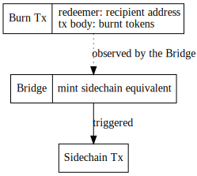
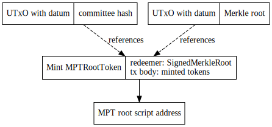
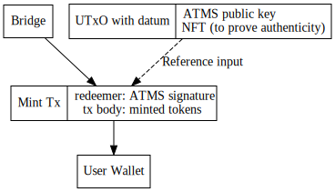
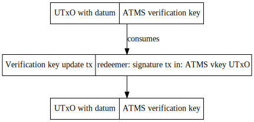

# Trustless sidechain

This specification details the main chain contract of a trustless sidechain system. The work relies on the BLS ATMS signature scheme, but this might not be available in time for Cardano, so we decided to implement the contract in two phases:

- [phase 1](https://github.com/mlabs-haskell/trustless-sidechain/milestone/1): MVP using append only signature scheme
- [phase 1.5](https://github.com/mlabs-haskell/trustless-sidechain/milestone/3): script optimisations and security improvements
- [phase 2](https://github.com/mlabs-haskell/trustless-sidechain/milestone/2): using ATMS signature scheme

Mainchain utilizes the following components to handle interactions with a sidechain:

- `FUELMintingPolicy`: minting policy validating the mint or burn of FUEL tokens on mainchain ([2.](#2.-transfer-fuel-tokens-from-mainchain-to-sidechain), [3.2.](#3.2.-individual-claiming))
- `MPTRootTokenMintingPolicy`: minting policy for storing cross-chain transaction bundles' MPT roots ([3.1.](#3.1.-merkle-root-insertion))
- `CommitteeCandidateValidator`: script address for committee candidates ([4.](#4.-register-committee-candidate), [5.](#5.-deregister-committee-member%2Fcandidate))
- `MPTRootTokenValidator`: script address for storing `MPTRootToken`s ([3.1.](#3.1.-merkle-root-insertion))
- `CommitteeHashValidator`: script address for the committee members' hash ([1.](#1.-initialise-contract), [6.](#6.-update-committee-hash))
<!-- - `ATMSVerificationKeyValidator`: script address for the ATMS verification key -->

All of these policies/validators are parameterised by the sidechain parameters, so we can get unique minting policy and validator script hashes.

```haskell
data SidechainParams = SidechainParams
  { chainId :: BuiltinInteger
  , genesisHash :: BuiltinByteString
  }
```

### 1. Initialise contract

For initialisation, we need to set the first <!-- ATMS verification key --> committee hash on chain using a NFT (consuming some arbitrary utxo). We use this committee hash to verify signatures for sidechain to mainchain transfers. This is a hash of concatenated public key hashes of the committee members. This hash will be updated each when the committee changes, see [6.](#6.-update-committee-hash) for more details.

### 2. Transfer FUEL tokens from mainchain to sidechain

**Workflow:**

1. Call the burn endpoint of the contract with BurnParams
2. A transaction will be submitted to mainchain with the burnt amount in the tx body and the sidechain recipient and the signature in the redeemer
3. The Bridge component observing the mainchain where the given minting policy is handled, verifies the transaction and creates an appropriate sidechain transaction

**Endpoint params:**

```haskell
data BurnParams = BurnParams
  { recipient :: ByteString
  , amount :: Integer
  }
```



### 3. Transfer FUEL tokens from sidechain to mainchain

**Workflow:**

1. Sidechain collects unhandled transactions
2. Sidechain block producers compute `txs = outgoing_txs.map(tx => blake2(tx.recipient, tx.amount)` for each transaction, and create a Merkle-tree from these. The root of this tree is signed <!--with ATMS multisig--> by the committee members with an appended signature
3. Bridge broadcasts Merkle root to chain
4. Txs can be claimed individually

#### 3.1. Merkle root insertion

**Endpoint params for merkle root insertion:**

```haskell
data SaveRootParams = SaveRootParams
  { sidechainParams :: SidechainParams
  , merkleRoot :: BuiltinByteString
  , threshold :: Integer
  , committeeSignatures :: [(PubKey, Maybe BuiltinByteString)] -- Public keys of all committee members with their corresponding signatures
  }
```

Merkle roots are stored on-chain, using `MPTRootToken`s, where the `tokenName` is the Merkle root. These tokens must be at the `MPTRootTokenValidator` script address.

**Redeemer:**

```haskell
data SignedMerkleRoot = SignedMerkleRoot
  { merkleRoot :: ByteString
  , lastMerkleRoot :: ByteString
  , signatures :: [ByteString] -- Current committee signatures ordered as their corresponding keys
  , beneficiary :: ByteString -- Sidechain address
  , committeePubKeys :: [PubKey] -- Lexicographically sorted public keys of all committee members
  }
```

Minting policy verifies the following:

- signature can be verified with the <!--ATMS verification key--> submitted public keys of committee members, and the concatenated and hashed value of these keys correspond to the one saved on-chain
- list of public keys does not contain duplicates
- UTxO with the last Merkle root is referenced in the transaction

Validator script verifies the following:

- UTxOs containing an `MPTRootToken` cannot be unlocked from the script address



The merkle tree has to be constructed in the exact same way as it is done by [following merkle tree implementation](https://github.com/mlabs-haskell/trustless-sidechain/blob/master/src/TrustlessSidechain/MerkleTree.hs). Entries in the tree should be calculated as follow:
```
index - 32 bit unsigned integer, used to provide uniqueness among transactions within the tree
amount - 256 bit unsigned integer that represents amount of tokens being sent out of the bridge
recipient- arbitrary length bytestring that represents decoded bech32 cardano address
sidechainEpoch - sidechain epoch for which merkle tree was created

index = value padded to 4 bytes
amount = value padded to 32 bytes
recipient = arbitrary length bytestring
sidechainEpoch = value padded to 8 bytes
value = index ++ amount ++ sidechainEpoch ++ recipient 
entry = blake2b(value)
```

#### 3.2. Individual claiming

**Endpoint params for claiming:**

```haskell
data MintParams = MintParams
  { amount :: Integer
  , recipient :: ByteString
  , merkleProof :: MerkleProof
  , chainId :: Integer
  , index :: Integer
  , sidechainEpoch :: Integer
  }
```

Minting policy verifies the following:

- `MPTRootToken` with the name of the Merkle root of the transaction (calculated from from the proof) can be found in the `MPTRootTokenValidator` script address
- chainId matches the minting policy chainId
- recipient, amount, index and sidechainEpoch combined with merkleProof match against merkleRootHash
- the merkleRoot where the transaction is in, and it's position in the list hashed `blake2(merkleRoot, txIdx)` of the transaction is NOT included in the distributed set[^1] (the actual hash might be subject to change)
- a new entry with the value of `blake2(tx.recipient, tx.amount, merkleRoot)` is created in the distributed set



**Minting policy redeemer:**

```haskell
data FUELRedeemer
  = MainToSide ByteString ByteString
  -- ^ Recipient address on the sidechain and the signature of its owner (see 2.)
  | SideToMain MerkleProof
```

### 4. Register committee candidate

**Workflow:**

1. An SPO registering as a block producer (commitee member) for the sidechain sends BlockProducerRegistration and its signature (where the signed message contains the sidechain parameters, sidechain public key and the input utxo in CBOR format)
2. The Bridge monitoring the committee candidate script address is validating the SPO credentials, chainId, and the consumed inputUtxo

**Datum:**

```haskell
data BlockProducerRegistration = BlockProducerRegistration
  { bprSpoPubKey :: PubKey -- own public key
  , bprInputUtxo :: TxOutRef -- a utxo that must be spent with the transaction
  , bprSidechainPubKey :: ByteString -- public key in the sidechain's desired format
  , bprSpoSignature :: Signature -- Signature of the SPO private key
  , bprSidechainSignature :: Signature -- Signature of the sidechain private key
  }
```

### 5. Deregister committee member/candidate

**Workflow:**

1. The UTxO with the registration information can be redeemed by the original sender (doesn't have to check the inputUtxo)
2. The Bridge monitoring the committee candidate script address interprets this as a deregister action

### 6. Update <!--ATMS verification key--> committee hash

1. Bridge component triggers the Cardano transaction. This tx does the following:

**Endpoint params:**

```haskell
data UpdateCommitteeHashParams = UpdateCommitteeHashParams
  { -- | The public keys of the new committee.
    newCommitteePubKeys :: [PubKey]
  , -- | The asset class of the NFT identifying this committee hash
    token :: !AssetClass
  , -- | The signature for the new committee hash.
    committeeSignatures :: [(PubKey, Maybe BuiltinByteString)]
  }
```

Validator script verifies the following:

- verifies that hash of committeePublicKeys matches the hash saved on chain
- verifies that all the provided signatures are valid 
- verifies that size(signatures) > 2/3 * size(committeePubKeys)
- verifies the NFT of the UTxO holding the old verification key at the script address
- consumes the above mentioned UTxO
- outputs a new UTxO with the updated <!--ATMS key--> committee hash containing the NFT to the same script address
- reference to the last Merkle root is referenced in the transaction

**Datum:**

```haskell
data UpdateCommitteeHash = UpdateCommitteeHash
  { committeePubKeysHash :: ByteString -- Hash of all lexicographically sorted public keys of the current committee members
  , lastMerkleRoot :: ByteString
  }
```

```
committeePubKeys = sort([key1, key2, ..., keyN])
committeePubKeysHash = blake2b(concat(committeePubKeys))
keyN - 33 bytes compressed ecdsa public key of a committee member
```



**Redeemer:**

```haskell
data UpdateCommitteeRedeemer = UpdateCommitteeRedeemer
  { signatures :: [BuiltinByteString]
  , newCommitteePubKeys :: [PubKey]
  , committeePubKeys :: [PubKey]
  }
```

Signatures are constructed as follow:
```
newCommitteePubKeys - concatenated elements from a list where single element is newCommiteeMemberPubKey
newCommiteeMemberPubKey - 33 bytes compressed ecdsa public key of the next committee member
sidechainEpoch - sidechain epoch for which we obtain signature

sidechainEpoch = value padded to 8 bytes
signature = ecdsa.sign(data: blake2b(newCommitteePubKeys ++ sidechainEpoch), key: committeeMemberPrvKey)
```

## Appendix

[^1]: Distributed set implementation details are still WIP, but we plan to use something like this: https://github.com/Plutonomicon/plutonomicon/blob/main/stick-breaking-set.md
