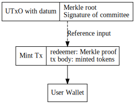
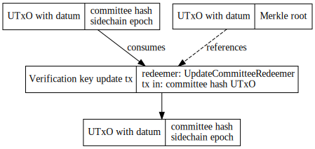

# Trustless sidechain

This specification details the main chain contract of a trustless sidechain system. The work relies on the BLS ATMS signature scheme, but this might not be available in time for Cardano, so we decided to implement the contract in two phases:

- phase 1: using append only signature scheme
- phase 2: using ATMS signature scheme

Mainchain utilizes the following components to handle interactions with a sidechain:

- `FUELMintingPolicy`: minting policy validating the mint or burn of FUEL tokens on mainchain
- `MPTRootTokenMintingPolicy`: minting policy for storing cross-chain transaction bundles' MPT roots
- `CommitteeCandidateValidator`: script address for committee candidates
- `MPTRootTokenValidator`: script address for storing `MPTRootToken`s
- `CommitteeHashValidator`: script address for the committee members' hash
<!-- - `ATMSVerificationKeyValidator`: script address for the ATMS verification key -->

All of these policies/validators are parameterised by the sidechain parameters, so we can get unique minting policy and validator script hashes.

```haskell
data SidechainParams = SidechainParams
  { chainId :: BuiltinInteger
  , genesisHash :: BuiltinByteString
  }
```

### Initialise contract

For initialisation, we need to set the first <!-- ATMS verification key --> committee hash on chain with a NFT (consuming some arbitrary utxo).

### Transfer FUEL tokens from mainchain to sidechain

**Workflow:**

1. Call the burn endpoint of the contract with BurnParams
2. A transaction will be submitted to mainchain with the burnt amount in the tx body and the sidechain recipient in the redeemer
3. The Bridge component observing the mainchain where the given minting policy is handled, verifies the transaction and creates an appropriate sidechain transaction

**Endpoint params:**

```haskell
data BurnParams = BurnParams
  { recipient :: ByteString
  , amount :: Integer
  }
```


### Transfer FUEL tokens from sidechain to mainchain

**Workflow:**

1. Sidechain collects unhandled transactions
2. Sidechain block producers compute `txs = outgoing_txs.map(tx => blake2(tx.recipient, tx.amount)` for each transaction, and create a Merkle-tree from these. The root of this tree is signed <!--with ATMS multisig--> by the committee members with an appended signature
3. Bridge broadcasts Merkle root to chain
4. Txs can be claimed individually

**Endpoint params for merkle root insertion:**

Merkle roots are stored on-chain, using `MPTRootToken`s, where the `tokenName` is the Merkle root. These tokens must be at the `MPTRootTokenValidator` script address.

<!--

```haskell
data SignedMerkleRoot = SignedMerkleRoot
  { merkleRoot :: ByteString
  , signature :: ByteString
  }
```
-->

```haskell
data SignedMerkleRoot = SignedMerkleRoot
  { merkleRoot :: ByteString
  , signature :: ByteString
  , committeePkhs :: [PubKeyHash] -- Public keys of all committee members
  }
```

Minting policy verifies the following:

- signature can be verified with the <!--ATMS verification key--> submitted public key hashes of committee members, and the concatenated and hashed value of these correspond to the one saved on-chain

Validator script verifies the following:

- UTxOs containing an `MPTRootToken` cannot be unlocked from the script address


**Endpoint params for claiming:**

```haskell
data MintParams = MintParams
  { amount :: Integer
  , recipient :: ByteString
  , merkleProof :: MerkleProof
  , chainId :: Integer
  }
```

Minting policy verifies the following:

- `MPTRootToken` with the name of the Merkle root of the transaction (calculated from from the proof) can be found in the `MPTRootTokenValidator` script address
- chainId matches the minting policy chainId
- recipient and amount matches the actual tx body contents
- the merkleRoot where the transaction is in, and it's position in the list hashed `blake2(merkleRoot, txIdx)` of the transaction is NOT included in the distributed set[^1] (the actual hash might be subject to change)
- a new entry with the value of `blake2(tx.recipient, tx.amount, merkleRoot)` is created in the distributed set



**Minting policy redeemer:**

```haskell
data FUELRedeemer
  = MainToSide ByteString -- Recipient address on the sidechain
  | SideToMain MerkleProof
```

### Register committee candidate

**Workflow:**

1. An SPO registering as a block producer (commitee member) for the sidechain sends BlockProducerRegistration and its signature
2. The Bridge monitoring the committee candidate script address is validating the SPO credentials, chainId, and the consumed inputUtxo

**Datum:**

```haskell
data BlockProducerRegistration = BlockProducerRegistration
  { pubKey :: PubKey -- own public key
  , inputUtxo :: TxOutRef -- a utxo that must be spent with the transaction
  , sidechainPubKey :: ByteString -- public key in the sidechain's desired format
  , signature :: Signature
  }
```

### Deregister committee member/candidate

**Workflow:**

1. The UTxO with the registration information can be redeemed by the original sender (doesn't have to check the inputUtxo)
2. The Bridge monitoring the committee candidate script address interprets this as a deregister action

### Update <!--ATMS verification key--> committee hash

For phase 1, we use this committee hash to verify signatures for sidechain to mainchain transfers.This is a hash of concatenated public key hashes of the committee members.

1. Bridge component triggers the Cardano transaction. This tx does the following:

- verifies the signature on the new <!--ATMS key--> committee hash (must be signed by the old committee)
- verifies the NFT of the UTxO holding the old verification key at the script address
- consumes the above mentioned UTxO
- outputs a new UTxO with the updated <!--ATMS key--> committee hash containing the NFT to the same script address

**Endpoint params:**

<!--
```haskell
data UpdateVKey = UpdateVKey
  { newVKey :: ByteString,
  , signature :: ByteString
  }
```
-->

```haskell
data UpdateCommitteeHash = UpdateCommitteeHash
  { newCommitteeHash :: ByteString,
  , signature :: ByteString
  , committeePkhs :: [PubKeyHash] -- Public keys of the current committee members
  }
```



**Redeemer:**

```haskell
data UpdateCommitteeRedeemer = UpdateCommitteeRedeemer
  { signature :: BuiltinByteString
  , committeePkhs :: [PubKeyHash]
  }
```

## Appendix

[^1]: Distributed set implementation details are still WIP, but we plan to use something like this: https://github.com/Plutonomicon/plutonomicon/blob/main/stick-breaking-set.md
