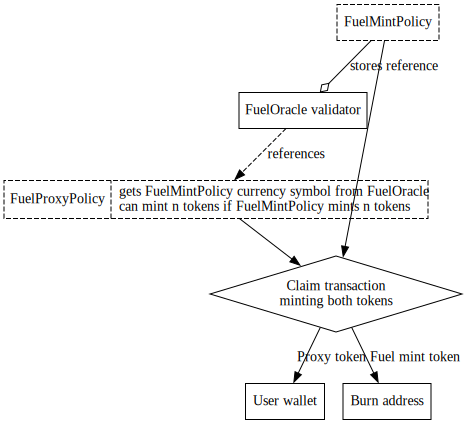
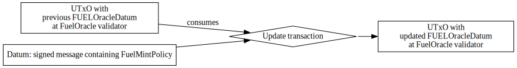
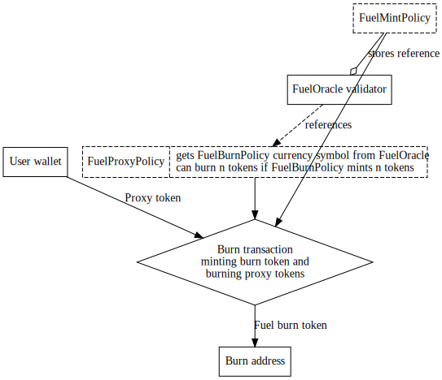
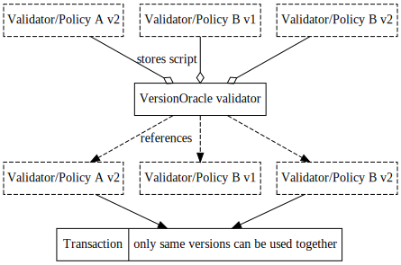

# Update strategy

In this specification we describe the mechanisms of the Cardano mainchain part of the trustless
sidechain protocol update. To allow the protocol to evolve with time, we need to migrate from old
validators to new ones, deprecate old tokens to new ones.

We achieve the update by using an oracle validator. This validator address will be the single
source of truth, to find the validators and minting policies for the protocol.

## 1. Assumptions

- The governance strategy required to approve the protocol update is out of scope of this specification

## 2. Strategies

We considered the following strategies, but these can also be used in combination:

- _migration strategy_: at any given point in time, there's only one valid version of a
  validator or minting policy. On an update event, all assets have to be migrated to the new
  protocol. The benefit of this approach is the simplicity, however the migration cost of a
  long-living chain can be tremendously costly.
- _versioned update_: in this strategy, we would maintain references to old validators and minting
  policies, giving time for the protocol users to migrate their assets as they like. With this
  strategy it is important to allow full migration, in case a version has to be abandoned due to
  a security issue. The update method must be flexible enough to allow addition and removal of
  certain validators/minting policies.
  For versioned validators, the version used must be specified by the datum or redeemer of the
  transaction.
- _partial versioned update_: this is in-between migration and the versioned solution, where the
  UTxOs in the old validator are considered valid after the update, but new insertions are not
  allowed. For partially verioned validators, always the latest version is used by default.
  In practice these validators are set up the same way as the ones with migration strategy, but
  without having the old tokens and datums migrated to the new version of the validator.
- _transaction token pattern_: we could introduce a light-weight validator/minting policy in place
  of our current minting policies and validators, and move all actual logic to
  [Transaction Token Minting Policies (TxTMP)](https://plutonomicon.github.io/plutonomicon/transaction-token-pattern).
  The validators and minting policies could then use an oracle to reference the current version(s)
  of a TxTMP that is accepted, and would only verify that the referenced token is minted.
  The benefits of this approach are:

  - our validator addresses and currency policies would be constant over versions
  - decoupled token minting and burning logic (a token minted with V1 logic can be burnt with V2, etc.)

  A drawback is that this would slightly raise the fees due to the cost of extra tokens minted for each FUEL minting transaction.

These strategies can be used in combination for optimal migration cost/complexity.

In case of our sidechain protocol, I propose the following strategies for our validators and minting policies:

- `FUELMintingPolicy`: Transaction Token Pattern
- `CommitteeCandidateValidator`: migration
- `MPTRootTokenMintingPolicy`: partial versioned update
- `MPTRootTokenValidator`: partial versioned update
- `CommitteeHashPolicy`: partial versioned update
- `CommitteeHashValidator`: partial versioned update
- `DsConfValidator`: it's role is taken over by `VersionOracleValidator`
- `DsConfPolicy`: it's role is taken over by `VersionOraclePolicy`
- `DsInsertValidator`: versioned update
- `DsKeyPolicy`: versioned update

## 3. `FUELMintingPolicy` Transaction Token Pattern Implementation
This section discusses in more detail how to apply the transaction token
pattern to `FUELMintingPolicy`.
In the development of these ideas, we will introduce a new minting policy,
`FUELProxyPolicy`, whose tokens will be regarded as the FUEL tokens whereas
`FUELMintingPolicy` will be seen as a "for internal use only" token.

As a high level idea, the application of Transaction Token Pattern will require
that `FUELProxyPolicy` will forward all of its validations to some
minting policy, called a *proxied minting policy*, (e.g.
`FUELMintingPolicy`) stored in the datum at a *distinguished UTxO*, and
`FUELProxyPolicy` will mint only if a that proxied minting policy mints in the
same transaction. The extra tokens minted from the proxied minting policy may
be paid to any address and does not effect the functionality of the
system[^extraProxiedTokenNote].

[^extraProxiedTokenNote]:
    The extra proxied tokens could be sent directly back to the user's wallet,
    or paid to some arbitrary validator script. The former option makes this
    confusing for users, and the latter scenario will slightly increase the
    cost of the transaction (min UTxO fee).
    Alternatively, the former option could send the token back to the user's
    wallet, and another transaction could burn the proxied tokens (a
    transaction pipeline could be used so we do not need to wait 2 blocks) --
    but again, this would slightly increase fees since it does two transactions
    instead of one.

We will also allow the distinguished UTxO to store a collection of proxied
minting policies where `FUELProxyPolicy` will mint only if *any* of the proxied
minting policies mints.
This allows `FUELProxyPolicy` to mint for any supported version of the protocol
in the case a participant has unclaimed FUEL in a merkle root from a previous
version.
See [3.4.](#34-example-workflow-of-updating-the-committee-signing-scheme) for
details.

This method of forwarding all of `FUELProxyPolicy`'s validations to some
proxied minting policy allows one to update the system in the sense that
provided we have sufficient governance mechanisms for the update, one may
arbitrarily change the distinguished UTxO which holds the collection of proxied
minting policies to modify the conditions for when `FUELProxyPolicy` mints.
In particular, this allows a governance mechanism to modify `FUELProxyPolicy` without changing its
currency symbol.
See [3.1.](#31-alternative-designs) for discussion on the importance of
this.

### 3.1 Alternative designs
We discuss alternative designs.

We classify the designs in two categories: explicit token migration, and
implicit token migration.

- _Explicit token migration._ Suppose that one would like to modify the system
  for an upgrade.
  Indeed, this forces a change in the current system's validators and minting
  policies; so participants must agree what the new `FUEL` tokens are, and
  explicitly burn their current `FUEL` tokens in exchange for the new `FUEL`
  tokens. We call this process of participants explicitly burning their assets
  in exchange for a new version of their assets an *explicit token migration*.

  We discuss various ways of implementing the explicit token migration.

    - _Allowing individuals to migrate tokens themselves._ This could be
      achieved by implementing the upgraded FUEL minting policy to
      alternatively mint only if the old FUEL is burnt. Then, users could
      individually claim their new FUEL via burning their own old FUEL.

      Note that the new `FUEL` minting policy needs to support the migration of
      assets, and would hence be a larger than necessary as it must support
      migration of the old `FUEL`. As more updates happen, this could make
      supporting many old versions impossible due to transaction size limits.

    - _Using the Bridge to migrate tokens._ Recalling that the Bridge already
      observes changes in the main chain, we may modify the Bridge / `FUEL`
      claiming mechanism to allow new `FUEL` to be claimed in the case that old
      `FUEL` is burnt.

_Problems with explicit token migration._ If there's a critical security issue
with the old FUEL (e.g. someone can mint themselves unlimited FUEL), then this
critical security issue also appears in the new `FUEL`. Moreover, if this
system runs for a long time, it would be costly (in terms of ada) for every old
`FUEL` to be burnt and minted to new `FUEL`.

- _Implicit token migration._ In
  [3.](#3-fuelmintingpolicy-transaction-token-pattern-implementation) we
  described a method to upgrade the system without requiring participants to
  migrate their assets via burning / minting to the new system.
  Indeed, an upgrade with such a system requires no actions from participants,
  and we call this an *implicit token migration*.

_Problems with implicit token migration._ Since the method of implicit token
migration introduces additional minting policies and validators inside of the
transaction, this certainly will make things cost more (in terms of ada). So,
this has the potential issue of running into transaction size limits, but
reference scripts ([CIP33](https://cips.cardano.org/cips/cip33/)) can help
mitigate this.

_Discussion._ Clearly, both of the presented methods have their shortcomings.
In our opinion, we believe that the implicit token migration using the
    transaction token minting policy pattern is the superior choice.
It provides us with the ability to migrate tokens for free, and provides us with the flexibility
    to modify the system in production should there need changes (upgrades, security patches, etc.).
Also, it provides a clean break of abstraction to decouple behavior.

### 3.2 Validators / Minting Policies
We will introduce a new `FUELProxyPolicy` which will be regarded as the `FUEL`
tokens.
`FUELProxyPolicy` will be parameterized by two currency symbols of minting
policies, called `FUELOracleMintPolicy` and `FUELOracleBurnPolicy`, which are
NFTs (and hence must be parameterized by a UTxO) that will each uniquely
identify a UTxO at a `FUELOracleValidator` script validator address which
holds as datum some collection of proxied tokens that completely determines the
conditions when `FUELProxyPolicy` mints and burns.

An upgrade to the system amounts to spending the `FUELOracleValidator` that the
NFT `FUELOracleMintPolicy` (or `FUELOracleBurnPolicy`) sits at, and paying the
NFT `FUELOracleMintPolicy` (or `FUELOracleBurnPolicy`) to a new
`FUELOracleValidator` with an altered collection of proxied tokens as datum.
Then, the conditions for when `FUELProxyPolicy` mints (or burns) is now
determined by the new altered collection of proxied tokens.
It is outside the scope of this document to discuss the conditions for when the
validator `FUELOracleValidator` will succeed, as there would need to be some
sort of governance mechanism which decides when we may upgrade
`FUELProxyPolicy`.
See [3.3](#33-governance-of-updates) for details.

The rest this section discusses the design of `FUELProxyPolicy` and how it
determines which proxied minting policy must mint in order for
`FUELProxyPolicy` to itself mint.

We first describe a datum, `FUELOracleDatum`, which holds the proxied minting
policies' currency symbols as follows.
```haskell
type FUELOracleDatum = VersionMap

newtype Version = Version Integer
  deriving Eq

newtype VersionMap = VersionMap
    { unFUELOracleDatum :: Map Version CurrencySymbol
        -- ^ this maps a 'Version' to a 'CurrencySymbol' where participants may
        -- choose a 'Version' with its corresponding 'CurrencySymbol' that they
        -- would like to use to claim their 'FUELProxyPolicy' tokens.
    }
```
That is, this a map which associates a `Version` with a proxied minting
policy's `CurrencySymbol`. See
[here](https://github.com/input-output-hk/plutus/blob/master/plutus-tx/src/PlutusTx/AssocMap.hs#L58-L60)
for the `Map` data type.

The datum `FUELOracleDatum` will reside at the script address
`FUELOracleValidator` uniquely identified by the NFT  `FUELOracleMintPolicy`.
Similarly for burning, at another `FUELOracleValidator` script address uniquely
identified by `FUELOracleMintPolicy`, there will be another `FUELOracleDatum`.

Indeed, participants will want to determine which `Version` they would like to
use to claim their `FUELProxyPolicy` tokens and whether they wish to mint or
burn their `FUELProxyPolicy` tokens.
Hence, this information will be passed as a redeemer to `FUELProxyPolicy` with
the following data type.
```haskell
data FUELProxyPolicyRedeemer = FUELProxyPolicyRedeemer
    { version :: Version
        -- ^ 'version' determines which proxied minting policy the participant
        -- would like to use in the 'FUELOracleDatum'.
    , mode :: Mode
        -- ^ 'mode' determines whether the participant would like to mint or
        -- burn tokens.
    }

data Mode
    = Mint
    | Burn
```

Thus, if the `mode` of the redeemer is `Mint`, `FUELProxyPolicy` verifies
all of the following:

1. there is a reference input which contains the `FUELOracleMintPolicy` token
   with `FUELOracleDatum` as datum;

2. there is a value, `proxiedToken`, in `FUELOracleDatum` which corresponds to
   the `version` of the redeemer;

3. the `proxiedToken` mints `k > 0` tokens with token name `""`; and

4. `FUELProxyPolicy` only mints `k` tokens with token name `FUEL`.

Otherwise, if the `mode` of the redeemer is `Burn`, `FUELProxyPolicy` verifies all of the
following (note conditions 2., 3. are identical to the previous case):

1. there is a reference input which contains the `FUELOracleBurnPolicy` token
   with `FUELOracleDatum` as datum;

2. there is a value, `proxiedToken`, in `FUELOracleDatum` which corresponds to
   the `version` of the redeemer;

3. the `proxiedToken` mints `k > 0` tokens with token name `""`; and

4. `FUELProxyPolicy` only mints `-k` tokens (i.e., burns `k` tokens) with token name `FUEL`.

Note that in the `Burn` case, we burn `k` `FUELProxyPolicy` (i.e., mint `-k`)
only if we mint `k > 0` of the proxied token.
An alternative design would be to only have the `Mint` case and remove the
restriction that `k > 0`, but this design was discarded for technical reasons.
Unlike minting, where one may arbitrarily mint tokens iff the minting policy
succeeds, burning tokens requires the participant to additionally
spend such tokens from an address.
This is inconvenient as the proxied minting policy must be present in some
address the user may spend when attempting to burn, but as time goes on,
updates may invalidate such tokens.
So, this design avoids this subtle annoyance.

The entire workflow is summarized as follows.

**Workflow**
1. NFTs `FUELOracleMintPolicy` and `FUELOracleBurnPolicy` are minted, and paid
   to distinct `FUELOracleValidator` validator scripts with datums
```
    0 -> Currency symbol of FUELMintingPolicy
```
and
```
    0 -> Currency symbol of a tautology policy that always returns true
```
respectively where we use the notation `a -> b` to denote "`a` maps to `b`".
Note the choice `0` as the `Version` was arbitrary and could have been any
integer.

2. Users may mint `FUELProxyPolicy` for `FUEL` where we note that
   `FUELProxyPolicy` mints only if `FUELMintingPolicy` mints; and similarly,
   users may burn their `FUELProxyPolicy` only if the tautology policy mints
   (which may always occur).

3. A governance mechanism chooses to upgrade the system by spending the UTxO
   that holds the `FUELOracleMintPolicy` NFT (or the `FUELOracleBurnPolicy`) at
   validator `FUELOracleValidator`, and paying it to another
   `FUELOracleValidator` validator address with a new `FUELOracleDatum`.

4. Note that any new `FUEL` tokens must now validate with the new collection of
   proxied minting policies provided.

5. Steps 2., 3., 4. may be repeated indefinitely for users and governance mechanisms.



<figcaption align = "center"><i>Claiming FUELProxy token using the transaction token pattern</i></figcaption><br />



<figcaption align = "center"><i>Updating the list of valid FUELMintingPolicies</i></figcaption><br />



<figcaption align = "center"><i>Burning FUELProxy token using the transaction token pattern</i></figcaption><br />

### 3.3 Governance of updates
In this section, we discuss options for governing updates.
Previously, we mentioned that the conditions for which an update happens are
completely determined by the script validator address which holds the
`FUELOracleMintPolicy` (or `FUELOracleBurnPolicy`) NFT which resides at a
`FUELOracleValidator` script address.

As an early implementation draft, we will require that `FUELOracleValidator`
will be parameterized by some public key, and will succeed only if the
transaction was signed by the given public key.
In the future, these conditions when `FUELOracleValidator` succeeds may want to
be changed to committee signatures.

Interestingly, the mechanism which governs updates can itself be updated.
This is because the only constraint that the script validator uniquely
identified by `FUELOracleMintPolicy` (or `FUELOracleBurnPolicy`) has (from the
perspective of `FUELProxyPolicy`) is that it must have `FUELOracleDatum` as its
datum; so this means that the conditions on which this validator may succeed
(and hence permit an update) can be changed alongside an update of the system.
So, not only can we update `FUELProxyPolicy`, we can also update the mechanism
which governs the updates.

### 3.4 Example Workflow of Updating the Committee Signing Scheme
This section discusses a workflow for updating the committee signing scheme.

Let's suppose the scenario is as follows.

1. The sidechain is started with some given committee signing scheme.

2. Many years later (with many unclaimed FUEL tokens left onchain), we decide
   that it's far better to replace the committee signing scheme.

3. New FUEL transactions are created with the new committee signing scheme.

We would like to:

- support users claiming their old unclaimed FUEL;

- allow users to be able to claim the new FUEL from the new committee signing
  scheme.

Recall from the [main
specification](https://github.com/mlabs-haskell/trustless-sidechain/blob/master/docs/Specification.md)
that `FUELMintingPolicy` verifies the all of following conditions:

1. The FUEL claimed corresponds to an element in a merkle root that was
   inserted (i.e., minted by the `SignedMerkleRoot` policy), and the
   transaction corresponds to the transaction specified in the merkle root in a
   suitable sense.
   Note that `FUELMintingPolicy` must be parameterized by the currency symbol
   of the `SignedMerkleRoot` policy to verify this.

2. The hash of the transaction of the FUEL claimed has just been inserted in
   the distributed set.
   Note that `FUELMintingPolicy` hence must be parameterized by the currency
   symbol of elements inserted in the distributed set to verify this.

We reiterate: `FUELMintingPolicy` must be parameterized by the currency symbol
of the `SignedMerkleRoot` policy to verify 1., and must also be parameterized
by the currency symbol of elements just inserted in the distributed set to
verify 2..

This example will demonstrate how the currency symbols which parameterize
`FUELMintingPolicy` can be modified to support different versions with
different signature schemes.

To begin, we will initialize the `FUELOracleDatum` that is uniquely identified
by the `FUELOracleMintPolicy` of `FUELProxyPolicy` as follows.
```
0 -> Currency symbol of FUELMintingPolicy
```
In other words, `FUELProxyPolicy` mints only if the same conditions as the
original `FUELMintingPolicy` are satisfied in the original specification.

Now, we discuss how we can change the committee signature scheme while
supporting claiming old tokens.

Recall from the main specification that the `SignedMerkleRoot` policy creates a
merkle root of FUEL transactions only if the following conditions are
satisfied:

1. The current committee has signed the merkle root.

2. If the previous `merkleRoot` is specified, the UTxO with that is given as
   reference input.

3. The unique `SignedMerkleRoot` token has token name as the merkle root, and
   is paid to a `MerkleRootTokenValidator`.

To facilitate discussion, we'll assume condition 1. has been modularized in a
minting policy, say `CommitteeSignedToken`, which mints only if the current
committee has signed its unique token name (unfortunately, the current
iteration was not implemented this way and these verifications are hardcoded in
the `SignedMerkleRoot` policy).
Thus, `SignedMerkleRoot` would instead in 1. verify that `CommitteeSignedToken`
has minted the merkle root. Clearly, `SignedMerkleRoot` must be parameterized
with the currency symbol of `CommitteeSignedToken` to achieve this.

So, if we have a new committee signing scheme, say `CommitteeSignedToken'`,
if we were to parameterize `SignedMerkleRoot` with the new currency symbol
of `CommitteeSignedToken'`, we would get a new `SignedMerkleRoot` policy which we
will call `SignedMerkleRoot'` which will have a distinct currency symbol from
the original `SignedMerkleRoot`.

Of course, before this new `SignedMerkleRoot'` policy can be used, one would
need to do the appropriate setup to ensure that the `CommitteeSignedToken` is
able to identify the current committee onchain -- most likely ensuring that the
NFT which identifies the committee identifies the public keys of the committee
onchain.

So, if we construct a new `FUELMintingPolicy` that is parameterized by the new
`SignedMerkleRoot'` policy, and the same currency symbol for the distributed
set (recall these are the two things that `FUELMintingPolicy` is parameterized
by); we would get a new `FUELMintingPolicy` policy, say `FUELMintingPolicy'`,
that mints only if the merkle root was signed with the new signature scheme
(and the same distributed set condition as the original `FUELMintingPolicy` is
satisfied).

Thus, to support claiming of new FUEL tokens in `FUELProxyPolicy`, we would
modify the `FUELOracleDatum` uniquely identified by the `FUELOracleMintPolicy`
of `FUELProxyPolicy` to as follows.
```
0 -> Currency symbol of FUELMintingPolicy
1 -> Currency symbol of FUELMintingPolicy'
```
Note that offchain we need to do some work to ensure that we give
`FUELMintingPolicy` and `FUELMintingPolicy'` a unique `Version` integer.

As a summary, this new `FUELProxyPolicy` allows users to either:

- claim `FUEL` from merkle roots that were minted with the old
  `FUELMintingPolicy`; or

- claim `FUEL` from merkle roots that were minted with the new
  `FUELMintingPolicy'`

as required.

### 3.5 Optimization Ideas
In this section we discuss some optimization ideas for `FUELProxyPolicy`.

#### 3.5.1 Efficient `VersionMap` Lookups
Recall that `VersionMap` is implemented with the [`Map` data
type](https://github.com/input-output-hk/plutus/blob/master/plutus-tx/src/PlutusTx/AssocMap.hs#L58-L60)
for which the `lookup` operation requires a [linear
scan](https://github.com/input-output-hk/plutus/blob/master/plutus-tx/src/PlutusTx/AssocMap.hs#L131-L139).

Certainly, we can replace this with more efficient data structures such as an
array.
Unfortunately, we'll need to do some tricks to achieve this as there is no data
type for an array of `ByteString`s in Plutus.

Let's make some remarks.

- We know that we only store `CurrencySymbol`s in the `VersionMap` which
  `CurrencySymbol`s are the image of of a 256 bit hash function and are hence
  `ByteString`s of length 32.

- `ByteString`s have a builtin operation for taking a contiguous sub-`ByteString`
  of a `ByteString` with
  [sliceByteString](https://github.com/input-output-hk/plutus/blob/1af96af28f45030c94e11138a2f13869e9e63b79/doc/read-the-docs-site/reference/cardano/builtin-parameters.csv#L129).

We will also require that `Version`s are *contiguous and start at 0*.
Since `Version` integers are arbitrary and may be chosen in any particular way,
this requirement isn't too onerous to assume.
The only implication is that when updating, the governance mechanism needs to
be sure that this requirement is satisfied.

Then, we may replace `VersionMap` with
```haskell
newtype VersionMap = VersionMap { unVersionMap :: ByteString }
```
for which any `versionMap :: VersionMap` satisfies the following
invariants:

1. `length versionMap` is a multiple of 32.

2. `sliceByteString (i * 32) 32 versionMap` is a `CurrencySymbol` where `i` is the
  `Version` a participant is interested in using, and
  [`sliceByteString`'s arguments are described here](https://github.com/input-output-hk/plutus/blob/f6c803dcf15af9b28b7f2a0baeefa0d12d69d0c7/plutus-tx/src/PlutusTx/Builtins.hs#L94-L97).
  This will be the new `lookup` operation for this representation of
  `VersionMap`.

As a picture, the memory representation is as follows
```
0                   ...                  31 32                  ...                  63
|------------Currency symbol 0------------| |------------Currency symbol 1------------| ... etc.
```
where the numbers on the top denote the index of the `i`th byte of the
`ByteString` that ``VersionMap` contains.

So, if a participant was interested in version `i`, `FUELProxyPolicy` would use
the builtin `sliceByteString` with the operation described in 2. to grab the
corresponding proxied minting policy's currency symbol.
Indeed, this may be more efficient than the linear `lookup` operation of a
`Map`.

#### 3.5.2 Using Reference Scripts for `FUELProxyPolicy`
Since we know that `FUELProxyPolicy` will *always* reference a
`FUELOracleValidator`, it would be reasonable to include `FUELProxyPolicy` as a
reference script in each `FUELOracleValidator`.
This would make the transaction smaller (and hopefully reduce fees!) as the
`FUELProxyPolicy` is already included onchain.
See [CIP33](https://github.com/cardano-foundation/CIPs/tree/master/CIP-0033) for details.

#### 3.5.3 Merging the datums identified by `FUELOracleMintPolicy` and `FUELOracleBurnPolicy` in a single `FUELOracleValidator`
It's unclear whether having two distinct UTxOs for holding a `FUELOracleDatum`
for minting and burning respectively was a good idea.
Indeed, this forces us to have a large "initial transaction" when minting both
NFTs (there are already issues with the init transaction being too large).

An alternative would be to have a single `FUELOraclePolicy` NFT which uniquely
identifies a UTxO with datum as follows.
```haskell
data FUELOracleDatum = FUELOracleDatum
    { mintMap :: VersionMap
    , burnMap :: VersionMap
    }
```
This would reduce the init transaction's size, but it would also force every
`FUELProxyPolicy` mint to additionally include the `burnMap` (when it is not
necessary) which may in turn make the transaction slightly larger (potentially
increasing fees).

It's unclear if this will provide any benefit at all.

## 4. Versioning Implementation
In this section we discuss how different versions will be maintained on-chain.
As mentioned in the previous sections, the implementation of the an on-chain
versioning system is not a requirement, but it has some benefits:
- backwards compatibility
- utilising reference scripts
- single source of truth for scripts
- modularity

#### Backwards compatibility
Without on-chain versioning, the user must use the version of the toolkit that
matches the version of the claim. With versioninig, the same off-chain code can
handle various versions. However, it's worth mentioning that maintaining backwards
compatibility could still be difficult on the off-chain code if the interface of
the policies/validators change.

#### Utilising reference scripts
Versioning design is tightly coupled with the use of reference scripts, which will
reduce the maintenance cost of the chain (e.g. FUEL mint fees [reduced by more than 50%](https://github.com/mlabs-haskell/trustless-sidechain/pull/359/files#diff-1aa9f7592eb75953f0ccffa0eb1b9029c9791cc5cdc799df278f32a4406b2bb5L195-R203)).

We can implement the same optimisations using reference scripts without versioning,
and the result would actually end up being similar to this versioning design (we
would need an oracle validator, where the reference scripts are stored in separate UTxOs).
However, without on-chain versioning the off-chain code has to verify, that the
reference script on-chain matches the off-chain version, and if not, it must fall
back to including the script in the transaction itself.

#### Single source of truth for scripts
With versioning, off-chain script handling becomes simpler:
- protocol initialisation and update sends the scripts to the `VersionOracle`
- all transactions use the `VersionOracle` to find the validator addresses and scripts

Without versioning, for all transactions the off-chain SDK includes the Plutus scripts
themselves (or we can use reference scripts, as explained above).

#### Modularity
Resulting from the single source of truth property, we can easily swap out certain scripts
in our protocol, even without a source code change, because there are no hard-coded refrences
in the scripts themselves. We could provide multiple implementation for a certain script
(e.g. different signature schemes for merkle root insertion and committee handover), and the
end-users would have the freedom, to choose from them.

### 4.1 Implementation

We implement a new validator and a new minting policy:

- `VersionOracleValidator`: validator address holding the references to all the above mentioned
  validators and minting policies in [#2](#2-strategies).
- `VersionOraclePolicy`: this token will prove that the version update was approved and the
  references are valid.

Both of the above are parameterised by the `GenesisUtxo`.
Also, we will modify `FUELMintingPolicy` and `MPTRootTokenMintingPolicy` to include the current
protocol version in their signed message and only allow minting with the actual version.

Furthermore, all scripts depenedending on some other script must use the VersionOracle to
get their dependencies (currency symbols or validator hashes) instead of a script parameter
or any other method to ensure that we get the above mentioned benefits. All script must use
the same version, to avoid unforeseable incompatibilities between script. To achieve this
all scripts must match their own version with the scripts of their dependencies.



<figcaption align = "center"><i>High level concept of versioning</i></figcaption><br />

The version oracle allows four actions: initialisation, insertion, update, invalidation.
All actions except initalisation require a specific signature from the governance mechanism.
Initialisation must occur together with the protocol initialisation, consuming the genesisUtxo.

> Note: strictly speaking the _update_ action is not necessary. It is just an optimised way of
> inserting a new version and invalidating the old one; instead of burning and reminting the token
> it moves it to the new UTxO. The end result is exactly the same.
> One more caveat with the Update action is the duplication of the governance mechanism, both the
> minting policy and the validator has to be able to execute the governance mechanism verification.

**Message of the Update Signature:**

```haskell
data SignedVersionOracle
  = InsertVersionOracle VersionOracle ScriptHash
  -- ^ Adding a new version alongside the existing ones
  --    VersionOracle: identifier for the new version (scriptId + version)
  --    ScriptHash: hash of the new Plutus Script
  | UpdateVersionOracle VersionOracle ScriptHash Version
  -- ^ Replacing a specific version
  --    VersionOracle: identifier for the new version (scriptId + version)
  --    ScriptHash: hash of the new Plutus Script
  --    Version: old version to be invalidated (it will use the scriptId from VersionOracle)
  | InvalidateVersionOracle VersionOracle
  -- ^ Removing a version
  --    VersionOracle: identifier for the old version (scriptId + version)
```

#### 4.1.1. VersionOracleValidator

For each validator or minting policy, a separate UTxO with the following datum will
be created at the `VersionOracleValidator`. A `VersionOraclePolicy` token must be present with the
UTxO to prove its validity. Furthermore, each UTxO will also include a reference script
(see [CIP33](https://github.com/cardano-foundation/CIPs/tree/master/CIP-0033)), holding the actual validator or minting policy script.
This design allows multiple versions of the same validator.

**Datum:**

```haskell
data VersionOracle = VersionOracle
  { version :: Int
  -- ^ `version` of the protocol
  , scriptId :: Int
  -- ^ `scriptId` is the unique identifier of the validator
  }
```

Spending from the validator verifies:
 - a token was burnt (invalidation)

OR

 - exactly one VersionOracleToken exists in the transaction inputs
 - exactly one VersionOracleToken exists in the transaction outputs
 - `SignedVersionOracle` is built onchain using the `UpdateVersionOracle` constructor
 - `SignedVersionOracle` is signed by the governance mechanisms

#### 4.1.2. VersionOraclePolicy

This token will prove that the `VersionOracle` datum was approved by the committee.

**Mint/burning rules:**
 - `GenesisUtxo` is spent

OR

 - exactly one token exists in the transaction outputs (insertion) OR in the transaction inputs (invalidation)
 - `SignedVersionOracle` is built onchain using the `InsertVersionOracle` or `InvalidateVersionOracle` constructor respectively
 - `SignedVersionOracle` is signed by the governance mechanisms

 > Note: the policy does not check whether it was sent to the correct validator address or not. If we want to add this check,
 > we run into a circular dependency problem: both the validator and the minting policy has to know about each other. There are
 > two possible solutions: injecting the validator address through the redeemer (for example part of the SignedVersionOracle);
 > allowing mint to any arbitrary address, but hashing the signed message and putting the value to the token name of the minted
 > token, so it cannot be tampered with. In this case, and additional validation has to happen when we find the VersionOracle on-chain

#### 4.1.3. VersionOracle lookup

We will make VersionOracle the single source of truth of finding validators and minting policies. This includes the following two cases:
- regular reference scripts (as described in CIP33 a reference input holds a reference script instead of attaching the script itself to the transaction)
- referencing currency symbol or validator hash of a different script (for example a validator wants to check whether a certain token was minted)

The workflow is the following:
1. off-chain: lookup the UTxOs of all the required scripts
2. off-chain: adding any script dependencies as reference inputs to the transaction
3. on-chain:
      - in regular use of reference script, no extra change is required on-chain
      - when a script depends on some other script, the validator has to find the correct UTxO from the reference scripts

To help with the above tasks, we will implement the following utility functions:
- offchain: find UTxO with reference script at the VersionOracleValidator address (`findVersionOracle(ScriptId, Version) -> Contract () TxOutRef`)
- onchain: find the currency symbol or validator hash of a script from reference inputs (`getVersionedScript(VersionOracleCurrencySymbol, ScriptId, Version, TxInfo) -> ScriptHash`)
