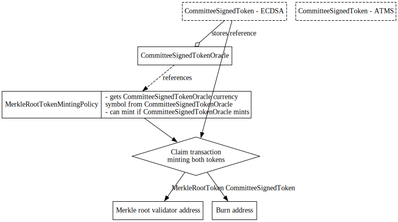

# Reusable Modular Design

## Requirements

- design of a reusable design to modularise any feature of the protocol

## Design

Modularity is achievable for most units of business logic within the code, however we do need to be specific about
the design & separation of concerns between these modules in order to take advantage of modularity properly. Modularity
is also not free, and it can easily impact transaction fees in particular. Modularisation can be achieved in the following
pattern:

1. capture the business logic that may be ‘swapped out’.
2. place this logic within a minting policy onchain, create a pointer to this minting policy using the datum of a UTxO,
identified by a unique token. This UTxO’s datum is controlled by the administrator or governor of the given sidechain/bridge.
3. When the relevant transaction is called, the validator expects the UTxO with a pointer and unique token to be
included in the transaction, it then checks that the minting policy from the pointer succeeds. (the minted asset is of no
further value and can be discarded)
4. When the ‘module’ needs to be changed, the governing body changes the datum in the reference UTxO to reflect the new module.

This pattern should broadly apply to any particular business logic change (for example, changing the signature solution used)
with respect to the interface between the sidechain and the trustless-sidechain-bridge smart contract protocol.

## Changes on the main chain side

- init: including the optional token mint
- registration: offchain only, add 1 permission token for registration (adding a new cli argument)

## Changes on the Bridge:

- init: store the currency policy of the permission token
- registration: verify the existence of the permission token

## Potential Consequences

- Fees may increase as we make the transaction more complex

## Implementation example

For an example, we could consider modularising the signature verification of Merkle root insertions.
Currently, this is done directly in the `MerkleRootTokenMintingPolicy`.

To modularise the signature verification step, we will create a new `CommitteeSignedToken`, which encapsulates
the signature verification of an arbitrary message. The scripts accepts a message hash as its redeemer.
The policy allows minting of one token, if the message hash is signed by the committee. For traceability
in other scripts, the name of the minted token will be equal to the message hash.

We can offer multiple verification functions simply by implementing the same interface (another minting policy with
the same redeemer), for example in addition to our ECDSA append scheme verification, we could add a BLS ATMS implementation.

To achieve modularity, we will need to introduce a `CommitteeSignedTokenOracle` validator, that will store the reference
to the verification function of choice for the protocol in a UTxO. The validator is owned by a governing body, the UTxO
can only be spent with a verification of a signature (or by use of some other governance mechanism).
An NFT must also be attached to this UTxO to prove its authenticity.

> Note: Instead of this concrete oracle validator, we could also use the `VersionOracle` described in the [Update Strategy document](./01-UpdateStrategy.md).

In the `MerkleRootTokenMintingPolicy` we remove all signature verification steps and replace it with the following:
- hashing the `SignedMerkleRoot`
- verifying that one `CommitteeSignedECDSAToken` was minted with the above message hash

When building the transaction, we must mint the above token together with the Merkle root token. After the transaction
has succeeded, the `CommitteeSignedToken` can be thrown away (burned or sent to an arbitrary address).

<figcaption align = "center"><i>Example implementation of a modular system</i></figcaption> 
