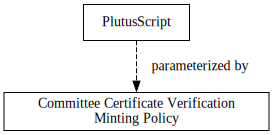
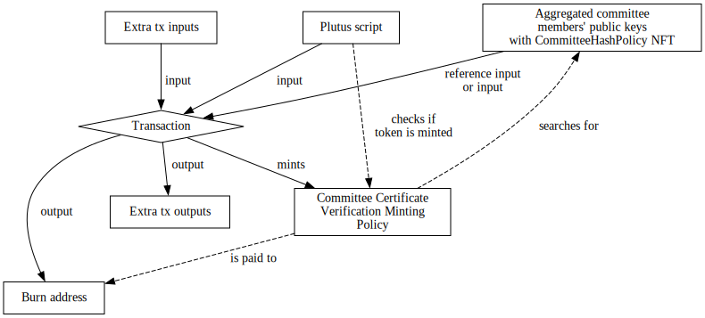
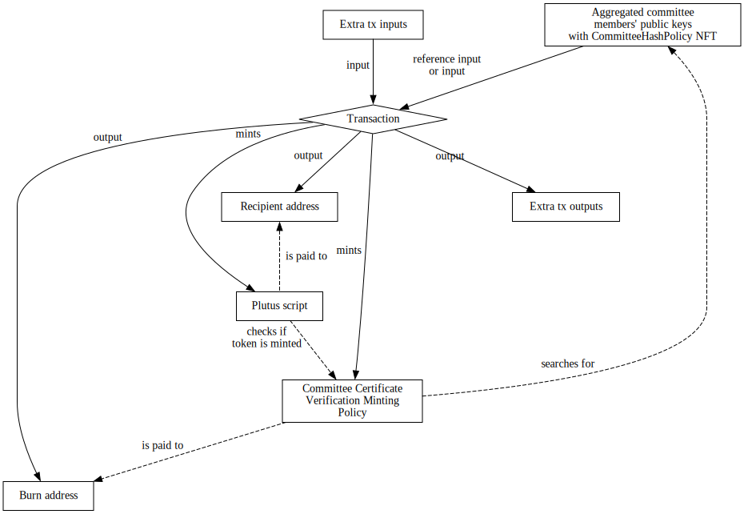
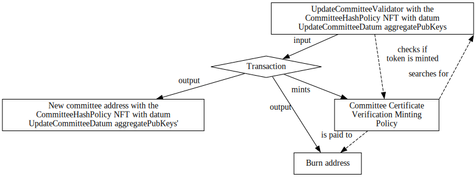
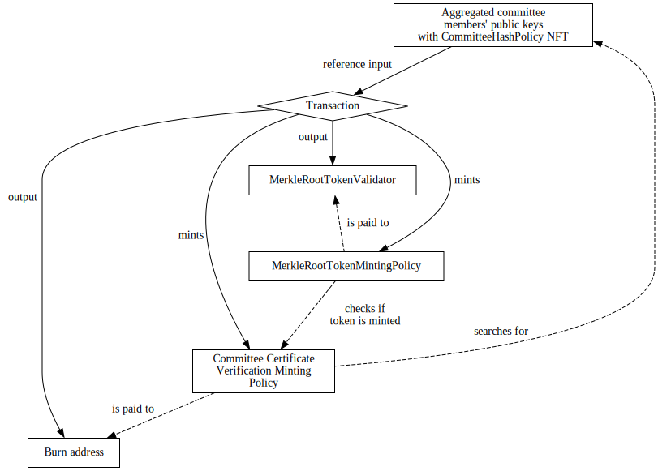
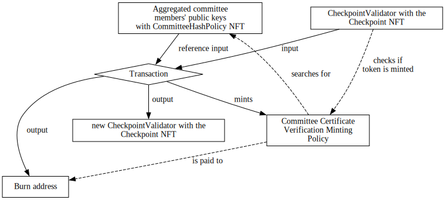

# Modular Committee Certificate Verification

## Requirements

- Allow a sidechain at start-time or upgrade-time to change the method of
  verifying a certificate.

- Allow a sidechain to adjust or upgrade cryptographic verifications.

- Provide a simple 'dummy' method as a stand-in for cryptographic features not
  yet available on Cardano smart contracts.

## Overview
This SIP will discuss the background of the implementation of the current
committee certificate verification mechanism, and how we can adjust the system
to support the requirements.

## Background

In the current implementation, the committee verifies certificates in the
following three places.

1. [Committee handover](https://github.com/mlabs-haskell/trustless-sidechain/blob/master/docs/Specification.md#6-committee-handover).

2. [Transfer FUEL tokens from sidechain to mainchain](https://github.com/mlabs-haskell/trustless-sidechain/blob/master/docs/Specification.md#3-transfer-fuel-tokens-from-sidechain-to-mainchain).

3. [Checkpointing](https://github.com/mlabs-haskell/trustless-sidechain/blob/master/docs/Specification.md#7-checkpointing).

In all three cases, the same code for the committee certificate verification
is duplicated inside each of these systems i.e., each of these systems have
the same duplicated logic to verify that enough of the current committee
onchain has signed a message.
To this end, each of these systems are:

- parameterized by the currency symbol of an [NFT
  `CommitteeHashPolicy`](https://github.com/mlabs-haskell/trustless-sidechain/blob/master/docs/Specification.md#61-update-committee-hash)
  (generated from the [`initUtxo` from the initialize sidechain
  transaction](https://github.com/mlabs-haskell/trustless-sidechain/blob/master/docs/Specification.md#1-initialise-contract))
  to allow them to identify the current committee onchain; and
- have the same verification logic to ensure that strictly more than the
  threshold of the current committee has signed the message.

And obviously, before any of these systems may function, one must mint the
`CommitteeHashPolicy` NFT which uniquely identifies the current committee
onchain.

This proposal will describe:

1. modularizing the duplicated logic of committee certificate verification in a
   single minting policy (that scripts may be parameterized by);

2. describe how this allows one to adjust / upgrade cryptographic
   verifications; and

3. discussing potential implementations that use alternate cryptographic
   verifications.

The upgrading will be left to the [update
strategy](https://github.com/mlabs-haskell/trustless-sidechain/blob/master/docs/SIPs/01-UpdateStrategy.md),
so the main contribution of this SIP is an argument towards modularity of the
duplicated code for committee certificate verifications.

## Modular Design of Committee Certificate Verification
We first discuss the general structure that all committee certificate
verifications will follow.

The key idea is that we will delegate a committee certificate verification to a
minting policy that will mint a token only if the token's name has been
verified by the current committee's cryptographic verification mechanisms.
Note that this limits us to providing committee certificate verifications for
messages that are at most 256 bits long (the maximum token name length), but
indeed, any message can be hashed with a cryptographic hash function to be 256
bits, and so the hash can be signed instead.

More precisely, a _committee certificate verification minting policy_ is a
minting policy with the following workflow.

1. The system is initialized by minting an NFT, `CommitteeHashPolicy`, and
   paying the NFT to some validator script which as datum holds a
   representation of the current committee as some abstract type
   `aggregatePubKeys` (indeed, the datum may store more than just the current
   committee such as a sidechain epoch).

2. The committee certificate verification minting policy is parameterized
   by: the currency symbol of the previous `CommitteeHashPolicy`, and some
   fraction `n/d` that denotes the ratio of how many committee members are
   needed to sign a message (more details below).

   The committee certificate verification minting policy mints only if:

    - exactly one token with token name, say `tn`, of the committee certificate
      verification minting policy is minted[^exactlyOneToken]; and

    - `tn` has *enough* (details on how much "enough" is later) committee
      members that have verified `tn` from the provided multisignature (as a
      redeemer) of some abstract type `multisignature` where the current
      committee's `aggregatePubKeys` is identified by the NFT
      `CommitteeHashPolicy` (in a reference input or
      input[^inputOrReferenceInput]).

      The number of *enough* committee members that have verified `tn` is
      currently implemented as any number of committee members that is
      *strictly larger* than `size of current committee * n / d` (in the real
      number sense).
      The original white paper[^proofOfStakeSidechains] (Section 4.1) suggests
      that this really should be any number of committee members that is *at
      least* the threshold amount i.e., any number of committee members greater
      than or equal to `ceil(size of current committee * n / d)`.

   Note that the committee certificate verification token is not needed after
   this transaction and may be paid to some arbitrary burn address.

[^inputOrReferenceInput]: In the [reference input
  CIP](https://cips.cardano.org/cips/cip31/#:~:text=A%20reference%20input%20is%20a,output%20rather%20than%20spending%20it.),
  it unfortunately does not allow one to reference and spend the same
  transaction, so to allow upgrading of the committee, it is necessary to
  search through the regular transaction inputs as well.

[^exactlyOneToken]: If the restriction of having exactly one token is too
  strong, then this can be generalized to allow any number of tokens.
  Or alternatively, these scripts can be parameterized by a dummy integer to
  ensure that the currency symbol of committee certificate verification
  policies are distinct.

Later, we will show specific examples of this definition from different
cryptographic primitives. For now, we will take this as a definition and assume
that we have a committee certificate verification policy which follows this
workflow.

We discuss how this can be used within other Plutus scripts that wish to
verify that the current committee has verified a given certificate `M`.
Any such Plutus script must be parameterized by the currency symbol of a
committee certificate verification minting policy and must verify all of the
following:

- the committee certificate verification minting policy has minted a token with
  token name `tn`; and

- `tn` is the cryptographic hash of `M`.

The following diagram depicts that such a Plutus script must be parameterized
by the committee certificate verification policy.



The following diagram demonstrates the components of a transaction which
contains such a Plutus script as a validator that is given as a transaction
input.




The following diagram demonstrates the components of a transaction which
contains such a Plutus script as a minting policy that is paid to some recipient address.



If any such of these Plutus scripts wish to _upgrade_ their cryptographic
verification mechanisms, then this amounts to simply changing which committee
certificate verification minting policy it is parameterized by.
Indeed, this will change the hash of the Plutus script and hence requires an
[update
strategy](https://github.com/mlabs-haskell/trustless-sidechain/blob/master/docs/SIPs/01-UpdateStrategy.md)
to avoid this issue.

_Drawbacks._
Some drawbacks of this method include: it may increase fees since
transactions will need to include this minting policy in the transaction, and
the fees may be higher than just directly coding the logic to verify a
committee certificate inside a Plutus script.
For the former drawback, one can store a [reference script](https://cips.cardano.org/cips/cip33/) of the committee
certificate verification minting policy and reference it in every transaction it is
used in.
Indeed, one may consider putting the reference script in the UTxO identified by
the `CommitteeHashPolicy` since this UTxO will always be present in a
transaction for which the committee certificate verification minting policy
mints.
As for the latter drawback, it is the hope that this will be negligible and
the gains of modularity will outweigh this.

## Changes
As mentioned in the [background](#background), there are currently three Plutus
scripts which verify a committee certificate.

In this section, we address each of these scripts and discuss the modifications
for these systems to use a committee certificate verification minting policy.
We will assume that each of these scripts are parameterized by the currency
symbol of some committee certificate verification policy which satisfies the
definition in the previous section.

### Committee Handover Changes
See
[here](https://github.com/mlabs-haskell/trustless-sidechain/blob/master/docs/Specification.md#61-update-committee-hash)
for the original specification.

Like the previous specification, we will have a validator script uniquely
identified by the `CommitteeHashPolicy` which as datum holds the current
committee and sidechain epoch.
We will call this validator `UpdateCommitteeValidator`.

Its datum will be as follows.
```diff
- data UpdateCommitteeHash = UpdateCommitteeHash
+ data UpdateCommitteeDatum aggregatePubKeys = UpdateCommitteeDatum
-   { committeePubKeysHash :: ByteString
+   { aggregateCommitteePubKeys :: aggregatePubKeys
    , sidechainEpoch :: Integer
    }
```
Note that this is essentially identical to the previous specification with the
only difference being we abstract the representation of the aggregated
committee public keys to some `aggregatePubKeys` type.

As redeemer, `UpdateCommitteeValidator` will take the following
`UpdateCommitteeMessage` data type as follows.
```haskell
data UpdateCommitteeMessage aggregatePubKeys = UpdateCommitteeMessage
  { sidechainParams :: SidechainParams
  , newAggregateCommitteePubKeys :: aggregatePubKeys
  , previousMerkleRoot :: Maybe ByteString
    -- ^ last merkle root inserted on chain, unless there is no Merkle root
    -- inserted yet
  , newSidechainEpoch :: Integer
    -- ^ the sidechain epoch of the new committee
  , newValidatorAddress :: Address
    -- ^ the validator address where the new committee will reside (this allows
    -- one to reuse the `CommitteeHashPolicy` when one changes the
    -- committee certificate verification minting policy)
  }
```

Finally, `UpdateCommitteeValidator` validates only if the following are all
satisfied:

- The committee certificate verification minting policy mints with token name
  `tn` for which `tn` satisfies `tn == blake2b(cbor(UpdateCommitteeMessage))`
  where `UpdateCommitteeMessage` is as provided in the redeemer

- The NFT `CommitteeHashPolicy` is output at a validator address
  `newValidatorAddress` from the redeemer.
  This validator address must also have as datum `UpdateCommitteeHashDatum` for
  which its `aggregateCommitteePubKeys` is the `newAggregateCommitteePubKeys`
  from the redeemer, and its `sidechainEpoch` is `newSidechainEpoch` from the
  redeemer.

- The `sidechainEpoch` in the current datum is strictly smaller than
  `newSidechainEpoch` as provided in the redeemer (this is to prevent replay
  attacks).

- There is a reference to the `previousMerkleRoot` in the transaction.

In essence, these verify that this transaction for updating the committee
corresponds to the signed `UpdateCommitteeMessage` in a reasonable sense.

The following diagram captures how this transaction is intended to be built.



Note that this new committee handover mechanism does *not* rely on specifics of
the committee certificate verification mechanism, as it assumes that the
committee certificate verification minting policy will "do the right thing".

### Merkle Root Insertion (Save Root) Changes
This section discusses the changes to the
[`MerkleRootTokenMintingPolicy` as defined in the original specification](https://github.com/mlabs-haskell/trustless-sidechain/blob/master/docs/Specification.md#31-merkle-root-insertion).

The endpoint params will be identical to as they were before, and hence
requires no changes to the Bridge.

As redeemer, `MerkleRootTokenMintingPolicy` will take the following data type.
```haskell
data MerkleRootInsertionMessage = MerkleRootInsertionMessage
  { sidechainParams :: SidechainParams
    -- ^ Parameters identifying the Sidechain
  , merkleRoot :: ByteString
  , previousMerkleRoot :: Maybe ByteString
  }
```
Note that similarly to the committee handover from the previous section, we
pass the `MerkleRootInsertionMessage` directly as a redeemer instead of passing
a separate redeemer type and reconstructing the message onchain.

`MerkleRootTokenMintingPolicy` will mint only if the following are satisfied.

- If `previousMerkleRoot` is specified, the UTxO with the given Merkle root is
  referenced in the transaction as a reference input.

- There exists a `MerkleRootToken` with token name as `merkleRoot` at a
  `MerkleRootTokenValidator` script address as a transaction output.

- The committee certificate verification minting policy mints a token name, say
  `tn`, which satisfies `tn == blake2b(cbor(MerkleRootInsertionMessage))`.


The following diagram captures how this transaction is intended to be built.



### Checkpoint Changes
This section discusses the changes to the
[`CheckpointValidator` as defined in the original specification](https://github.com/mlabs-haskell/trustless-sidechain/blob/master/docs/Specification.md#7-checkpointing).

This essentially follows the same ideas of changes as the previous section.

The endpoint params will be identical to as before, and hence requires no
changes to the Bridge.

As redeemer, the `CheckpointValidator` will take the following data type.
```haskell
data CheckpointRedeemer = CheckpointRedeemer
  { committeeSignatures ∷ [SidechainSignature]
  , committeePubKeys ∷ [SidechainPublicKey]
  , newCheckpointBlockHash ∷ ByteString
  , newCheckpointBlockNumber ∷ Integer
  }
```

The datum of the `CheckpointValidator` will remain the same -- we reproduce it here again.
```haskell
data CheckpointDatum = CheckpointDatum
  { blockHash ∷ ByteString
  , blockNumber ∷ Integer
  }
```

Then, `CheckpointValidator` will validate only if all of the following are
satisfied.

- Verifies the oneshot token `CheckpointPolicy` of the UTxO holding the old
  verification key at the script address.

- Verifies that the new checkpoint number is strictly increasing

- Consumes the above mentioned UTxO

- Outputs a new UTxO with the updated checkpoint containing the oneshot token
  `CheckpointPolicy` to the same script address

- The committee certificate verification minting policy mints a token name (say
  `tn`) which satisfies `tn == blake2b(cbor(CheckpointMessage))` where
  `CheckpointMessage` is defined as follows.

```haskell
data CheckpointMessage = CheckpointMessage
  { checkpointMsgSidechainParams :: SidechainParams
  , checkpointMsgBlockHash :: BuiltinByteString
  , checkpointMsgBlockNumber :: Integer
  , checkpointMsgSidechainEpoch :: Integer
  }
```

The following diagram captures how this transaction is intended to be built.



## Implementations of Committee Certificate Verification Minting Policies
We have finished discussing changes for how the current Plutus scripts can use
a committee certificate verification minting policy, so all that remains is to
discuss how one may implement a committee certificate verification minting
policy.

The steps all implementations will follow will be:

1. Instantiating `UpdateCommitteeHashDatum aggregatePubKeys` with a specific
   type for `aggregatePubKeys`, and choosing a specific type for
   `multisignature` as the redeemer for the committee certificate verification
   minting policy.

2. Defining the committee certificate verification policy.

We will discuss four designs.

- `CommitteeDummyATMSPolicy`: a "dummy" design which may be used while we wait
  for new cryptographic primitives.

- `CommitteePlainATMSPolicy`: the current design used which relies on
  appending public keys together.

- `CommitteeMultisignatureATMSPolicy`: a design which uses multisignature
  mechanisms not available on the blockchain.

- `CommitteePoKATMSPolicy`: a design which uses proofs of knowledge (but the
  features are unavailable on the blockchain).

Most of these mechanisms spell out the details in the original white
paper[^proofOfStakeSidechains], so there are no claims of originality of these
ideas.

[^proofOfStakeSidechains]: Gazi, Peter, et al. "Proof-of-Stake Sidechains."
  *2019 IEEE Symposium on Security and Privacy (SP)*, IEEE, 2019, pp. 139-56,
  https://doi.org/10.1109/SP.2019.00040.

### Design of `CommitteeDummyATMSPolicy`
The `CommitteeDummyATMSPolicy` is a trivial minting policy that verifies
nothing (and always mints) and may be used while we wait for new cryptographic
primitives to be added in the blockchain.

We do not discuss this further since it's straightforward and technically does
not satisfy the requirements for a committee certificate verification minting
policy.

### Design of `CommitteePlainATMSPolicy`
The `CommitteePlainATMSPolicy` is the same committee certificate verification
mechanism that is in the current implementation.

We will instantiate the `aggregatePubKeys` type to be the concatenated hash of
public keys
```haskell
-- | Invariant: 'ATMSPlainAggregatePubKey' is the concatenated hash of sidechain
-- public keys. More precisely,
-- @
-- committeePubKeys = sort([key1, key2, ..., keyN])
-- committeePubKeysHash = blake2b(concat(committeePubKeys))
-- keyN - 33 bytes compressed ecdsa public key of a committee member
-- @
newtype ATMSPlainAggregatePubKey = ATMSPlainAggregatePubKey ByteString
```
and we instantiate the `multisignature` type to two lists of public keys and
their associated signatures
```haskell
-- | Invariant: 'atmsPublicKeys' is sorted lexicographically, and the
-- `atmsSignatures` signatures is a subsequence of the signatures corresponding public
-- keys of `atmsPublicKeys`
data ATMSPlainMultisignature = ATMSPlainMultisignature
    { atmsPublicKeys :: [SidechainPubKey]
    , atmsSignatures :: [ByteString]
    }
```
where we require that the `atmsPublicKeys` is lexicographically
sorted and `atmsSignature` is a subsequence of the corresponding signatures of
`atmsPublicKeys` for a given message.

Then, `CommitteePlainATMSPolicy` takes as redeemer an `ATMSPlainMultisignature`, and
is parameterized by the currency symbol of `CommitteeHashPolicy` and a
threshold `n/d`; and mints only if the following are all satisfied:

- there is a reference input (or input) with the `CommitteeHashPolicy` NFT with
  datum `UpdateCommitteeDatum ATMSPlainAggregatePubKey`;

- the concatenated hash of the public keys `atmsPublicKeys` of the redeemer
  `ATMSPlainMultisignature` matches `aggregateCommitteePubKeys` in
  `UpdateCommitteeDatum ATMSPlainAggregatePubKey`; and

- the unique token name of `CommitteePlainATMSPolicy` has been verified by
  enough public keys and signatures where the size of the current committee is
  determined by `length atmsPublicKeys`.

Clearly, this satisfies the workflow required for a committee certificate
verification minting policy.

### Design of `CommitteeMultisignatureATMSPolicy`
The `CommitteeMultisignatureATMSPolicy` is an alternative committee certificate
verification mechanism that should be a bit more efficient since it uses proper
cryptographic multisignature schemes, but it unfortunately requires some features
unavailable on Cardano.

We will first discuss the required builtins (that are unavailable on Cardano),
then discuss how these builtins can be used to give us a committee certificate
verification minting policy.

#### Required Builtins
We will assume the following builtin functions
```haskell
-- Group operations in a Gap Diffie Hellman (abbr. GDH) group
gdhMul :: ByteString -> ByteString -> ByteString
gdhDiv :: ByteString -> ByteString -> ByteString

-- Hashes arbitrary 'ByteString's to a non unit element of a GDH group
gdhHash :: ByteString -> ByteString

ddhVerify
    :: ByteString -- ^ Public key (element in a GDH group)
    -> ByteString -- ^ Message    (element in a GDH group)
    -> ByteString -- ^ Signature  (element in a GDH group)
    -> Bool
```
where
- `gdhMul` is the group multiplication in a GDH group (errors if the arguments
  are not group elements);

- `gdhDiv` is the group multiplication by the inverse in a GDH group (errors if
  the arguments are not group elements);

- `gdhHash` is a cryptographic hash function to a GDH group except for the
  unit; and

- `ddhVerify` verifies that the provided signature shows that the given public
  key has signed the message digest (errors if the arguments are not group
  elements).

For details, see these references[^shortSignaturesFromTheWeilPairing][^thresholdSignaturesMultisignatures].

[^shortSignaturesFromTheWeilPairing]: Boneh, Dan, et al. "Short Signatures from
  the Weil Pairing." *Journal of Cryptology*, vol. 17, no. 4, 2004, pp.
  297-319, https://doi.org/10.1007/s00145-004-0314-9.

[^thresholdSignaturesMultisignatures]: Boldyreva, Alexandra. "Threshold
  Signatures, Multisignatures and Blind Signatures Based on the
  Gap-Diffie-Hellman-Group Signature Scheme." *Public Key Cryptography - PKC
  2003*, Springer Berlin Heidelberg, 2003, pp. 31-46,
  https://doi.org/10.1007/3-540-36288-6_3.

Now, we will recall a fact[^thresholdSignaturesMultisignatures] about GDH
groups (without proof).

- Given public keys `key1`, ..., `keyN` of the GDH group, we can create an
  *aggregate public key* by multiplying each of the keys together i.e.,
  ```haskell
  aggregateKeys = key1 `gdhMul` ... `gdhMul` keyN
  ```
  and similarly, given signatures (of the aforementioned keys)
  `sig1`, ... `sigN`, we can create an multisignature by multiplying the
  signatures together
  ```haskell
  multisignature = sig1 `gdhMul` ... `gdhMul` sigN
  ```

  Then, rather surprisingly, the original `ddhVerify` will verify that the
  provided multisignature shows that the provided aggregated public key (and
  hence *all* the public keys `key1`,..,`keyN`) has signed a message digest --
  subject to rogue key attacks[^rogueKeyAttacksPoP][^rogueKeyAttacks].

[^rogueKeyAttacksPoP]: Ristenpart, Thomas, and Scott Yilek. "The Power of
  Proofs-of-Possession: Securing Multiparty Signatures Against Rogue-Key
  Attacks." *Advances in Cryptology - EUROCRYPT 2007*, Springer Berlin
  Heidelberg, pp. 228-45, https://doi.org/10.1007/978-3-540-72540-4_13.

[^rogueKeyAttacks]: Peyrin, Thomas, and Steven Galbraith. "Compact
  Multi-Signatures for Smaller Blockchains." *Advances in Cryptology -
  ASIACRYPT 2018*, vol. 11273, Springer International Publishing AG, 2018, pp.
  435–64, https://doi.org/10.1007/978-3-030-03329-3_15.

#### Implementation
Assuming we have the aforementioned builtin functions, we are almost ready to
discuss how to implement `CommitteeMultisignatureATMSPolicy`.
But first, note that we will make use of functionality and types from [Merkle
trees implemented
here](https://github.com/mlabs-haskell/trustless-sidechain/blob/master/onchain/src/TrustlessSidechain/MerkleTree.hs).

So, to implement `CommitteeMultisignatureATMSPolicy`, we will instantiate the
`aggregatePubKeys` type with the product (in a GDH group) of each of the
committee members' public keys, the number of members in the committee, and the
root of a Merkle tree of all of the committee members
```haskell
data ATMSMultisignatureAggregatePubKey =
    ATMSMultisignatureAggregatePubKey
    { atmsAggregatePubKeys :: ByteString
        -- ^ the product (in a GDH group) of all of the committee
        -- members' public keys
    , atmsCommitteeeSize :: Integer
        -- ^ the number of members in the committee
    , atmsMerkleRoot :: RootHash
        -- ^ a Merkle root of all of the current committees' public keys
    }
```
and we instantiate the `multisignature` type with a signature  (an element of
a GDH group), the public keys of committee members who did *not* sign the
message, and Merkle proofs of the committee members who did not sign the
message in `atmsMerkleRoot`
```haskell
data ATMSMultisignatureSignature = ATMSMultisignatureSignature
    { atmsSignature :: ByteString
        -- ^ the product (in a GDH group) of all the committee members who
        -- signed the message
    , atmsNonSigningPubKeys :: [ByteString]
        -- ^ the committee members who did not sign the message
    , atmsNonSigningPubKeysMerkleProofs :: [MerkleProof]
        -- ^ the Merkle proofs for the corresponding committee members who
        -- did not sign the message sorted lexicographically
    }
```
where we require that `atmsNonSigningPubKeysMerkleProofs` are the
corresponding distinct Merkle proofs of the given `atmsNonSigningPubKeys`, and
`atmsNonSigningPubKeysMerkleProofs` is sorted
lexicographically[^merkleProofsSortedLexicographically] (to allow testing for
distinctness of Merkle proofs
easily -- later we will see why this is desired).

[^merkleProofsSortedLexicographically]: The [current representation of a
  `MerkleProof`](https://github.com/mlabs-haskell/trustless-sidechain/blob/master/onchain/src/TrustlessSidechain/MerkleTree.hs#L238-L241)
  most likely will have an inefficient comparisions, but this can be optimized to
  "flattening" the Merkle proof to a single ByteString, then using the builtin
  [sliceByteString](https://github.com/input-output-hk/plutus/blob/1af96af28f45030c94e11138a2f13869e9e63b79/doc/read-the-docs-site/reference/cardano/builtin-parameters.csv#L129)
  to extract the specific "sides" when proving the element is in the given
  Merkle root. And finally, this permits efficient comparision of Merkle proofs
  since `ByteString`s may be compared using the efficient builtin
  [lessThanByteString](https://github.com/input-output-hk/plutus/blob/1af96af28f45030c94e11138a2f13869e9e63b79/doc/read-the-docs-site/reference/cardano/builtin-parameters.csv#L71).

Then, `CommitteeMultisignatureATMSPolicy` takes as redeemer an `ATMSMultisignatureSignature`, and
is parameterized by the currency symbol of `CommitteeHashPolicy` and a
threshold `n/d`; and mints only if the following are satisfied.

- There is a reference input (or input) with the `CommitteeHashPolicy` NFT with
  datum `UpdateCommitteeDatum ATMSMultisignatureAggregatePubKey`.

- `length atmsNonSigningPubKeys == length atmsNonSigningPubKeysMerkleProofs` is true,
  and write this quantity as `numNonSigners` (the number of nonsigners). We
  must further verify that there are enough signers (by subtracting the
  `numNonSigners`) where the committee size is taken as the integer
  `atmsCommitteeeSize`.

- Every `atmsNonSigningPubKeysMerkleProofs` is distinct (requiring that these
  are sorted lexicographically makes this check easy) and all of the
  corresponding `atmsNonSigningPubKeys` are in the `atmsMerkleRoot` (i.e., this
  verifies that every non signer is in the current committee and there are no
  duplicated non signers[^nonSignersAreUnique]).

[^nonSignersAreUnique]: It may not be immediately clear why Merkle proofs
  uniquely identify elements in a Merkle tree (even when there are duplicated
  elements in the Merkle tree).
  The easiest way to see this result is to just observe that Merkle proofs are
  essentially a path from the root down to the leaf containing either a `L` or
  a `R` (left or right) denoting the sibling branch.
  So, two distinct leaves in the Merkle tree have distinct paths from the root,
  and hence must have distinct Merkle proofs.

- The unique token name `tn` minted for `CommitteeMultisignatureATMSPolicy` satisfies
    ```haskell
    ddhVerify
        -- the public key of the committee except for the non signers
        (atmsAggregatePubKeys `gdhDiv` (atmsNonSigningPubKey1 `gdhMul` ... `gdhMul` atmsNonSigningPubKeyN))
        -- the message we wish to verify is signed
        tn
        -- the multisignature
        atmsSignature
    ```
    i.e., the public key of the committee except for the non signers (the non
    signers are divided out of the aggregated public key) have signed the
    message.

Clearly, this satisfies the workflow required for a committee certificate
verification minting policy.

### Design of `CommitteePoKATMSPolicy`
The `CommitteePoKATMSPolicy` is an alternative committee certificate
verification mechanism that uses proofs of knowledge.
Unfortunately, this is a bit more complicated to spell out so we leave this for
a different SIP.
Interested readers may refer to the original white paper[^proofOfStakeSidechains].

## Conclusion
We have discussed a design for modularizing the committee certificate verification mechanism.
Fundamentally, this proposes to modularize the "committee signing part" into a
single common minting policy that mints only if the current committee has
signed its minted token name.
We demonstrated how current Plutus scripts can be adapted to fit in this
framework, and finally discussed some ways one may implement a committee
certificate verification mechanism.
