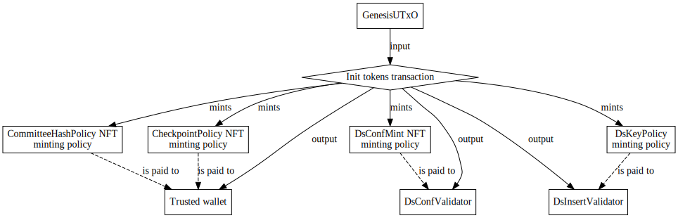
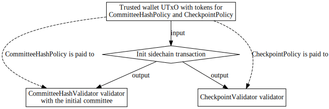
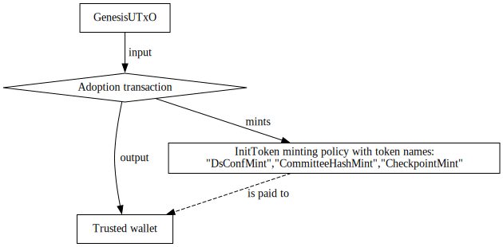
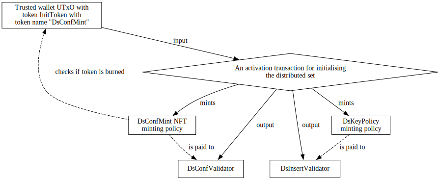

# Flexible Initialisation

## Problem

As discussed in the [Sidechain lifecycle](../Architecture.md#Sidechain-lifecycle)
of the Architecture document, initialisation can be split into two steps:
_Adoption_ and _Activation_.

The current implementation depends on spending the genesis UTxO to initialise
components such as distributed set or checkpoint. This means that everything has
to happen in one transaction, and we can only split these actions by using some
trick (for example pre-minting the NFT for checkpoint and committee hash -- see
the diagrams below). This method works well for previous versions, but it has
it’s limitations:

- adoption transaction is close to the maximum transaction size
- [protocol update](./01-UpdateStrategy.md) requires reinitialising components
  (e.g. distributed set and checkpoint)
- no clear abstraction boundary between adoption and activation (with pre-minting)

The following diagram depicts a transaction currently used to premint tokens
for initialization.
Note that the distributed set has some complexities in its initialization to
have a trustless setup.



Once the tokens are preminted, a separate transaction must pay the
aforementioned tokens to the appropriate validators.
The following diagram depicts this scenario.



## Solution

To solve these issues, we introduce a new minting policy, called `InitToken`.
For each component we want to initialise later, we mint one `InitToken` at the
time of adoption. These tokens will have the same currency symbol, but each of
them will have a unique token name, pointing to their corresponding component,
to prevent misuse (or intentional abuse).

InitTokens can only be minted when the genesis UTxO is spent (or when a valid
update certificate was submitted). For the components themselves, we will
require the `InitToken` with a matching token name to be burnt.

With this change, we will be unable to run adoption and activation in one
transaction, but in turn, we will have more flexibility to break up the
activation action into granular steps. This could have the added benefit of not
committing too much to a sidechain in the early phase, by only
submitting/initialising the bare minimum features at adoption, and being able
to activate features one-by-one.

## Implementation
The implementation will include the addition of `InitToken`, and modification
of `DsConfMint`, `CommitteeHashCurrencySymbol` and `CheckpointCurrencySymbol`.

#### InitToken
The following implementation is based on the existence of an Update strategy in
place, but it can be simply modified to accomodate an implementation without
update strategy, by removing the update certificate verification from the
`InitToken` mint requirement.

`InitToken` will be parameterised by `GenesisUTxO` and the redeemer will be the
following sum type:

**Redeemer:**

```hs
data InitTokenMode
    = Genesis
    | Update UpdateCertificate
    | Use
```
The policy verification differs based on the InitTokenMode:

`Genesis`:
- mint amount must be positive
- `GenesisUTxO` must be consumed in the same transaction

`Update`:
- mint amount is positive
- valid update certificate is supplied

`Use`:
- mint amount is negative

Note, there are no verifications wrt. the exact amount of the minted tokens, or
the proper naming of the token names. These are taken care of by the off-chain
part of our code. However, this is based on the assumption, that the sidechain
initialiser is an honest player.

As a diagram, a transaction which corresponds to the `Genesis` mode is
depicted below.



#### DsConfMint

`DsConfMint`, `CommitteeHashCurrencySymbol` and `CheckpointCurrencySymbol` are
all following a similar implementation, so we are only going detail the
necessary changes to `DsConfMint`.

We’re removing the dependency on the `GenesisUTxO` from the parameter of
`DsConfMint`, and replacing it with the currency symbol for `InitToken` instead:

```diff
- newtype DsConfMint = DsConfMint {dscmTxOutRef :: TxOutRef}
+ newtype DsConfMint = DsConfMint {dscmInitTokenCurSym :: CurrencySymbol}
```

We also change the verification logic:
- removing genesis utxo check
- adding check, verifying that exactly one token  with the currency symbol of
  `dscmInitTokenCurSym` and the token name of `DsConfMint` was burnt in the
  transaction

As a diagram, initialisation of the distributed set amounts to submitting a
transaction of the following form where we note that the only difference from
the current setup is that is that `DsConfMint` checks if `InitToken` is burned
and the other required validators minting policies are the same as before.


