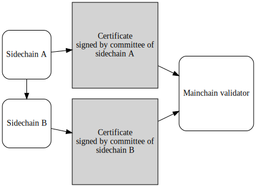
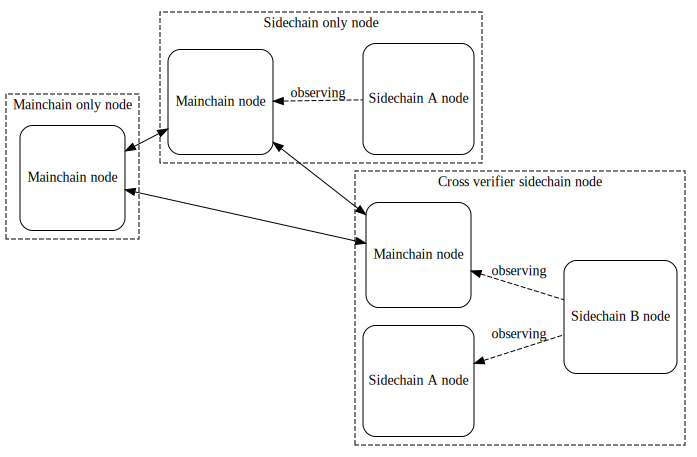
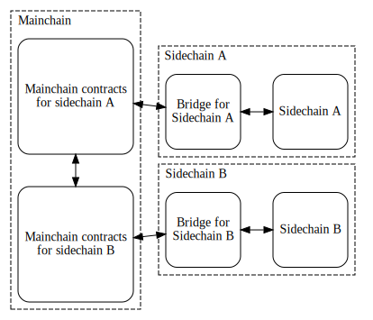

# Cross-Chain Verification

## Problem

We want to expand the initial design with one mainchain and one singular
sidechain, to a more open system with more than one sidechains. This opens up
a lot of possibilities, as cross-chain token and data transfer, or cross-chain
verification, etc. This document will go into detail about the latter, but it
also lays the groudwork for all cross-chain capabilities.

Cross-chain verification will be a special configuration of two or more
sidechains, where sidechain A will require both its own committee and the
committee of sidechain B to sign sidechain certificates. If there are more
than two sidechains are involved, all of them will create certificates.



## Assumptions

As we open up a huge flexibility with cross-chain capabilities, it brings it's
own challenges: sidechains will need to be compatible with each other, account
for different modular options and different consensus mechanisms. To limit the
variations and possibilities, we have to establish a few constraints:
- All participating sidechains must connect to the same mainchain network
- All participating sidechains must use the same major version of the mainchain
  SDK
- Sidechains may use different verification modules (ECDSA, BLS, etc.)

This document will also depend on some earlier proposals, namely:
- [Update strategy with VersionOracle][update_str]
- [ModularCommitteeCertificateVerification][modular_ver]

## High level design

As it was established in the original [Proof-of-Stake Sidechains white paper][whitepaper],
there is a hierarchical relation to mainchain and sidechain: all sidechain nodes
have to directly observe the mainchain too, while not all mainchain nodes have
to follow sidechains. Sidechains participating in a cross-chain verification
configuration will follow a similar relationship:
- Cross verified sidechain does not need to have directly observe the verifier
  chain(s)
- Cross verifier sidechain(s) will have to observe the verified chain

As a summary, we could distinguish three different actors in the same network:



As sidechains participating in a cross-chain verification configuration might
be completely different blockchains (as long as they are compatible with the
trustless-sidechain protocol), ideally we want to minimise the direct
interaction required between the two bridges. This design relies on the
mainchain to trigger events between the sidechains.



The workflow of a regular certificate creation and verification is as follows:
1. Merkle tree is built, and Merkle root insertion message is generated
2. Message is signed by committee members
3. Signatures aggregated into a certificate
4. Certificate is sent to mainchain contract, `MerkleRootToken` minted

A cross-chain verification workflow will follow the exact same flow, with the
only difference in the 4th step, minting a `PartialMerkelRootToken` instaed of
`MerkleRootToken`. Sidechain B, observing the validator address of sidechain A
will be able to follow the process:

1. Committee observing `PartialMerkleRootToken` mint
2. Committee verifies the Merkle root, creates and signs a message
3. Signatures aggregated into certificate
4. Certificate is sent to mainchain contract, `MerkleRootToken` minted
5. `PartialMerkleRootToken`s aggregated into the final `FinalMerkleRootToken`

In a cross-chain verified sidechain, the `FUELMintingPolicy` will only accept
the `FinalMerkleRootToken`.

## Implementation

The changes required for cross-chain verification will touch the following
areas:
1. Initialisation/update (using VersionOracle)
2. Merkle root mint
3. Merkle root aggregation

#### 1. Initialisation/update (using VersionOracle)

We will have to be able to initialise a sidechain with some knowledge about the
other chain. We will use the `VersionOracle` for this purpose. As it was
mentioned in the [Update Strategy][update_str] document, the `VersionOracle`
of a sidechain is the Single Source of Truth holding the reference scripts of
the validators and currency symbols. Reference scripts are attached to UTxOs
at the `VersionOracleValidator` address, with a datum called `VersionOracle`
storing the `scriptId`, a unique ID for the Plutus script, and the `version`
number. Note that this version number is local to the given sidechain, and has
nothing to do with the library version. A `VersionOracleToken` is attached to
each UTxO to prove the authenticity of the oracle.

By knowing the address of `VersionOracleValidator` and the currency symbol of
`VersionOracleToken`, we can access all validators and currency symbols of the
sidechain. We will use this fact, to access the on-chain code of sidechain A
from the off-chain code of sidechain B.

We will reserve a range of `scriptId`s for foreign sidechains from 100-119,
where 100-109 are the `VersionOracleValidator`s, and 110-119 are the respective
`VersionOracleToken`s (e.g. 100: `ForeignVersionOracleValidatorA`,
101: `ForeignVersionOracleValidatorB`, 110: `ForeignVersionOracleTokenA`,
111: `ForeignVersionOracleTokenB`)

At initialisation or protocol update, the above mentioned reference scripts of
the verifier chain will be deployed, with a special version of
`FUELMintingPolicy`, which accepts `FinalMerkleRootToken` instead of
`MerkleRootToken`.

#### 2. Merkle root mint

For the cross verified chain, we will use a special version of `MerkleRootToken`
and `MerkleRootValidator`, we will call there `PartialMerkleRootToken` and
`PartialMerkleRootValidator` respectively. Their implementation will be
identical to their non-cross-chain counterparts, with the following differences:

As `PartialMerkleRootValidator` will hold multiple `PartialMerkleRootToken`s
with the same merkle root, one from each sidechain, we will need to
differentiate between them, and make sure we have one token from each required
sidechain. To achieve this, we will add a datum to the UTxO of the merkle root,
with this information. We will use the `VersionOracleToken` currency symbol (we
will call this `VersionOracleRef`) to identify the verifier sidechain:

```haskell
data MerkleRootDatum = MerkleRootDatum
    { verifierVersionOracleRef :: VersionOracleRef
    }

newtype VersionOracleRef = VersionOracleRef CurrencySymbol
```

As a general rule, scripts are parameterised by their own `VersionOracleRef`,
however in this case, `PartialMerkleRootToken` minting policy will be
parameterised by the `VersionOracleRef` of the verifier sidechain, while
`PartialMerkleRootValidator` will be parameterised by the `VersionOracleRef`
of the verified sidechain. This is justified by the fact that we send a
certified root form sidechain B to A.

The verification of `PartialMerkleRootToken` will be different in the following
three points:
- existence of reference input pointing to `previousMerkleRoot` is not checked
- verify that `verifierVersionOracleRef` in the output datum is identical to the
  parameter `VersionOracleRef`
- burning of the token is allowed, if a `FinalMerkleRoot` is minted with the
  same Merkle root as it's token name

Unlike `MerkleRootValidator`, `PartialMerkleRootValidator` will allow spending,
if the `MerkleRootToken` is burnt in the same UTxO.

#### 3. Merkle root aggregation

A new endpoint will be implemented to aggregate `PartialMerkleRootToken`s,
and mint a single `FinalMerkleRootToken`.

`FinalMerkleRoot` is parameterised by the list of `VersionOracleRef`s of the
verifier sidechains.
Minting a `FinalMerkleRoot` verifies that for each of the `VersionOracleRef`s
in the list, there is one `PartialMerkleRootToken` burnt with the same
Merkle root as the token name.

One important detail is that `FinalMerkleRootToken` will take scriptId of
`MerkeRootToken` so there's no need to change the implementation of
`FUELMintingPolicy`.

## Alternative design considerations

#### Direct chain to chain communication

This design is trying to minimise the direct interaction between sidechains,
by sacrificing speed: aggregating signatures on the verified sidechain,
submitting sidechain certificate to mainchain and aggregating signatures on
the verifier chain has to occur in sequence. However, it's possible to
implement some way of direct communication between sidechains to parallelise
signature aggregation without any changes to the mainchain specification and
workflow.

#### Incremental aggregation

To eliminate the need for a separate aggregation step, it would be possible
to incrementally aggregate with each Merkle root insertions. First one of
the Merkle roots is inserted, then the second Merkle root burning the first one
while keeping track of the sidechain identifiers.
This approach has it's issues: we could run into a race condition, when two
or more sidechain submit their Merkle root at the same time, without aggregating
them. Defining an order could solve this issue, but it could seriously slower
the process, and is harder to optimise.

#### Non-aggregated variant

Instead of aggregating `PartialMerkleRootToken`, we could use them directly
in the `FUELMintingPolicy`, checking all tokens. However, this pushes a lot of
excess memory and execution cost to all claim actions, making the costs higher.


[whitepaper]: https://eprint.iacr.org/2018/1239.pdf
[update_str]: ./01-UpdateStrategy.md
[modular_ver]: ./05-ModularCommitteeCertificateVerification.md
