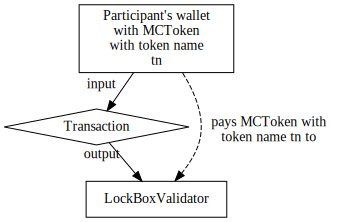
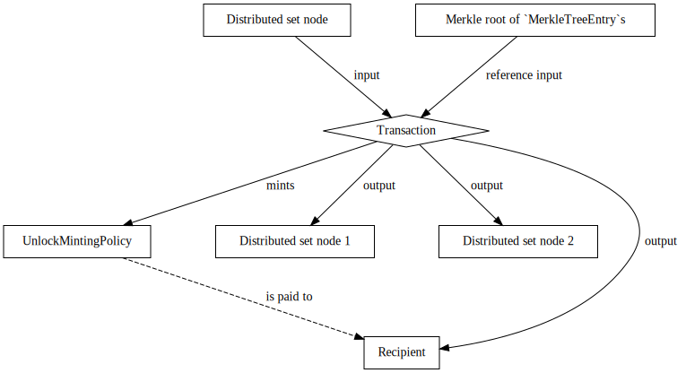
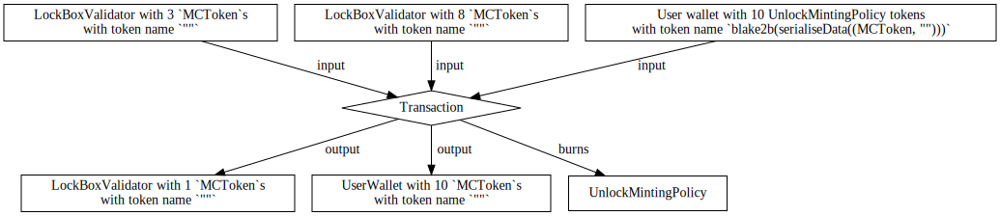

# Modularising Token Handling

## Requirements
The end goal is to be able to deploy two types of sidechains:

1. fuel tokens are owned by the sidechain (lock/unlock), a wrapped token exists
   on the mainchain (mint/burn) (current flow)

2. fuel tokens are owned by the mainchain, a wrapped token exists on the
   sidechain

## Background
The current semantics of the onchain Plutus code to provide the
mechanism for which an asset is transferred between the mainchain and the
sidechain (vice versa) is realized with the `FUEL` token which accomplishes the
following:

- A transfer from *mainchain* to *sidechain* burns a participant's `FUEL`
  tokens with a specified the sidechain recipient (as redeemer).
  Thus, for the sidechain recipient to receive their corresponding sidechain
  tokens in the sidechain, the Bridge must observe that a mainchain transaction
  has burnt `FUEL`, and unlock the corresponding sidechain tokens to the
  recipient on the sidechain (by e.g. minting such tokens).

- A transfer from *sidechain* to *mainchain* amounts to creating a Merkle root
  of such transactions (i.e., a *sidechain certificate*) which are posted to
  the mainchain (via the Bridge), and later participants may claim `FUEL` from
  a specified Merkle root by minting `FUEL` tokens.

The key point is this -- the current mechanism implements this transfer via
*minting* and *burning* of some distinguished token.
We call such a token a *wrapped token*.

In general, the mechanism for which coins are transferred between sidechains
and back at a fixed (or otherwise deterministic) exchange rate is a called a
*two-way peg*[^refEnablingBlockchainInnovations].

We call the currently implemented mechanism which implements the two-way peg on
the mainchain via minting and burning of a wrapped token a *mainchain wrapped
token transfer*.

This SIP proposes an alternative method (which may be used in place of the
*wrapped token*) to implement the two-way peg on the mainchain.
So, instead of minting and burning a wrapped token, we propose to take any
arbitrary token on the mainchain, say `MCToken`, and implement the two-way peg
as follows.

- Transfers of `MCToken` from *mainchain* to *sidechain* amounts to
  participants sending their `MCToken` to a distinguished address that contains
  the sidechain recipient, call such an address a *lock box address*,
  which *locks* the participant's `MCToken`s.
  Thus, for a sidechain recipient to receive their corresponding sidechain
  tokens in the sidechain, the Bridge must observe transactions which lock
  `MCToken`s at a lock box address and mint the corresponding amount to the
  sidechain recipient.

- Transfers of `MCToken` from *sidechain* to *mainchain* amounts to (again)
  creating a Merkle root of such transactions which are posted to the mainchain
  (note this reuses the existing mechanism),
  and later participants may claim their `MCToken`s by using some specified
  Merkle root to spend UTxOs at a lock box address for which `MCToken` is
  locked at and finally pay the locked `MCToken`s to themselves.
  In essence, Merkle roots give participants permission to *unlock* previously
  locked `MCToken`s to claim themselves.

We call a two-way peg implemented this way on the mainchain via locking
and unlocking of `MCToken`s a *mainchain lock/unlock transfer*.

The implementation of a mainchain lock/unlock transfer is the primary focus of
this proposal, and we will show how the current system can be augmented to
allow both a lock/unlock transfer of assets in Cardano while supporting the
mint/burn mechanism as well.

## Plutus Design Specification.
This design will have a `LockBoxValidator` which will be the lock box address
for `MCToken`s.
In the original specification, recall that participants claimed `FUEL` tokens
from Merkle roots.
This proposal will allow participants to claim an alternate token (in addition
to `FUEL` tokens), `UnlockMintingPolicy`, from Merkle roots for which burning
of `UnlockMintingPolicy` allows unlocking `MCToken`s residing at
`LockBoxValidator` addresses.
Moreover, to ensure that mainchain recipients may only claim at most the number
of `MCToken`s specified from the sidechain, we will also require a validator,
`LockConfigValidator`, which holds as datum information regarding
`UnlockMintingPolicy` and `LockBoxValidator` (to avoid circular dependencies);
and we will also need an NFT `LockConfigOraclePolicy` which will uniquely
identify a `LockConfigValidator`.

In summary, the design will require the following Plutus scripts.
- `LockBoxValidator`: the validator address which will be the lock box address.
- `UnlockMintingPolicy`: a minting policy which is minted from Merkle roots and
  whose burning unlocks `LockBoxValidator`.
- `LockConfigValidator`: a validator which always returns false which as its
  datum contains necessary information to handle the circular dependencies
  between `LockBoxValidator` and `UnlockMintingPolicy`.
- `LockConfigOraclePolicy`: an NFT to uniquely identify `LockConfigValidator`.

We define these scripts more precisely.

We first define `LockConfigOraclePolicy` and `LockConfigValidator`.

`LockConfigOraclePolicy` is an NFT (and hence must be parameterized by a UTxO)
that must be paid to a `LockConfigValidator` (which it uniquely identifies).
`LockConfigValidator` never succeeds and has as its datum
```haskell
data LockConfigDatum = LockConfigDatum
    { lockBoxValidatorAddress :: Address
    , unlockMintingPolicyCurrencySymbol :: CurrencySymbol
    }
```
which contains the address of `LockBoxValidator` and the currency symbol of a
specified `UnlockMintingPolicy`.

In a sense, `LockConfigValidator` and `LockConfigOraclePolicy` provide a
static read-only configuration of this system that *must* be run first to
initialize the system.
The following diagram depicts a transaction which executes this setup.


Now, we define `LockBoxValidator`.

`LockBoxValidator` will be parameterized by `LockConfigOraclePolicy`.
`LockBoxValidator`'s redeemer does not matter (and hence may be the unit type),
and as datum it must contain a `ByteString` of the address of the sidechain
recipient.
`LockBoxValidator` validates only if all of the following are satisfied:

-  there exists a reference input which holds `LockConfigOraclePolicy` that has
   as datum `LockConfigDatum`; and

-  `unlockMintingPolicyCurrencySymbol` burns at least one token (i.e., mints
   strictly less than 0 tokens).

Note that `LockBoxValidator` simply forwards all of its verifications to
`UnlockMintingPolicy` which does most of the heavy lifting.

So, all that remains is to define `UnlockMintingPolicy`.

Recall that `FUELMintingPolicy` mints `k` tokens with token name
`FUEL` only if `k` tokens were transferred over to the mainchain recipient from
the sidechain; and `FUELMintingPolicy` may be burned arbitrarily.
`UnlockMintingPolicy` will be essentially identical to `FUELMintingPolicy`
except that minting will be generalized to allow for different token names that
will be the hash of an asset's currency symbol and token name, and
`UnlockMintingPolicy` will burn `k` tokens with token name `tn = blake2b
(serialiseData (MCToken currency symbol, MCToken token name))` only if `k`
`MCToken`s with the specified token name are unlocked from a `LockBoxValidator`.

More precisely, `UnlockMintingPolicy` will be parameterized by

- `SidechainParams`;

- the currency symbol of
  [`MerkleRootTokenMintingPolicy`](https://github.com/mlabs-haskell/trustless-sidechain/blob/master/docs/Specification.md#3-transfer-fuel-tokens-from-sidechain-to-mainchain)
  to ensure that sidechain transactions have been previously signed by the
  committee;

- the currency symbol of [`DsKeyPolicy` for keys in the distributed set](https://github.com/mlabs-haskell/trustless-sidechain/blob/master/docs/DistributedSet.md); and

- the currency symbol of `LockConfigOraclePolicy` for identifying
  `LockConfigValidator` which contains as datum `LockConfigDatum`.

Note that `UnlockMintingPolicy` is parameterized by the same things as
`FUELMintingPolicy` except for the extra last currency symbol.

As redeemer, `UnlockMintingPolicy` will take the following data type.
```haskell
data UnlockBurnInfo = UnlockBurnInfo
  { unlockBurnCurrencySymbol :: CurrencySymbol
  , unlockBurnTokenName :: TokenName
  }

data UnlockMintInfo = UnlockMintInfo
  { unlockMintMerkleTreeEntry :: MerkleTreeEntry
  , unlockMintMerkleProof :: MerkleProof
  }

data UnlockMintingPolicyRedeemer
  = UnlockMint UnlockMintingInfo
  | UnlockBurn UnlockBurnInfo
```
Again, note the similarities to `FUELRedeemer` from the main specification --
`UnlockMintingPolicyMint` is identical to `SideToMain`, but `UnlockMintingPolicyBurn` is different
as burning `UnlockMintingPolicy` does *not* correspond to transferring tokens from
mainchain to sidechain and instead corresponds to unlocking `MCToken`s from a
`LockBoxValidator` address.

Now, we discuss the conditions for which `UnlockMintingPolicy` mints.

We first propose some changes to the `MerkleTreeEntry` (i.e., transactions sent
over from the sidechain) data type from the main specification.
Since `MCToken` may have an arbitrary token name and the current
`MerkleTreeEntry` assumes the token name is `FUEL`, we propose to modify
`MerkleTreeEntry` as follows.

```diff
+data FUELClaimEntryInfo = FUELClaimEntryInfo
+  { index :: Integer -- 32 bit unsigned integer, used to provide uniqueness among transactions within the tree
+  , amount :: Integer -- 256 bit unsigned integer that represents amount of tokens being sent out of the bridge
+  , recipient :: ByteString -- arbitrary length bytestring that represents decoded bech32 cardano address
+  , previousMerkleRoot :: Maybe ByteString -- previousMerkleRoot is added to make sure that the hashed entry is unique
+  }

+data LockBoxEntryInfo = LockBoxEntryInfo
+  { index :: Integer -- 32 bit unsigned integer, used to provide uniqueness among transactions within the tree
+  , amount :: Integer -- 256 bit unsigned integer that represents amount of tokens being sent out of the bridge
+  , recipient :: ByteString -- arbitrary length bytestring that represents decoded bech32 cardano address
+  , currencySymbol :: CurrencySymbol -- the currency symbol to unlock from a lock box
+  , tokenName :: TokenName  -- the token name of the currency symbol to unlock from a lock box
+  , previousMerkleRoot :: Maybe ByteString -- previousMerkleRoot is added to make sure that the hashed entry is unique
+  }

-data MerkleTreeEntry = MerkleTreeEntry
+data MerkleTreeEntry
+  = FUELClaimEntry FUELClaimEntryInfo
+  | LockBoxEntry LockBoxEntryInfo
```
Note the following.
- We renamed the constructor for `MerkleTreeEntry` to `FUELClaimEntry`. This
  allows the sidechain to still transfer FUEL tokens to the mainchain, and
  hence requires no changes to the Bridge for the existing `FUEL` token
  transfer.
- We added a new constructor `LockBoxEntry` which is essentially identical to
  `FUELClaimEntry`, but instead allows the mainchain participant who is to
  unlock some token from a `LockBoxValidator` with the given `currencySymbol`
  and `tokenName`.

Then, `UnlockMintingPolicy` mints (strictly more than 0 tokens) with token name
`tn` only if all of the following are satisfied.

- The redeemer is `UnlockMintingPolicyMint`, and
  `unlockMintingMintMerkleTreeEntry` is a `LockBoxEntry`.

- A `MerkleRootToken` with token name, say `merkleRoot`, is given as a
  reference input at a `MerkleRootTokenValidator` script address.

- `blake2b(serialiseData(unlockMintingMintMerkleTreeEntry))` is in the Merkle root
  `merkleRoot` using as witness the Merkle proof `unlockMintingMintMerkleProof`.

- `blake2b(serialiseData(unlockMintingMintMerkleTreeEntry))` is NOT included in the
  [distributed set](https://github.com/mlabs-haskell/trustless-sidechain/blob/master/docs/DistributedSet.md),
  and is inserted in the distributed set in this transaction (to ensure that
  tokens can be claimed at most once).
  Also, note that the distributed set needs to be modified so that
  `blake2b(serialiseData(unlockMintingMintMerkleTreeEntry))` is added to the
  distributed set only if `UnlockMintingPolicyMint` mints to prevent adversaries from
  maliciously locking someone else's tokens away forever (note that this
  requirement is the same for `FUELMintingPolicy` from the original
  specification).
  More discussion on this will come later.

- The transaction corresponds to the `unlockMintingMintMerkleTreeEntry` in the
  sense that: `UnlockMintingPolicyMint` mints exactly `amount` tokens with
  unique token name `tn = blake2b (serialiseData (currencySymbol, tokenName))`; and there
  exists a transaction output at `recipient` with at least `amount`
  `UnlockMintingPolicyMint` tokens with token name `tn` (see [#280 for the
  security
  proof](https://github.com/mlabs-haskell/trustless-sidechain/issues/290)).

Again, note that this is essentially identical to the conditions given in
[`FUELMintingPolicy` for individual
claiming](https://github.com/mlabs-haskell/trustless-sidechain/blob/master/docs/Specification.md#32-individual-claiming)
except for that we note that the token name `tn` keeps track of the currency
symbol and token name of the `MCToken` that one wishes to unlock.

This will also require a modification to the [distributed
set](https://github.com/mlabs-haskell/trustless-sidechain/blob/master/docs/DistributedSet.md).
Recall that the distributed set only allows the hash of a `MerkleTreeEntry` to
be inserted in the distributed set only if `FUELMintingPolicy` mints, so
it's clear that the hash of a `MerkleTreeEntry` may be inserted in the
distributed set iff `FUELMintingPolicy` mints.
This condition is needed so that adversaries cannot arbitrarily insert things
in the distributed set potentially locking a participant's tokens away forever
(as otherwise the system will believe that the honest participant is attempting
to "double spend" their tokens).
Indeed, this condition must be generalized so that either:

- if `MerkleTreeEntry` is `FUELClaimEntry`, then the hash of the
  `FUELClaimEntry` may be inserted in the distributed set only if
  `FUELMintingPolicy` mints; or

- if `MerkleTreeEntry` is `LockBoxEntry`, then the hash of the
  `LockBoxEntry` may be inserted in the distributed set only if
  `UnlockMintingPolicy` mints.

Finally, `UnlockMintingPolicy` with token name `tn` burns (mints strictly
less than 0 tokens) `k > 0` tokens only if all of the following are all
satisfied.
- The redeemer is `UnlockMintingPolicyBurn`.
- `tn` is `blake2b(serialiseData (unlockMintingBurnCurrencySymbol, unlockMintingBurnTokenName))`
- There exists a reference input with `LockConfigOraclePolicy` which has as
  datum `LockConfigDatum`.
- Let `ki` denote the sum of transaction *inputs* with currency symbol
  `unlockMintingBurnCurrencySymbol` and token name `unlockMintingBurnTokenName`
  at address `lockBoxValidatorAddress`. Let `ko` denote the sum of all
  transaction *outputs* with currency symbol `unlockMintingBurnCurrencySymbol`
  and token name `unlockMintingBurnTokenName` at address
  `lockBoxValidatorAddress`. Then, we verify that `ko >= ki - k` i.e., there
  are at least `ki - k` tokens with currency symbol
  `unlockMintingPolicyCurrencySymbol` and token name
  `unlockMintingBurnTokenName` that are claimable by someone else in the future
  in `LockBoxValidator`s.
- The `lockBoxValidatorAddress` outputs are "relatively small"[^relativelySmall].

[^relativelySmall]: This condition is a technical condition where adversaries
  can add a whole bunch of garbage tokens to an output to make the output far
  too large to be able to be spent, thus locking the tokens away forever.

This completes the definitions for a design of a mainchain lock/unlock
transfer.

## Workflow
This section discusses the entire workflow.
We will assume that the sidechain has been initialized appropriately.

**Workflow: transferring `MCToken`s from mainchain to sidechain**
1. On the mainchain, a participant posts a transaction which pays some amount
   of `MCToken`s to the validator address `LockBoxValidator`.
2. Sidechain nodes observe that 1. has occurred on the mainchain, and hence
   (after the transaction is stable) includes the corresponding transaction in
   the sidechain where sidechain nodes determine the sidechain recipient from
   the datum of `LockBoxValidator`.
   Also, sidechain nodes *must* verify that the UTxO in the mainchain from 1.
   is "relatively small" to preventing transaction size issues in the next
   workflow.

The following diagram depicts the transaction for step 1 of the workflow.



**Workflow: transferring from sidechain to mainchain**
1. On the sidechain, a participant posts a transaction which burns `MCToken`'s
   corresponding sidechain tokens.
2. Eventually, transactions from 1. are bundled up into a Merkle root, and
   the Merkle root is signed by the committee and posted to the mainchain.
3. A mainchain recipient of a transaction from 1. claims their
   `UnlockMintingPolicy` tokens by posting a transaction on the mainchain.
4. After a mainchain recipient from 3. has their `UnlockMintingPolicy` tokens, they
   must post at least one transaction to burn their `UnlockMintingPolicy` tokens in
   exchange for `MCToken`s sitting at `LockBoxValidator` addresses.
   Indeed, they may have to spend multiple `LockBoxValidator` addresses to
   receive their full entitled amount, and hence offchain code needs to make
   an appropriate selection of `LockBoxValidator` addresses to consume.

The following diagram depicts the transaction for step 3 of the workflow.



And the following diagram depicts the transaction for step 4 of the workflow
where a participant claims `10` `MCToken`s with token name `tn`.



There's one point of ambiguity in the workflow for transferring from sidechain
to mainchain.
That is, how do participants choose which selection of `LockBoxValidator`
addresses to use to claim their `MCToken`s?

Assuming that participants will always act in their best interests,
participants will most likely always try to pick the largest
`LockBoxValidator`s in effort to minimize fees.
In effect, this means that the total number of `LockBoxValidator`s that will be
consumed will be at most the number of `LockBoxValidator`s that are currently
present onchain.
Indeed, it would be nice if there were such an analysis / heuristics to give a
schedule which minimizes the maximum amount of transactions any participant
would need to spend to claim their `MCToken`s.
Some heuristics which don't work (i.e., are still significantly worse than an
optimal solution) for participants to follow include picking the largest
`LockBoxValidator` or picking the smallest `LockBoxValidator` that is larger
than the amount a user wants to claim.

Alternatively, the approach that MuesliSwap[^refMuesliSwap] argues for is that
participants will not act greedily and always pick the largest
`LockBoxValidator` as participants are aware of each other's competing
existences, and so if they all tried to pick the largest `LockBoxValidator`,
they will all block each other, and then must attempt to use a less than
optimal combination of `LockBoxValidator`s which may have already been spent --
resulting in suboptimal play for themselves.
Hence, they argue that leaving all `LockBoxValidator`s as a "free for all"
essentially "regulates itself".

So, following that approach, this means that offchain code should build transactions
using a random selection of `LockBoxValidator`s in effort to reduce UTxO
contention -- see CIP2[^refCIP2] for details.

## Design Discussion and Related Work
This section discusses the design with other potential designs, and relevant
related work in other sidechains.

First, we will define some notation.
The design described above where the we mint an intermediate token
(`UnlockMintingPolicy`) in one transaction, then burn the intermediate token to
unlock `MCToken`s locked at a `LockBoxValidator` address will be called a
*proxied unlock mechanism*.
In this section, we will discuss an alternative mechanism, which we will call a
*direct unlock mechanism*, for which claiming of Merkle roots directly unlock
`MCToken`s from a `LockBoxValidator` in a *single* transaction.

It's easy to see that a direct unlock mechanism will most likely be a little
bit more efficient as claiming can be done in a single transaction (as opposed
to two in the best case).
Unfortunately, there's an issue that sometimes participants will not be able to
always unlock their tokens with this approach.
Consider the following scenario.

1. Alice on the mainchain transfers 100 `MCToken`s to her own sidechain address
   by paying 1 `MCToken` to a `LockBoxValidator` 100 times. So there are 100
   UTxOs at the `LockBoxValidator` address in the mainchain each with a single
   `MCToken`.

2. Bob on the sidechain trades Alice for all of her corresponding sidechain
   tokens of `MCToken`.

3. Bob transfers all of his 100 sidechain tokens that he traded from Alice back
   to the mainchain, so this transaction is eventually saved in a single Merkle
   root that is posted to the mainchain.

4. Bob attempts to unlock the 100 `LockBoxValidator`s each with a single
   `MCToken` on the mainchain in a single UTxO, but this would fail as the
   transaction is too large

Clearly, this motivates why the proxied unlock mechanism (as implemented with
`UnlockMintingPolicy`) as participants can essentially "partially" unlock their
`MCToken`s over multiple transactions, and hence *always* unlock the tokens
they are entitled to.

Note that a direct unlock mechanism has no such feature to "partially" unlock
tokens one is entitled to.
But, a way to fix this scenario in the direct unlock mechanism would be to
allow some participants to "merge" dust UTxOs together into a larger UTxO, then
claim these tokens.
The merging of dust UTxOs could be resolved with the following solutions.

- *Allowing merging of arbitrary lock box addresses.* A first approximation
  suggests that either any participant or the committee itself should sign
  certificates to merge UTxOs -- but both still have the same drawback that
  participants who transferred large transactions from mainchain to sidechain
  must spend dust UTxOs into a large UTxO before unlocking their tokens when
  other honest participants may try to spend such a UTxO *before* the
  participant who requires a large UTxO can unlock it.

- *Only allowing transfer of `MCToken`s to the sidechain if `MCToken`s are sent
  to a unique (or very few) lock box addresses that participants always keep
  adding to*.
  This design would solve the resolve the aforementioned issue as all
  `MCToken`s would be kept in one large distinguished lock box address, but
  unfortunately introduces new concurrency issues as all participants must
  spend the same UTxO.

  This solution will be more fully sketched out in another
  [section](#alternate-plutus-design-specification).

- *A mix of both solutions.* One may consider collecting locked `MCToken`s into
  a single distinguished large UTxO when uniquely minting Merkle roots, and
  only allow unlocking of `MCToken`s at the distinguished large UTxO that
  corresponds to the Merkle root.

  This could potentially help mitigate the concurrency issues of the previous
  solution, but puts more burden on the participant submitting the Merkle root
  for participants to claim their transactions.
  Moreover, such an individual would need to "know" how many lock box addresses
  to collect requiring some changes to the Merkle tree to store this
  information.

  This solution will not be sketched out in this document.
  In the next section, we will see that this is essentially a straightforward
  interpretation of Drivechain's solution.

### Related work
Some related work suggests the following solutions
- Drivechain[^refDrivechain] for BitCoin sets the lock box address to be an
  "anyone can spend" address, so via a soft fork, it miners are trusted to
  ensure that the locked `MCToken`s (bitcoins) are only unlocked under
  appropriate conditions.

  Then, when sufficient sidechain to mainchain transfers appear, miners will
  bundle locked `MCToken`s at lock box addresses into a *single large UTxO*,
  then pay this single large UTxO to claim addresses.

  This is essentially the third fix to the direct lock mechanism.
  Note that they fix the slow/poor concurrency problem via allowing *atomic
  swaps* (securely trading mainchain tokens for sidechain tokens [vice versa]
  as an independent deal without going through sidechain nodes) -- something
  that we may want to consider adding to our system as well.

- XClaim[^refXClaim] sets the lock box address to a backing intermediary's
  address who is incentivized to act honestly and allow participants to claim
  their `MCToken` (transferred from sidechain to mainchain) by forcing the
  backing intermediary to deposit collateral which is slashed and reimbursed to
  wrong actors if the backing intermediary behaves incorrectly.

  This approach wasn't taken, and there doesn't seem to be any value to add
  another class of participants in the protocol already.
  Although, it does have the advantage that standard coin selection algorithms
  of a wallet would be used to minimize dust.

- Polkadot[^refPolkadot] suggests that to lock transactions in Bitcoin, the
  `MCToken`s (Bitcoins) should be paid to some threshold signature script which
  only may be claimed if sufficient committee members have signed the
  transaction.

  This approach of committee members individual signing transactions
  individually does not map nicely in the current system with Merkle roots as
  this suggests that the committee members should just individually sign every
  transaction instead of using a Merkle root at all.

## Relation to Existing SIPs
Clearly, the implementation of the token `UnlockMintingPolicy` is essentially
identical to `FUELMintingPolicy` with minor changes in the mint mechanism, and
large overhaul to the burn mechanism.

Luckily, the [update
strategy](https://github.com/mlabs-haskell/trustless-sidechain/blob/master/docs/SIPs/01-UpdateStrategy.md#3-fuelmintingpolicy-transaction-token-pattern-implementation)
provides exactly the modularity to swap out the logic of minting or burning
of `FUELProxyPolicy` (recall that in the update strategy, `FUEL` tokens are
regarded as `FUELProxyPolicy` tokens).
So, one could replace the tautology burning policy (recall that this is the
default for `FUELProxyPolicy`) with the new conditions of the `UnlockMintingPolicy`
to instead have have a mainchain lock/unlock transfer.

## Alternate Plutus Design Specification
This section sketches an alternate design which should also work, but has
inferior concurrency.

The key ideas of this design are as follows.

- The system is initialized by minting an NFT, `LockBoxOracleMintingPolicy`,
  (or a small number of NFTs -- more discussion on this
  [later](#improving-the-concurrency)), which will uniquely identify a
  `LockBoxValidator`.

  This `LockBoxValidator` will contain *all* `MCToken`s that are transferred
  from mainchain to sidechain.
  To simplify matters, we will assume that each `LockBoxValidator` uniquely
  identified by a `LockBoxOracleMintingPolicy` only contains a single `MCToken`.

  This will also help prevent issues where adversaries may pay a large amount
  of garbage tokens to a validator and preventing it from being unlocked.

- Transferring `k` `MCToken`s from mainchain to sidechain amounts to consuming
  the `LockBoxValidator` uniquely identified by a `LockBoxOracleMintingPolicy`,
  and adding the participant's `k` `MCToken`s to a new `LockBoxValidator`
  output uniquely identified by `LockBoxOracleMintingPolicy`.

- Transferring `k` `MCToken`s from sidechain to mainchain amounts to consuming
  the `LockBoxValidator` uniquely identified by a `LockBoxOracleMintingPolicy`,
  and moving `k` `MCToken`s already sitting at `LockBoxValidator` to the
  participant's wallet, and paying the remaining `MCToken`s to a new
  `LockBoxValidator` output uniquely identified by
  `LockBoxOracleMintingPolicy`.

  As a technicality, the unlocking of `LockBoxValidator` will be implemented
  with the help of another minting policy, `UnlockMintingPolicy`, which will be
  similar to `FUELMintingPolicy` with the only difference being that its token
  name is the hash of the cbor serialization of a currency symbol and token
  name.
  In other words, `UnlockMintingPolicy` will be essentially identical to the
  first design, except that it may be burnt arbitrarily.

We define the aforementioned scripts more precisely.

`LockBoxOracleMintingPolicy` will be an NFT and hence must be parameterized by
a UTxO to ensure that it is itself unique.
To have a trustless setup, one may parameterize the NFT with the address of
`LockBoxValidator` to ensure that the NFT is paid to `LockBoxValidator`.

`LockBoxValidator` must be parameterized by the currency symbol of
`LockBoxOracleMintingPolicy` and `UnlockMintingPolicy`.

As datum, `LockBoxValidator` will store a single Cardano asset that it will
lock.
Thus, `LockBoxValidator` will have as datum the following data type.
```haskell
data LockBoxDatum = LockBoxDatum
    { lockedCurrencySymbol :: CurrencySymbol
    , lockedTokenName :: TokenName
    }
```

As redeemer, `LockBoxValidator` will take the following data type.
```haskell
data LockBoxValidatorRedeemer
    = Lock
        { lockSidechainRecipient :: ByteString
            -- ^ The sidechain recipient.
        }
    | Unlock
        { unlockCurrencySymbol :: CurrencySymbol
        , unlockTokenName :: TokenName
        }
```

Then, `LockBoxValidator` will succeed in two cases: either a participant is
locking some `MCToken`s and adding to the locked tokens in the
`LockBoxValidator`; or a participant is claiming their tokens from the
`LockBoxValidator`.

So, in the former case `LockBoxValidator` succeeds only if the following are
all satisfied.

- The `LockBoxValidatorRedeemer` is `Lock`.

- There exists a script output at the `LockBoxValidator` address with the
  `LockBoxOracleMintingPolicy` which has the same datum as the current
  `LockBoxValidator`.
  Note that this `LockBoxValidator` should also be "relatively small".

- Let `ki` denote the number of `lockedCurrencySymbol`s with token name
  `lockedTokenName` at the current `LockBoxValidator` address.
  Then, the unique `LockBoxValidator` output identified by
  `LockBoxOracleMintingPolicy` must have strictly more than `ki`
  `lockedCurrencySymbol`s with token name `lockedTokenName`.

Indeed, if we let `ko` denote the number of `lockedCurrencySymbol`s with token
name `lockedTokenName` at the script output `LockBoxValidator` uniquely
identified by `LockBoxOracleMintingPolicy`, then the Bridge will interpret this
transaction to mean `ko - ki` tokens were transferred from mainchain to
sidechain with recipient `sidechainRecipient`  (from the `LockBoxValidatorRedeemer`).

The following diagram depicts this scenario.


As for the other case, when a participant wishes to claim tokens transferred
from the mainchain, `LockBoxValidator` succeeds only if the following are all
satisfied.

- The `LockBoxValidatorRedeemer` is `Unlock`.

- `UnlockMintingPolicy` mints `k` tokens with token name `tn` for which `tn` is
  `blake2b(serialiseData (unlockCurrencySymbol, unlockTokenName))`.

- The datum `LockBoxDatum` satisfies `lockedCurrencySymbol ==
  unlockCurrencySymbol` and `lockedTokenName == unlockTokenName`.

- Let `ki` denote the number of tokens with `unlockCurrencySymbol` and
  `unlockTokenName` at this current address. Then, there must exist a script
  output at the `LockBoxValidator` address with the
  `LockBoxOracleMintingPolicy` which has the same datum as the current
  `LockBoxValidator` and at least `ki - k` tokens of `unlockCurrencySymbol`
  token name with `unlockTokenName`

So, all that remains is to define `UnlockMintingPolicy`.
This is the same as the first design except that `UnlockMintingPolicy` may be
burned arbitrarily and it does not need to be parameterized by `LockConfigOraclePolicy`.
Hence, we do not exhaustively write this out a second time.

We can depict the transaction of unlocking tokens with the below diagram.


### Improving the concurrency
Indeed, we can have multiple `LockBoxValidator`s for the same currency symbol
uniquely identified by multiple NFTs.
The maximum number of such `LockBoxValidator`s should be relatively small so we
can be certain that they can all fit in a single transaction ensuring that
users are always able to claim their tokens from the sidechain.

## Conclusion
Two designs were presented for the alternate transfer mechanism.
There are tradeoffs for both implementations and its unclear if there is a
clear winner for either of the solutions.

[^refEnablingBlockchainInnovations]: Back, A., Corallo, M., Dashjr, L.,
Friedenbach, M., Maxwell, G., Miller, A.K., Poelstra, A., Timón, J., & Wuille,
P. (2014). Enabling Blockchain Innovations with Pegged Sidechains.

[^refDrivechain]: P. Sztorc. Drivechain - The Simple Two Way Peg, November 2015.
<http://www.truthcoin.info/blog/drivechain/>

[^refXClaim]: Zamyatin, Alexei, et al. "XCLAIM: Trustless, Interoperable,
  Cryptocurrency-Backed Assets." 2019 IEEE Symposium on Security and Privacy
  (SP), IEEE, 2019, pp. 193–210, <https://doi.org/10.1109/SP.2019.00085>.

[^refProofOfStakeSidechains]: Gazi, Peter, et al. "Proof-of-Stake Sidechains."
  2019 IEEE Symposium on Security and Privacy (SP), IEEE, 2019, pp. 139–56,
  <https://doi.org/10.1109/SP.2019.00040>.

[^refPolkadot]: Wood, Gavin. *POLKADOT: Vision for a Heterogeneous MULTI-CHAIN
  Framework*, 10 Nov. 2016, <https://assets.polkadot.network/Polkadot-whitepaper.pdf>.

[^refMuesliSwap]: *-- MuesliSwap -- A Decentralized Token Exchange on Cardano*,
  <https://legacy.muesliswap.com/whitepaper.pdf>. Accessed 26 May 2023.

[^refCIP2]: Vries, Edsko. *CIP 2 - Coin Selection Algorithms for Cardano*,
  <https://cips.cardano.org/cips/cip2/>. Accessed 26 May 2023.
