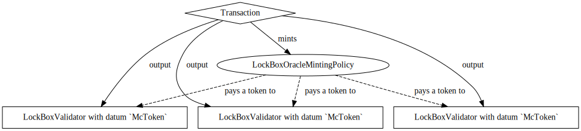
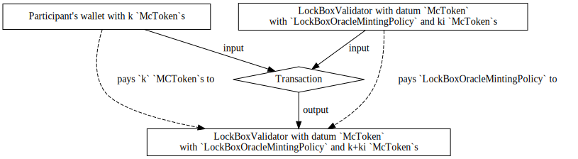
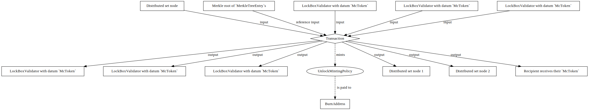

# Modularising Token Handling

## Requirements
The end goal is to be able to deploy two types of sidechains:

1. fuel tokens are owned by the sidechain (lock/unlock), a wrapped token exists
   on the mainchain (mint/burn) (current flow)

2. fuel tokens are owned by the mainchain, a wrapped token exists on the
   sidechain

## Background
The current semantics of the onchain Plutus code to provide the
mechanism for which an asset is transferred between the mainchain and the
sidechain is realized with the `FUEL` token which accomplishes the
following:

- A transfer from *mainchain* to *sidechain* burns a participant's `FUEL`
  tokens with a specified sidechain recipient (as redeemer).
  So, for the sidechain recipient to receive their corresponding sidechain
  tokens in the sidechain, the Bridge must observe that a mainchain transaction
  has burnt `FUEL`, and unlock the corresponding sidechain tokens to the
  recipient on the sidechain (by e.g. minting such tokens).

- A transfer from *sidechain* to *mainchain* amounts to creating a Merkle root
  of such transactions (i.e., a *sidechain certificate*) which are posted to
  the mainchain (via the Bridge), and later participants may claim `FUEL` from
  a specified Merkle root by minting `FUEL` tokens.

The key point is this -- the current mechanism implements this transfer via
*minting* and *burning* of some distinguished token.
We call such a token a *wrapped token*.

In general, the mechanism for which coins are transferred between sidechains
and back at a fixed (or otherwise deterministic) exchange rate is a called a
*two-way peg*[^refEnablingBlockchainInnovations].

We call the currently implemented mechanism which implements the two-way peg on
the mainchain via minting and burning of a wrapped token a *mainchain wrapped
token transfer*.

This SIP proposes an alternative method (which may be used in addition to the
*wrapped token*) to implement the two-way peg on the mainchain.
So, instead of minting and burning a wrapped token, we propose to take any
arbitrary token on the mainchain, say `McToken`, and implement the two-way peg
as follows.

- Transfers of `McToken` from *mainchain* to *sidechain* amounts to
  participants sending their `McToken` to a distinguished address (while
  identifying a sidechain recipient), call such an address a *lock box*, which
  *locks* the participant's `McToken`s.
  So, for a sidechain recipient to receive their corresponding sidechain
  tokens in the sidechain, the Bridge must observe transactions which lock
  `McToken`s at a lock box and mint the corresponding amount to the sidechain
  recipient.

- Transfers of `McToken` from *sidechain* to *mainchain* amounts to (again)
  creating a Merkle root of such transactions which are posted to the mainchain
  (note this reuses the existing mechanism).
  Later, participants may claim their `McToken`s by using some specified
  Merkle root to spend UTxOs at lock boxes for which `McToken` is
  locked at, and finally pay the locked `McToken`s to themselves.
  In essence, Merkle roots give participants permission to *unlock* previously
  locked `McToken`s to claim themselves.

We call a two-way peg implemented this way on the mainchain via locking
and unlocking of `McToken`s a *mainchain lock/unlock transfer*.

The implementation of a mainchain lock/unlock transfer is the primary focus of
this proposal, and we will show how to modify the current system such that it
allows a lock/unlock transfer of Cardano assets.

## Plutus Design Specification.
As an overview, we will create:

- A new minting policy `LockBoxOracleMintingPolicy` which will identify the
  `LockBoxValidator` addresses (lock boxes).

- A new validator address `LockBoxValidator` which will be the lock box that
  locks tokens transferred from mainchain to sidechain.
  This must support both controlled deposits and controlled withdrawals of
  tokens.

- A new minting policy `ReleaseToken` which allows controlled validation of a
  collection of `LockBoxValidators` to ensure that locked tokens are received
  by the intended recipient and users do not take more tokens than they are
  entitled to.

### `LockBoxOracleMintingPolicy`
We first describe `LockBoxOracleMintingPolicy` which will identify the
    `LockBoxValidator`s used in the sidechain.
This will be parameterized by:
- a UTxO (or anything to guarantee that this token is uniquely identified with a point in time);
- (optional) an integer denoting the total number of lock boxes available in the system;
- (optional) the address of the `LockBoxValidator` (indirectly)[^indirectParamterization].

[^indirectParamterization]: Often, we will say a Plutus script is _indirectly
  parameterized_ by `someData` meaning that `someData` must be found through a
  layer of indirection of some other read-only UTxO with this information.
  This is necessary since sometimes Plutus scripts must be cyclically
  parameterized by each other, and this is simply impossible as the hash of the
  scripts cannot depend on each other.

Note the optional data is not required but may be included to decrease trust
    assumptions in the setup.
Finally, `LockBoxOracleMintingPolicy` mints only if its UTxO is spent,
    exactly the integer denoting the total number of lock boxes of
    `LockBoxOracleMintingPolicy` is minted, and
    all minted `LockBoxOracleMintingPolicy` are paid to distinct
    `LockBoxValidator` addresses.

### `LockBoxValidator`
We describe `LockBoxValidator`.
`LockBoxValidator` will be parameterized by the currency symbol of
    `ReleaseToken`, and must also be (indirectly)
    parameterized by the currency symbol of `LockBoxOracleMintingPolicy`.
As redeemer, `LockBoxValidator` will take the following data type.
```haskell
data LockBoxValidatorRedeemer
    = Lock ByteString
        -- ^ the address of the sidechain recipient observed by sidechain nodes
    | Release
```
In other words, `LockBoxValidatorRedeemer` indicates that we are either
    interested in locking tokens inside the lock box, or releasing (unlocking)
    tokens already locked in the lock box.

The datum of `LockBoxValidator` will be the currency symbol and the token
    name of the mainchain asset we are interested in transferring between
    mainchain and sidechain.
```haskell
data LockBoxDatum
    = LockBoxDatum
        { lockBoxMcCurrencySymbol ::  CurrencySymbol
        , lockBoxMcTokenName :: TokenName
        }
```

If the redeemer is `Lock`, then the `LockBoxValidator` validates only if
    the following conditions are satisfied.

- There is a unique `LockBoxValidator` identified with
  `LockBoxOracleMintingPolicy` in the transaction inputs

- There is a unique `LockBoxValidator` with `LockBoxOracleMintingPolicy` in the
  transaction outputs with the same datum which is relatively small[^relativelySmall].

- There are strictly more `lockBoxMcCurrencySymbol` with token name
  `lockBoxMcTokenName` in the unique output `LockBoxValidator` identified by
  `LockBoxOracleMintingPolicy`.

[^relativelySmall]: This condition is a technical condition where adversaries
  can add a whole bunch of garbage tokens to an output to make the output far
  too large to be spent (as Plutus code will be spending all of its
  budget decoding the `ScriptContext`), thus locking the tokens away forever.

In summary, these conditions verify that the `LockBoxValidator` has strictly more of the
    specified asset.

If the redeemer is `Release`, then the `LockBoxValidator` validates
    only if `ReleaseToken` mints (recall that `LockBoxValidator` is
    parameterized by the currency symbol of `ReleaseToken`).
Note that in this case, `LockBoxValidator` simply forwards all of its
    verifications to `ReleaseToken`.

### `ReleaseToken`
We describe the final Plutus script, `ReleaseToken`, which is where most of
    the complexity lies.
In this description, we will be using many of the ideas from
    [SIP09](./docs/SIPs/09-Generalizing-Token-Transfer-From-Sidechain-to-Mainchain.md).

`ReleaseToken` allows one to claim already locked tokens from the
    sidechain.
`ReleaseToken` must be parameterized by the currency symbol of
    `MerkleRootTokenMintingPolicy`, and (indirectly) parameterized by the
    currency symbol of `LockBoxOracleMintingPolicy`.

We first must augment `MerkleTreeEntry` with an extra "arm" so `ReleaseToken`
has enough information to ensure that the recipient receives the intended
amount of tokens.
```diff
data MerkleTreeEntry
    = ...
+   | LockBoxMerkleTreeEntry
+       { amount :: Integer
+           -- 256 bit unsigned integer that represents amount of tokens being sent out of the bridge
+       , recipient :: Address
+           -- the address of a recipient
+       , lockedCurrencySymbol :: CurrencySymbol
+           -- currency symbol of the token to unlock on the mainchain
+       , lockedTokenName :: TokenName
+           -- token name of the token to unlock on the mainchain
+       , previousMerkleRoot :: Maybe ByteString
+           -- previousMerkleRoot is added to make sure that the hashed entry
+           -- is unique w.r.t other Merkle roots to prevent double claiming
+       }
```

Then, as redeemer `ReleaseToken` takes the following data type.
```haskell
data ReleaseTokenRedeemer = ReleaseTokenRedeemer
    { releaseTokenMerkleTreeEntry :: MerkleTreeEntry
        -- ^ invariant: this must be `LockBoxMerkleTreeEntry`
    , releaseTokenMerkleProof :: MerkleProof
    }
```
I.e., `ReleaseToken` takes as redeemer sufficient information to prove that a
`releaseTokenMerkleTreeEntry` is in a signed `MerkleRootTokenMintingPolicy`.

Then, `ReleaseToken` mints only if the following are all satisfied:

- There is a `MerkleRootTokenMintingPolicy` provided as reference input at a
  `MerkleRootTokenValidator` with Merkle root `merkleRoot`.

- `releaseTokenMerkleProof` shows that `cbor(releaseTokenMerkleTreeEntry)` is
  in `merkleRoot`.

- This transaction corresponds to `releaseTokenMerkleTreeEntry` in the sense
  that the `recipient` has at least `amount` of `lockedCurrencySymbol` with
  `lockedTokenName` as token name.

- `blake2b(cbor(releaseTokenMerkleProof,previousMerkleRoot))` is not included in the
  distributed set, and a new entry
  `blake2b(cbor(releaseTokenMerkleProof,previousMerkleRoot))` is inserted in the
  distributed set. This is needed to prevent "double claiming"

- Let `lockBoxIns` denote the set of all the transaction inputs which are at
  a `LockBoxValidator` address with `LockBoxOracleMintingPolicy`, and let
  `lockBoxOuts` denote the set of all transaction outputs which are at a
  `LockBoxValidator` address with `LockBoxOracleMintingPolicy`.

    -  `lockBoxIns` and `lockBoxOuts` all have as datum the
       `lockedCurrencySymbol` and `lockedTokenName`.

    -  There are the same amount of `lockBoxIns` and `lockBoxOuts`.

    -  `lockBoxOuts` are relatively small.

    -  Let `ki` denote the sum of all `lockedCurrencySymbol` with
       `lockedTokenName` in all `lockBoxIns`, and let `ko` denote the sum of
       all `lockedCurrencySymbol` with `lockedTokenName` in all `lockBoxOuts`.
       Then, `ko` must be at least `ki - amount` i.e.,  at least the remaining
       amounts of `lockedCurrencySymbol` with `lockedTokenName` as token name
       remain in lock boxes.

In summary, `ReleaseToken` verifies that the transaction sent over from the
    sidechain corresponds to the transaction on the mainchain, and this
    transaction happens at most once.
Also, since `ReleaseToken` is used exclusively to validate that the transaction
    itself is valid in the aforementioned sense, `ReleaseToken` is thus no
    longer needed after this transaction and may be sent to a burn address.

### Justification
This section briefly discusses some of the choices for this design.

All designs started with one key idea -- that is, we must have at least one
    validator address for the lock box where paying to this lockbox is a
    mainchain to sidechain transfer, and unlocking this lockbox denotes a
    transfer from sidechain to mainchain.

With this in mind, there is a point of ambiguity -- namely, how many lock boxes
    one should have in the system.
We saw that there were 3 choices for this.
Given an asset on the mainchain, we could have

- exactly one lock box uniquely identified by an NFT,

- an unbounded number of lock boxes identified by (only) a validator address,
  or

- a bounded number of lock boxes identified by some small number of minted
  tokens (this was the final solution written up in this document).

We discuss each possibility below.

- _Exactly one lock box._
  Early revisions suggested having exactly one lock box (uniquely identified by
  an NFT) for every Cardano asset we wish to transfer from mainchain to
  sidechain.
  Transfers from mainchain to sidechain amounts to spending the unique lock box
  UTxO, and transfers from sidechain to mainchain also amount to spending the
  unique lock box UTxO.
  While this is a nice simple idea, this potentially could have concurrency
  issues as all participants are "competing" to spend the same UTxO for every
  operation on the sidechain.

- _An unbounded number of lock boxes._
  Seeing the potential concurrency problems with having exactly one lock box,
  a natural suggestion would be to have an unbounded number of lock boxes.
  Thus, transfers from mainchain to sidechain would amount to paying one's
  assets to a lock box validator address.
  Unfortunately, since this imposes little structure on the UTxOs which contain
    the mainchain assets that are transferred to the sidechain, this
    adds complications to transfers from sidechain to mainchain.
  For example, if there are 100 participants who transfer 1 token from mainchain to
    sidechain, then there would be 100 UTxOs (lock boxes) each containing a single mainchain asset.
  So, if one tries to claim all 100 of the mainchain asset in a transfer from sidechain to mainchain,
    clearly one cannot do this in a single transaction due to transaction size
    limits of the blockchain.
  Following this line of reasoning, this forces the design to be "multi-staged"
    in the sense that transfers from sidechain to mainchain must allow claiming
    of tokens in lock boxes to be distributed over many transactions.
  A natural way to implement this would be to mint `k` tokens on the mainchain
  for each sidechain to mainchain transaction transferring `k` mainchain assets, and make
  burning of this token correspond to unlocking the mainchain assets.
  Of course, this extra level of "indirection" increases fees, so this idea was
    dismissed.

- _A bounded number of lock boxes._
  In effort to balance the pros / cons of the aforementioned ideas, we settled
  on having a small bounded number of lock boxes (the design presented in the
  document).
  Indeed, having multiple lock boxes may improve the concurrency situation as
  participants may not necessarily need to all compete to spend the same UTxOs,
  and if we choose the number of lock boxes to be small enough we can guarantee
  that _every_ transfer from sidechain to mainchain can occur in a single
  (hopefully) efficient transaction.

So, after weighing the tradeoffs, we decided the bounded number of lock boxes
was best.

There was an idea to have an unbounded number of lock boxes
    controlled by SPOs which could use the the stake distribution of the asset for
    the proof of stake leader election.
This idea is exciting, and will probably have more thought in later SIPs.

## Workflow
This section discusses the entire workflow for transferring a Cardano asset,
say `McToken`, between mainchain and sidechain (vice versa).

**Workflow: Initialization of lock boxes**
1. A small number of lock boxes are created with datum as `McToken`.
   Note that if we wanted to transfer other types of tokens, say `McToken'`,
   we would need to create lock boxes with datum as `McToken'` as well.

The following diagram depicts the transaction for step 1 of the workflow.


**Workflow: transferring `McToken`s from mainchain to sidechain**
1. On the mainchain, a participant posts a transaction which pays some amount
   of `McToken`s to the validator address `LockBoxValidator` identified by a
   `LockBoxOracleMintingPolicy` with datum as `McToken`.

2. Sidechain nodes observe that 1. has occurred on the mainchain, and hence
   (after the transaction is stable) includes the corresponding transaction in
   the sidechain where sidechain nodes determine the sidechain recipient from
   the redeemer `LockBoxValidatorRedeemer`.

   We discuss how sidechain nodes determine how many tokens to mint in the
   sidechain.
   Let `ki` denote the number of `McToken`s in the consumed `LockBoxValidator`
   transaction input identified by `LockBoxOracleMintingPolicy` and the datum,
   and let `ko` denote the the number of `McToken`s in the `LockBoxValidator`
   transaction output identified by the `LockBoxOracleMintingPolicy` and datum.
   Then, sidechain nodes will mint `ko - ki` tokens in the sidechain.

The following diagram depicts the transaction for step 1 of the workflow.



**Workflow: transferring from sidechain to mainchain**
1. On the sidechain, a participant posts a transaction which burns `McToken`'s
   corresponding sidechain tokens.
2. Eventually, transactions from 1. are bundled up into a Merkle root, and the
   Merkle root is signed by the committee and posted to the mainchain.
3. A mainchain recipient of a transaction from 1. claims their `McToken`s by
   posting a transaction on the mainchain, which mints a `ReleaseToken` that
   unlocks `McToken`s residing at `LockBoxValidator` addresses.

The following diagram depicts the transaction for step 3 of the workflow using
3 lock boxes for `McToken`.



[^refEnablingBlockchainInnovations]: Back, A., Corallo, M., Dashjr, L.,
Friedenbach, M., Maxwell, G., Miller, A.K., Poelstra, A., Timón, J., & Wuille,
P. (2014). Enabling Blockchain Innovations with Pegged Sidechains.

[^refDrivechain]: P. Sztorc. Drivechain - The Simple Two Way Peg, November 2015.
<http://www.truthcoin.info/blog/drivechain/>

[^refXClaim]: Zamyatin, Alexei, et al. "XCLAIM: Trustless, Interoperable,
  Cryptocurrency-Backed Assets." 2019 IEEE Symposium on Security and Privacy
  (SP), IEEE, 2019, pp. 193–210, <https://doi.org/10.1109/SP.2019.00085>.

[^refProofOfStakeSidechains]: Gazi, Peter, et al. "Proof-of-Stake Sidechains."
  2019 IEEE Symposium on Security and Privacy (SP), IEEE, 2019, pp. 139–56,
  <https://doi.org/10.1109/SP.2019.00040>.

[^refPolkadot]: Wood, Gavin. *POLKADOT: Vision for a Heterogeneous MULTI-CHAIN
  Framework*, 10 Nov. 2016, <https://assets.polkadot.network/Polkadot-whitepaper.pdf>.

[^refMuesliSwap]: *-- MuesliSwap -- A Decentralized Token Exchange on Cardano*,
  <https://legacy.muesliswap.com/whitepaper.pdf>. Accessed 26 May 2023.

[^refCIP2]: Vries, Edsko. *CIP 2 - Coin Selection Algorithms for Cardano*,
  <https://cips.cardano.org/cips/cip2/>. Accessed 26 May 2023.
