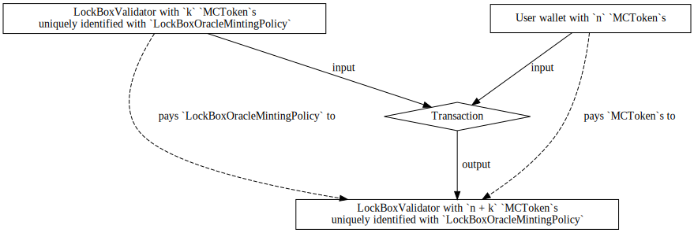
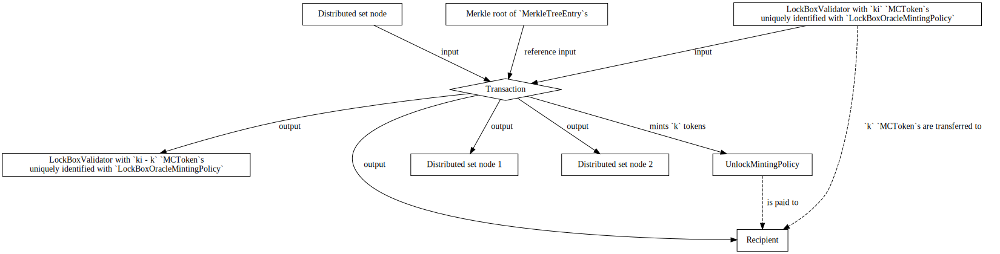
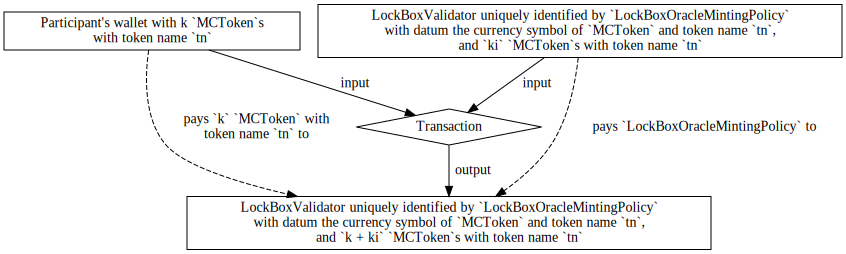
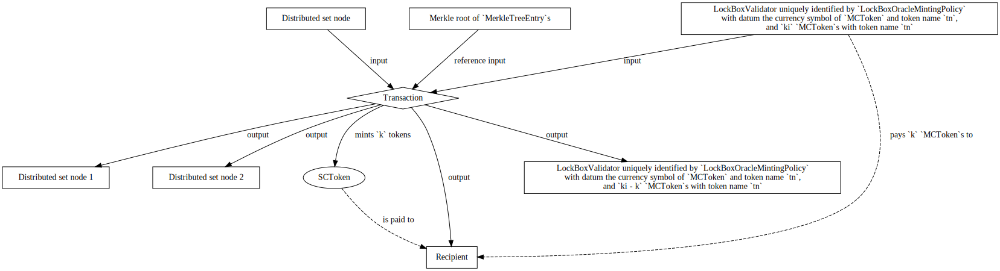
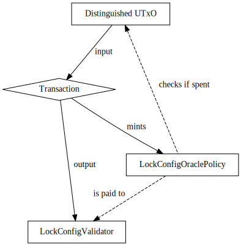

# Modularising Token Handling

## Requirements
The end goal is to be able to deploy two types of sidechains:

1. fuel tokens are owned by the sidechain (lock/unlock), a wrapped token exists
   on the mainchain (mint/burn) (current flow)

2. fuel tokens are owned by the mainchain, a wrapped token exists on the
   sidechain

## Background
The current semantics of the onchain Plutus code to provide the
mechanism for which an asset is transferred between the mainchain and the
sidechain (vice versa) is realized with the `FUEL` token which accomplishes the
following:

- A transfer from *mainchain* to *sidechain* burns a participant's `FUEL`
  tokens with a specified the sidechain recipient (as redeemer).
  Thus, for the sidechain recipient to receive their corresponding sidechain
  tokens in the sidechain, the Bridge must observe that a mainchain transaction
  has burnt `FUEL`, and unlock the corresponding sidechain tokens to the
  recipient on the sidechain (by e.g. minting such tokens).

- A transfer from *sidechain* to *mainchain* amounts to creating a Merkle root
  of such transactions (i.e., a *sidechain certificate*) which are posted to
  the mainchain (via the Bridge), and later participants may claim `FUEL` from
  a specified Merkle root by minting `FUEL` tokens.

The key point is this -- the current mechanism implements this transfer via
*minting* and *burning* of some distinguished token.
We call such a token a *wrapped token*.

In general, the mechanism for which coins are transferred between sidechains
and back at a fixed (or otherwise deterministic) exchange rate is a called a
*two-way peg*[^refEnablingBlockchainInnovations].

We call the currently implemented mechanism which implements the two-way peg on
the mainchain via minting and burning of a wrapped token a *mainchain wrapped
token transfer*.

This SIP proposes an alternative method (which may be used in place of the
*wrapped token*) to implement the two-way peg on the mainchain.
So, instead of minting and burning a wrapped token, we propose to take any
arbitrary token on the mainchain, say `MCToken`, and implement the two-way peg
as follows.

- Transfers of `MCToken` from *mainchain* to *sidechain* amounts to
  participants sending their `MCToken` to a distinguished address that contains
  the sidechain recipient, call such an address a *lock box address*,
  which *locks* the participant's `MCToken`s.
  Thus, for a sidechain recipient to receive their corresponding sidechain
  tokens in the sidechain, the Bridge must observe transactions which lock
  `MCToken`s at a lock box address and mint the corresponding amount to the
  sidechain recipient.

- Transfers of `MCToken` from *sidechain* to *mainchain* amounts to (again)
  creating a Merkle root of such transactions which are posted to the mainchain
  (note this reuses the existing mechanism),
  and later participants may claim their `MCToken`s by using some specified
  Merkle root to spend UTxOs at a lock box address for which `MCToken` is
  locked at and finally pay the locked `MCToken`s to themselves.
  In essence, Merkle roots give participants permission to *unlock* previously
  locked `MCToken`s to claim themselves.

We call a two-way peg implemented this way on the mainchain via locking
and unlocking of `MCToken`s a *mainchain lock/unlock transfer*.

The implementation of a mainchain lock/unlock transfer is the primary focus of
this proposal, and we will show how to modify the current system such that it
allows a lock/unlock transfer of Cardano assets.

## Plutus Design Specification.
In the original specification, recall that participants claimed `FUEL` tokens
from Merkle roots.
This proposal will suggest that we replace the `FUEL` token claiming mechanism
with a new token, `SCToken`, which generalizes the token name of `FUEL` tokens.
Then, we will have a `LockBoxValidator` which will be the lock box address for
a Cardano asset that will be uniquely identified by an NFT
`LockBoxOracleMintingPolicy`.
Finally, we will show how the new `SCToken`s can be easily adapted to allow
unlocking of tokens at the `LockBoxValidator` uniquely identified by
`LockBoxOracleMintingPolicy`.

We first define `SCToken`.
Recall that we stated that this will be very similar to `FUELMintingPolicy`,
and it intends to generalize `FUELMintingPolicy`'s functionality.
Hence, we will be presenting diffs from the original definitions in
`FUELMintingPolicy`.

We first must change the `MerkleTreeEntry` (i.e., transactions sent over from the
sidechain) data type from the main specification.
```diff
data MerkleTreeEntry = MerkleTreeEntry
  { index :: Integer -- 32 bit unsigned integer, used to provide uniqueness among transactions within the tree
  , amount :: Integer -- 256 bit unsigned integer that represents amount of tokens being sent out of the bridge
  , recipient :: ByteString -- arbitrary length bytestring that represents decoded bech32 cardano address
+  , tokenName :: TokenName -- the token name of the asset to be claimed
  , previousMerkleRoot :: Maybe ByteString -- previousMerkleRoot is added to make sure that the hashed entry is unique
  }
```
Note that we added a `tokenName` field which will be the `SCToken`'s token name
instead of being hardcoded to "FUEL" as it currently is.

As redeemer, `SCToken` will take the following data type.
```diff
-data FUELRedeemer
-  = MainToSide BuiltinByteString -- Recipient's sidechain address
-  | SideToMain MerkleTreeEntry MerkleProof

+data SCTokenRedeemer
+  = SCTokenBurn ByteString -- Recipient's sidechain address
+  | SCTokenMint MerkleTreeEntry MerkleProof
```
Note that this is identical to the current implementation of `FUELRedeemer`
with minor refactors to the names of the constructors.

Then, `SCToken` mints (strictly more than 0 tokens) with token name
`tn` only if all of the following are satisfied.

- The redeemer is `SCTokenMint`.

- A `MerkleRootToken` with token name, say `merkleRoot`, is given as a
  reference input at a `MerkleRootTokenValidator` script address.

- `blake2b(serialiseData(scTokenMintMerkleTreeEntry))` is in the Merkle root
  `merkleRoot` using as witness the Merkle proof `scTokenMintMerkleProof`.

- `blake2b(serialiseData(scTokenMintMerkleTreeEntry))` is NOT included in the
  [distributed set](https://github.com/mlabs-haskell/trustless-sidechain/blob/master/docs/DistributedSet.md),
  and is inserted in the distributed set in this transaction (to ensure that
  tokens can be claimed at most once).
  Also, note that the distributed set needs to be modified so that
  `blake2b(serialiseData(scTokenMintMerkleTreeEntry))` is added to the
  distributed set only if `SCToken` mints to prevent adversaries from
  maliciously locking someone else's tokens away forever (note that this
  requirement is the same for `FUELMintingPolicy` from the original
  specification).

- The transaction corresponds to the `scTokenMintMerkleTreeEntry` in the
  sense that:

    - There exists a transaction output at `recipient` with at least `amount`
      `SCToken` tokens with token name `tn` (see [#280 for the security
      proof](https://github.com/mlabs-haskell/trustless-sidechain/issues/290)).

    - `amount` `SCToken`s are minted with unique token name `tn`.

    - `tn` is `tokenName` from the `MerkleTreeEntry`.

Again, note that this is essentially identical to the conditions given in
[`FUELMintingPolicy` for individual
claiming](https://github.com/mlabs-haskell/trustless-sidechain/blob/master/docs/Specification.md#32-individual-claiming)
except we also verify that token name `tn` is the `tokenName` field of the
`MerkleTreeEntry`.

Also, `SCToken` can be burnt only if the redeemer is `SCTokenBurn` (this is
identical to `FUELMintingPolicy`).

This completes the definition of `SCToken`.

Now, we discuss how the locking and unlocking of Cardano assets can be
implemented with `SCToken`s.

First, we will modify the endpoint parameters for `SCToken` to the following.

```diff
+-- 'ClaimedAsset' is an asset which may be transferred from the sidechain.
+-- 'MintedAsset's are for tokens which represent a wrapped token for a
+-- sidechain token, and 'LockedAsset's are the currency symbol and token name
+-- of
+data ClaimedAsset
+  = MintedAsset ByteString -- an identifier of a sidechain token
+  | LockedAsset CurrencySymbol TokenName

data MintParams = MintParams
  { amount :: Integer
+  , claimedAsset :: ClaimedAsset
  , recipient :: ByteString
  , merkleProof :: MerkleProof
  , index :: Integer
  , previousMerkleRoot:: Maybe ByteString
  , dsUtxo:: Maybe TxOutRef
    -- ^ 'dsUtxo' is used exclusively offchain to potentially avoid a linear
    -- scan through the UTxO set to ensure uniqueness of claiming FUEL.
    -- See [footnote [1] in the distributed set document](./DistributedSet.md)
    -- for details.
  }
```
Note that this has identical endpoint parameters as
[`FUELMintingPolicy`](https://github.com/mlabs-haskell/trustless-sidechain/blob/master/docs/Specification.md#32-individual-claiming)
except that we require that the endpoint also includes a `claimedAsset` field
which is either the identifier for the `MintedAsset` (which is currently hard
coded to "FUEL")  or the `CurrencySymbol` and `TokenName` of a Cardano asset
(whose cbor hash will be the token name of `SCToken` -- more on this later).

With this in mind, we give the definition of `LockBoxValidator` and a minting
policy `LockBoxOracleMintingPolicy`.

`LockBoxOracleMintingPolicy` will be an NFT and hence must be parameterized by
a UTxO to ensure uniqueness, and will be paid to a `LockBoxValidator` script
address.

`LockBoxValidator` must be parameterized by the currency symbol of
`LockBoxOracleMintingPolicy` and `SCToken`.

As datum, `LockBoxValidator` will store the currency symbol and token name of
`MCToken` that it will lock.
Thus, `LockBoxValidator` will have as datum the following data type.
```haskell
data LockBoxDatum = LockBoxDatum
    { lockedCurrencySymbol :: CurrencySymbol
    , lockedTokenName :: TokenName
    }
```

As redeemer, `LockBoxValidator` will take the following data type.
```haskell
data LockBoxValidatorRedeemer
    = Lock
        { lockSidechainRecipient :: ByteString
            -- ^ The sidechain recipient.
        }
    | Unlock
        { unlockCurrencySymbol :: CurrencySymbol
        , unlockTokenName :: TokenName
        }
```
Note that this definition has partial functions for record accesses (which are
bad), but we use the record field names simply as convenient notation in the
specification to discuss the conditions which must be checked.

Then, `LockBoxValidator` will succeed in two cases: either a participant is
locking some `MCToken`s and adding to the locked tokens in the
`LockBoxValidator`; or a participant is claiming their tokens from the
`LockBoxValidator`.

So, in the former case `LockBoxValidator` succeeds only if the following are
all satisfied.

- The `LockBoxValidatorRedeemer` is `Lock`.

- There exists a script output at the `LockBoxValidator` address with the
  `LockBoxOracleMintingPolicy` which has the same datum as the current
  `LockBoxValidator`.
  Note that this `LockBoxValidator` should also be "relatively small".[^relativelySmall]

- Let `ki` denote the number of `lockedCurrencySymbol`s with token name
  `lockedTokenName` at the current `LockBoxValidator` address.
  Then, the unique `LockBoxValidator` output identified by
  `LockBoxOracleMintingPolicy` must have strictly more than `ki`
  `lockedCurrencySymbol`s with token name `lockedTokenName`.

[^relativelySmall]: This condition is a technical condition where adversaries
  can add a whole bunch of garbage tokens to an output to make the output far
  too large to be able to be spent (as Plutus code will be spending all of its
  budget decoding the `ScriptContext`), thus locking the tokens away forever.

Indeed, if we let `ko` denote the number of `lockedCurrencySymbol`s with token
name `lockedTokenName` at the script output `LockBoxValidator` uniquely
identified by `LockBoxOracleMintingPolicy`, then the Bridge will interpret this
transaction to mean `ko - ki` tokens were transferred from mainchain to
sidechain with recipient `sidechainRecipient`  (from the
`LockBoxValidatorRedeemer`).

The following diagram depicts this scenario.



As for the other case, when a participant wishes to claim tokens transferred
from the mainchain, `LockBoxValidator` succeeds only if the following are all
satisfied.

- The `LockBoxValidatorRedeemer` is `Unlock`.

- `SCToken` mints `k` tokens with token name `tn` for which `tn` is
  `blake2b(serialiseData (unlockCurrencySymbol, unlockTokenName))`.
  Moreover, at the output address with at least `k` such `SCToken`s, there are
  at least `k` tokens with `unlockCurrencySymbol` and `unlockTokenName`.

- The datum `LockBoxDatum` satisfies `lockedCurrencySymbol ==
  unlockCurrencySymbol` and `lockedTokenName == unlockTokenName`.

- Let `ki` denote the number of tokens with `unlockCurrencySymbol` and
  `unlockTokenName` at this current address. Then, there must exist script
  outputs at a `LockBoxValidator` address with a `LockBoxOracleMintingPolicy`
  which has the same datum as the current `LockBoxValidator` and at least `ki -
  k` tokens of `unlockCurrencySymbol` token name with `unlockTokenName`
  altogether.

We can depict the transaction of unlocking tokens (via minting `SCToken` with
the `MerkleTreeEntry`'s `claimedAsset` as `LockedAsset`) with the below
diagram.



Thus, in summary we have demonstrated how the aforementioned definitions permit
the following workflows.

- One may mint `SCToken` to unlock assets in Cardano, and burn these tokens as
  a noop.

- One may mint `SCToken` on Cardano with an identifier that corresponds to a
  token in the sidechain for sidechain to mainchain transfers. Moreover, one
  may burn this token for mainchain to sidechain transfers. Note that this is
  exactly the behavior of the old `FUELMintingPolicy`.

## Workflow
This section discusses the entire workflow for transferring a Cardano asset,
say `MCToken`, between mainchain and sidechain (vice versa).
We will assume that the sidechain has been initialized appropriately.

**Workflow: transferring `MCToken`s from mainchain to sidechain**
1. On the mainchain, a participant posts a transaction which pays some amount
   of `MCToken`s to the validator address `LockBoxValidator` identified by a
   `LockBoxOracleMintingPolicy` NFT.
2. Sidechain nodes observe that 1. has occurred on the mainchain, and hence
   (after the transaction is stable) includes the corresponding transaction in
   the sidechain where sidechain nodes determine the sidechain recipient from
   the redeemer `LockBoxValidatorRedeemer`.

   Note sidechain nodes determine how many tokens to mint in the sidechain by
   letting `ki` denote the number of `MCToken`s in the consumed
   `LockBoxValidator` transaction input uniquely identified by the
   `LockBoxOracleMintingPolicy` NFT, and letting `ko` denote the the number of
   `MCToken`s in the `LockBoxValidator` transaction output uniquely identified
   by the `LockBoxOracleMintingPolicy` NFT;
   and finally, the sidechain nodes will mint `ko - ki` tokens on the sidechain.

The following diagram depicts the transaction for step 1 of the workflow.



**Workflow: transferring from sidechain to mainchain**
1. On the sidechain, a participant posts a transaction which burns `MCToken`'s
   corresponding sidechain tokens.
2. Eventually, transactions from 1. are bundled up into a Merkle root, and
   the Merkle root is signed by the committee and posted to the mainchain.
3. A mainchain recipient of a transaction from 1. claims their
   `UnlockMintingPolicy` tokens by posting a transaction on the mainchain,
   which also unlocks `MCToken`s residing at `LockBoxValidator` addresses.
4. A participant may burn their `SCToken`s as they serve no
   purpose.

The following diagram depicts the transaction for step 3 of the workflow.



## Design Discussion and Related Work
This section discusses the design with other potential designs, and relevant
related work in other sidechains.

Recall that in the design described above in the same transaction as claiming
the Merkle roots a participant directly unlocks `MCToken`s from a
`LockBoxValidator`.
This design is nice because it is relatively simple to implement and requires
very little changes to the current implementation.

Unfortunately, it has a concurrency problem -- namely, all participants are
competing over consuming the same `LockBoxValidator` which is uniquely
identified by the `LockBoxOracleMintingPolicy`.

In this section, we will motivate alternate solutions which attempts to remedy
the concurrency problem by having many `LockBoxValidator`s participants may
claim tokens from.
At first glance, a remedy to the concurrency situation would be to increase the
number of `LockBoxValidator` entries.
So, one could have a small fixed number of `LockBoxValidator`s that
participants may interact with (which wouldn't scale as the number of
participants grow), so we will consider the alternative of having a non-fixed
amount of `LockBoxValidator`s.
In other words, instead of requiring sidechain nodes to *only* observe only the
`LockBoxValidator`s which are uniquely identified by
`LockBoxOracleMintingPolicy`, we can instead requiring sidechain nodes to
observe *all* `LockBoxValidator` addresses for which participants can arbitrarily
lock funds at such an address.

Unfortunately, there's an issue with this approach.
Sometimes participants will not be able to always unlock their tokens using the
design described above.
Consider the following scenario.

1. Alice on the mainchain transfers 100 `MCToken`s to her own sidechain address
   by paying 1 `MCToken` to a `LockBoxValidator` 100 times. So there are 100
   UTxOs at the `LockBoxValidator` address in the mainchain each with a single
   `MCToken`.

2. Bob on the sidechain trades Alice for all of her corresponding sidechain
   tokens of `MCToken`.

3. Bob transfers all of his 100 sidechain tokens that he traded from Alice back
   to the mainchain, so this transaction is eventually saved in a single Merkle
   root that is posted to the mainchain.

4. Bob attempts to unlock the 100 `LockBoxValidator`s each with a single
   `MCToken` on the mainchain in a single UTxO, but this would fail as the
   transaction is too large

There are numerous approaches around this that we will sketch.

- *Change `SCToken` and `LockBoxValidator` so that  `SCToken`s are minted as
  before (but does not correspond to unlocking of tokens at a
  `LockBoxValidator`), and instead, burning of `SCToken`s corresponds to
  unlocking of tokens at a `LockBoxValidator`*.
  This approach nice as it allows a "multi-staged" claim mechanism where the
  original Cardano asset can be exchanged for a wrapped sidechain token over
  multiple transactions.
  The author believes that this maps quite nicely in the UTxO model, and this
  will be sketched out in the appendix.

- *Allowing merging of arbitrary lock box addresses.*
  Unlike the previous solution where the problem of claiming a large amount of
  UTxOs to claim one's full entitled amount could be split up into multiple
  transactions, this solution proposes that participants themselves merge lock
  box addresses together to build a UTxO with sufficient tokens that they can
  then claim themselves.

  Alternatively, one may consider collecting locked `MCToken`s into
  a single distinguished large UTxO when uniquely minting Merkle roots, and
  only allow unlocking of `MCToken`s at the distinguished large UTxO that
  corresponds to the Merkle root.

This isn't an original problem unique to Cardano.
Some related work suggests the following solutions.

- Drivechain[^refDrivechain] for BitCoin sets the lock box address to be an
  "anyone can spend" address, so via a soft fork, it miners are trusted to
  ensure that the locked `MCToken`s (bitcoins) are only unlocked under
  appropriate conditions.

  Then, when sufficient sidechain to mainchain transfers appear, miners will
  bundle locked `MCToken`s at lock box addresses into a *single large UTxO*,
  then pay this single large UTxO to claim addresses.

  This is essentially the third fix to the direct lock mechanism.
  Note that they fix the slow/poor concurrency problem via allowing *atomic
  swaps* (securely trading mainchain tokens for sidechain tokens [vice versa]
  as an independent deal without going through sidechain nodes) -- something
  that we may want to consider adding to our system as well.

- XClaim[^refXClaim] sets the lock box address to a backing intermediary's
  address who is incentivized to act honestly and allow participants to claim
  their `MCToken` (transferred from sidechain to mainchain) by forcing the
  backing intermediary to deposit collateral which is slashed and reimbursed to
  wrong actors if the backing intermediary behaves incorrectly.

  This approach wasn't taken, and there doesn't seem to be any value to add
  another class of participants in the protocol already.
  Although, it does have the advantage that standard coin selection algorithms
  of a wallet would be used to minimize dust.

- Polkadot[^refPolkadot] suggests that to lock transactions in Bitcoin, the
  `MCToken`s (Bitcoins) should be paid to some threshold signature script which
  only may be claimed if sufficient committee members have signed the
  transaction.

  This approach of committee members individual signing transactions
  individually does not map nicely in the current system with Merkle roots as
  this suggests that the committee members should just individually sign every
  transaction instead of using a Merkle root at all.

## Appendix: Alternate Plutus Design Specification
This section sketches an alternate design which should also work, but has
better concurrency.

In summary, the design will require the following Plutus scripts.

- `LockBoxValidator`: the validator address which will be the lock box address.
- `UnlockMintingPolicy`: a minting policy which is minted from Merkle roots and
  whose burning unlocks `LockBoxValidator`.
- `LockConfigValidator`: a validator which always returns false which as its
  datum contains necessary information to handle the circular dependencies
  between `LockBoxValidator` and `UnlockMintingPolicy`.
- `LockConfigOraclePolicy`: an NFT to uniquely identify `LockConfigValidator`.

We define these scripts more precisely.

We first define `LockConfigOraclePolicy` and `LockConfigValidator`.

`LockConfigOraclePolicy` is an NFT (and hence must be parameterized by a UTxO)
that must be paid to a `LockConfigValidator` (which it uniquely identifies).
`LockConfigValidator` never succeeds and has as its datum
```haskell
data LockConfigDatum = LockConfigDatum
    { lockBoxValidatorAddress :: Address
    , unlockMintingPolicyCurrencySymbol :: CurrencySymbol
    }
```
which contains the address of `LockBoxValidator` and the currency symbol of a
specified `UnlockMintingPolicy`.

In a sense, `LockConfigValidator` and `LockConfigOraclePolicy` provide a
static read-only configuration of this system that *must* be run first to
initialize the system.
The following diagram depicts a transaction which executes this setup.



Now, we define `LockBoxValidator`.

`LockBoxValidator` will be parameterized by `LockConfigOraclePolicy`.
`LockBoxValidator`'s redeemer does not matter (and hence may be the unit type),
and as datum it must contain a `ByteString` of the address of the sidechain
recipient.
`LockBoxValidator` validates only if all of the following are satisfied:

-  there exists a reference input which holds `LockConfigOraclePolicy` that has
   as datum `LockConfigDatum`; and

-  `unlockMintingPolicyCurrencySymbol` burns at least one token (i.e., mints
   strictly less than 0 tokens).

Note that `LockBoxValidator` simply forwards all of its verifications to
`UnlockMintingPolicy` which does most of the heavy lifting.

So, all that remains is to define `UnlockMintingPolicy`.

Recall that `FUELMintingPolicy` mints `k` tokens with token name
`FUEL` only if `k` tokens were transferred over to the mainchain recipient from
the sidechain; and `FUELMintingPolicy` may be burned arbitrarily.
`UnlockMintingPolicy` will be essentially identical to `FUELMintingPolicy`
except that minting will be generalized to allow for different token names that
will be the hash of an asset's currency symbol and token name, and
`UnlockMintingPolicy` will burn `k` tokens with token name `tn = blake2b
(serialiseData (MCToken currency symbol, MCToken token name))` only if `k`
`MCToken`s with the specified token name are unlocked from a `LockBoxValidator`.

More precisely, `UnlockMintingPolicy` will be parameterized by

- `SidechainParams`;

- the currency symbol of
  [`MerkleRootTokenMintingPolicy`](https://github.com/mlabs-haskell/trustless-sidechain/blob/master/docs/Specification.md#3-transfer-fuel-tokens-from-sidechain-to-mainchain)
  to ensure that sidechain transactions have been previously signed by the
  committee;

- the currency symbol of [`DsKeyPolicy` for keys in the distributed set](https://github.com/mlabs-haskell/trustless-sidechain/blob/master/docs/DistributedSet.md); and

- the currency symbol of `LockConfigOraclePolicy` for identifying
  `LockConfigValidator` which contains as datum `LockConfigDatum`.

Note that `UnlockMintingPolicy` is parameterized by the same things as
`FUELMintingPolicy` except for the extra last currency symbol.

As redeemer, `UnlockMintingPolicy` will take the following data type.
```haskell
data UnlockBurnInfo = UnlockBurnInfo
  { unlockBurnCurrencySymbol :: CurrencySymbol
  , unlockBurnTokenName :: TokenName
  }

data UnlockMintInfo = UnlockMintInfo
  { unlockMintMerkleTreeEntry :: MerkleTreeEntry
  , unlockMintMerkleProof :: MerkleProof
  }

data UnlockMintingPolicyRedeemer
  = UnlockMint UnlockMintingInfo
  | UnlockBurn UnlockBurnInfo
```
Again, note the similarities to `FUELRedeemer` from the main specification --
`UnlockMintingPolicyMint` is identical to `SideToMain`, but `UnlockMintingPolicyBurn` is different
as burning `UnlockMintingPolicy` does *not* correspond to transferring tokens from
mainchain to sidechain and instead corresponds to unlocking `MCToken`s from a
`LockBoxValidator` address.

Now, we discuss the conditions for which `UnlockMintingPolicy` mints.

We first propose some changes to the `MerkleTreeEntry` (i.e., transactions sent
over from the sidechain) data type from the main specification.
Since `MCToken` may have an arbitrary token name and the current
`MerkleTreeEntry` assumes the token name is `FUEL`, we propose to modify
`MerkleTreeEntry` as follows.

```diff
+-- 'ClaimedAsset' is an asset which may be transferred from the sidechain.
+-- 'MintedAsset's are for tokens which represent
+data ClaimedAsset
+  = MintedAsset ByteString -- an identifier of a sidechain token
+  | LockedAsset CurrencySymbol TokenName

data MerkleTreeEntry = MerkleTreeEntry
  { index :: Integer -- 32 bit unsigned integer, used to provide uniqueness among transactions within the tree
  , amount :: Integer -- 256 bit unsigned integer that represents amount of tokens being sent out of the bridge
  , recipient :: ByteString -- arbitrary length bytestring that represents decoded bech32 cardano address
+  , claimedAsset :: ClaimedAsset -- the asset to be claimed by a merkle proof
  , previousMerkleRoot :: Maybe ByteString -- previousMerkleRoot is added to make sure that the hashed entry is unique
  }
```
Note the following.

- We added a `ClaimedAsset` data type which distinguishes the type of asset
  being transferred from the sidechain to the mainchain -- either we have a
  wrapped token, or we are unlocking a Cardano asset.

- A `ClaimedAsset` is added as a field to the `MerkleTreeEntry` that is used to
  bundle up the transactions from the sidechain.

Then, `UnlockMintingPolicy` mints (strictly more than 0 tokens) with token name
`tn` only if all of the following are satisfied.

- The redeemer is `UnlockMintingPolicyMint`, and
  `unlockMintingMintMerkleTreeEntry` has `claimedAsset` as `LockedAsset`.

- A `MerkleRootToken` with token name, say `merkleRoot`, is given as a
  reference input at a `MerkleRootTokenValidator` script address.

- `blake2b(serialiseData(unlockMintingMintMerkleTreeEntry))` is in the Merkle root
  `merkleRoot` using as witness the Merkle proof `unlockMintingMintMerkleProof`.

- `blake2b(serialiseData(unlockMintingMintMerkleTreeEntry))` is NOT included in the
  [distributed set](https://github.com/mlabs-haskell/trustless-sidechain/blob/master/docs/DistributedSet.md),
  and is inserted in the distributed set in this transaction (to ensure that
  tokens can be claimed at most once).
  Also, note that the distributed set needs to be modified so that
  `blake2b(serialiseData(unlockMintingMintMerkleTreeEntry))` is added to the
  distributed set only if `UnlockMintingPolicyMint` mints to prevent adversaries from
  maliciously locking someone else's tokens away forever (note that this
  requirement is the same for `FUELMintingPolicy` from the original
  specification).
  More discussion on this will come later.

- The transaction corresponds to the `unlockMintingMintMerkleTreeEntry` in the
  sense that: `UnlockMintingPolicyMint` mints exactly `amount` tokens with
  unique token name `tn = blake2b (serialiseData (currencySymbol, tokenName))`; and there
  exists a transaction output at `recipient` with at least `amount`
  `UnlockMintingPolicyMint` tokens with token name `tn` (see [#280 for the
  security
  proof](https://github.com/mlabs-haskell/trustless-sidechain/issues/290)).

Again, note that this is essentially identical to the conditions given in
[`FUELMintingPolicy` for individual
claiming](https://github.com/mlabs-haskell/trustless-sidechain/blob/master/docs/Specification.md#32-individual-claiming)
except for that we note that the token name `tn` keeps track of the currency
symbol and token name of the `MCToken` that one wishes to unlock.

This will also require a modification to the [distributed
set](https://github.com/mlabs-haskell/trustless-sidechain/blob/master/docs/DistributedSet.md).
Recall that the distributed set only allows the hash of a `MerkleTreeEntry` to
be inserted in the distributed set only if `FUELMintingPolicy` mints, so
it's clear that the hash of a `MerkleTreeEntry` may be inserted in the
distributed set iff `FUELMintingPolicy` mints.
This condition is needed so that adversaries cannot arbitrarily insert things
in the distributed set potentially locking a participant's tokens away forever
(as otherwise the system will believe that the honest participant is attempting
to "double spend" their tokens).
Indeed, this condition must be generalized so that either:

- if the field `claimedAsset` of the `MerkleTreeEntry` is `MintedAsset`, then
  the hash of the `FUELClaimEntry` may be inserted in the distributed set only
  if `FUELMintingPolicy` mints; or

- if `MerkleTreeEntry` is `LockBoxEntry`, then the hash of the
  `LockBoxEntry` may be inserted in the distributed set only if
  `UnlockMintingPolicy` mints.

Finally, `UnlockMintingPolicy` with token name `tn` burns (mints strictly
less than 0 tokens) `k > 0` tokens only if all of the following are all
satisfied.
- The redeemer is `UnlockMintingPolicyBurn`.
- `tn` is `blake2b(serialiseData (unlockMintingBurnCurrencySymbol, unlockMintingBurnTokenName))`
- There exists a reference input with `LockConfigOraclePolicy` which has as
  datum `LockConfigDatum`.
- Let `ki` denote the sum of transaction *inputs* with currency symbol
  `unlockMintingBurnCurrencySymbol` and token name `unlockMintingBurnTokenName`
  at address `lockBoxValidatorAddress`. Let `ko` denote the sum of all
  transaction *outputs* with currency symbol `unlockMintingBurnCurrencySymbol`
  and token name `unlockMintingBurnTokenName` at address
  `lockBoxValidatorAddress`. Then, we verify that `ko >= ki - k` i.e., there
  are at least `ki - k` tokens with currency symbol
  `unlockMintingPolicyCurrencySymbol` and token name
  `unlockMintingBurnTokenName` that are claimable by someone else in the future
  in `LockBoxValidator`s.
- The `lockBoxValidatorAddress` outputs are "relatively small"[^relativelySmall].

[^relativelySmall]: This condition is a technical condition where adversaries
  can add a whole bunch of garbage tokens to an output to make the output far
  too large to be able to be spent, thus locking the tokens away forever.

This completes the definitions for a design of a mainchain lock/unlock
transfer.

There's one point of ambiguity in the workflow for transferring from sidechain
to mainchain.
That is, how do participants choose which selection of `LockBoxValidator`
addresses to use to claim their `MCToken`s?

Assuming that participants will always act in their best interests,
participants will most likely always try to pick the largest
`LockBoxValidator`s in effort to minimize fees.
In effect, this means that the total number of `LockBoxValidator`s that will be
consumed will be at most the number of `LockBoxValidator`s that are currently
present onchain.
Indeed, it would be nice if there were such an analysis / heuristics to give a
schedule which minimizes the maximum amount of transactions any participant
would need to spend to claim their `MCToken`s.
Some heuristics which don't work (i.e., are still significantly worse than an
optimal solution) for participants to follow include picking the largest
`LockBoxValidator` or picking the smallest `LockBoxValidator` that is larger
than the amount a user wants to claim.

Alternatively, the approach that MuesliSwap[^refMuesliSwap] argues for is that
participants will not act greedily and always pick the largest
`LockBoxValidator` as participants are aware of each other's competing
existences, and so if they all tried to pick the largest `LockBoxValidator`,
they will all block each other, and then must attempt to use a less than
optimal combination of `LockBoxValidator`s which may have already been spent --
resulting in suboptimal play for themselves.
Hence, they argue that leaving all `LockBoxValidator`s as a "free for all"
essentially "regulates itself".

So, following that approach, this means that offchain code should build transactions
using a random selection of `LockBoxValidator`s in effort to reduce UTxO
contention -- see CIP2[^refCIP2] for details.

## Conclusion
Two designs were presented for the alternate transfer mechanism.
There are tradeoffs for both implementations and its unclear if there is a
clear winner for either of the solutions.

[^refEnablingBlockchainInnovations]: Back, A., Corallo, M., Dashjr, L.,
Friedenbach, M., Maxwell, G., Miller, A.K., Poelstra, A., Timón, J., & Wuille,
P. (2014). Enabling Blockchain Innovations with Pegged Sidechains.

[^refDrivechain]: P. Sztorc. Drivechain - The Simple Two Way Peg, November 2015.
<http://www.truthcoin.info/blog/drivechain/>

[^refXClaim]: Zamyatin, Alexei, et al. "XCLAIM: Trustless, Interoperable,
  Cryptocurrency-Backed Assets." 2019 IEEE Symposium on Security and Privacy
  (SP), IEEE, 2019, pp. 193–210, <https://doi.org/10.1109/SP.2019.00085>.

[^refProofOfStakeSidechains]: Gazi, Peter, et al. "Proof-of-Stake Sidechains."
  2019 IEEE Symposium on Security and Privacy (SP), IEEE, 2019, pp. 139–56,
  <https://doi.org/10.1109/SP.2019.00040>.

[^refPolkadot]: Wood, Gavin. *POLKADOT: Vision for a Heterogeneous MULTI-CHAIN
  Framework*, 10 Nov. 2016, <https://assets.polkadot.network/Polkadot-whitepaper.pdf>.

[^refMuesliSwap]: *-- MuesliSwap -- A Decentralized Token Exchange on Cardano*,
  <https://legacy.muesliswap.com/whitepaper.pdf>. Accessed 26 May 2023.

[^refCIP2]: Vries, Edsko. *CIP 2 - Coin Selection Algorithms for Cardano*,
  <https://cips.cardano.org/cips/cip2/>. Accessed 26 May 2023.
