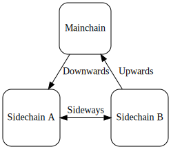
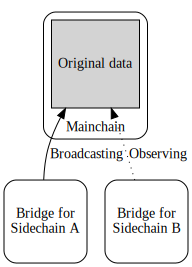
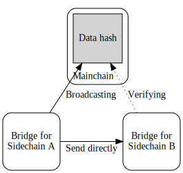

# General Data Bridge

## Goal

Built on a multi-chain configuration we want to allow inter-sidechain
communication of data feeds/oracle updates.

## Background

In the previous SIP ([SIP 8 - Cross Chain Verification][crosschainver]) we have
introduced a way to allow coordination of multiple sidechains.

In this proposal, we will expand on the above idea, and introduce a way to
verifiably transfer some arbitrary data between two sidechains. This capability
will enable multi-chain smart contracts and oracles that broadcast data to
another sidechain.

As with all data stored on a blockchain, we are mostly concerned about two
aspects: transaction fees and latency. Clearly, in an interactive multi-chain
protocol both these aspects are important from a usability standpoint. In this
proposal we will try to address these issues in a way that both fee and latency
is low, but in the end, it's the responsibility of the dApp developer to
transfer and store only the most important data on-chain, while relying on
other ways of communication between protocols.

## Assumptions

This proposal heavily builds on [SIP 7 - Modularising Token Handling][modulartokens]
and [SIP 8 - Cross Chain Verification][crosschainver] as the infrastructure of
cross-chain awareness. These SIPs should be understood first before reading this
document. Assumptions and requirements written in those documents will not
be mentioned here, but they all apply for the current document.

##  High level design

Although the main goal of this design is to introduce a way to send arbitrary
data between sidechains, it makes most sense to include communication between
a sidechain and mainchain, as the workflow would be almost identical.

With this in mind, we can identify three directions:

- Downwards: Mainchain to Sidechain
- Upwards: Sidechain to Mainchain
- Sideways: Sidechain A to Sidechain B



Data transfer will follow a similar flow to token transfer, and will reuse the
same mechanisms: transferring down can be achieved by a simple lock mechanism,
while transferring up will require a sidechain certificate. For sideways data
transfer, we will use the mainchain as a relay. In this case similarly to the
upwards transfer, a sidechain certificate must be created on the mainchain,
while the recipient sidechain will observe incoming data.

For all directions, transferred data will be stored unencrypted in a validator
address on mainchain, with a special native token as a proof of validity.

While many use-cases require the full data to be present on the mainchain,
in some scenarios, we would prefer to store only a hash of the original
data. If the original data is too big to be stored on chain, or
the fee would be too high, it would be beneficial to have a light-weight proof
of data transfer. We will introduce two ways of transfer: _full data transfer_
and _data hash transfer_. This is similar to the design of Plutus datums, where
you can use inline-datums to embed the datum, or just a datum hash.

Of course, in a hash-only transfer, there must exist some form of a direct
communication channel between chains, for example a regular HTTP server. Building
such a direct communication channel is not obligatory, therefore the default
will be full data transfer.

_Full data transfer_



A few of the benefits of using a full data transfer:
- no need for direct communication channels
- mainchain contracts can directly use data
- publicly readable (good fit for a data oracle)

_Data hash transfer_



A few of the benefits of using data hash transfer:
- reduced transaction fee due to smaller transaction size
- allowing transfer of arbitrary size of data
- allowing various optimisation of a multi-sidechain protocol by only using the
  mainchain relay as a verification step
- hiding original data without using any extra encryption (note however that
  for sensitive data encryption should still be used)

#### Claiming

The claiming workflow is almost identical to the token claim: it is using the
same Merkle root, claiming with a proof. There are however a few key differences:
- the claim transaction will mint a special token, proving the validity of the data
- the output must include a Datum with some metadata (details in the Implementation
  section)
- the optional data will be sent to designated validator address

Note: it's important to note that claiming is a separate step from Merkle root
insertion, so there is the possibility of data remaining unclaimed. To mitigate
this issue, we could incentivise sidechain users to find and claim these data
UTxOs, by locking n amount of tokens on the sidechain. These tokens would be
paid to the wallet of the claimer, while the data must always go to its
designated address. However, incentivisation is out of scope of the current SIP.

## Implementation

We will introduce a new validator: `PostBoxValidator`. All sidechains will
observe this validator and handle new UTxOs as incoming messages. In essence
this will be a lockbox validator never allowing redeeming, thus ensuring that
the data is always available. Any mainchain contract can use these UTxOs as
reference inputs, however they cannot be consumed.

Apart from this `PostBoxValidator` we will also allow sending the message to
an arbitrary address. This will allow better integration with mainchain
contracts, in cases when a protocol requires some UTxO to be consumable.

Each UTxO sent to one of these validators must include the following datum:

```haskell
data PostBoxValidatorDatum = PostBoxValidatorDatum
    { topic :: ByteString
    , sender :: Maybe SidechainRef
    , payload :: BroadcastPayload
    }

data BroadcastPayload
    = FullMessage BuiltinData
    | HashedMessage ByteString
```

### Downwards (Mainchain to Sidechain)

This is the simplest of all directions, as we do not need a certificate to prove
that some data was broadcast. Any UTxO sent to the `PostBoxValidator` with a
valid datum is considered a valid downward message. It's the responsibility of
the consumer to verify that the `PostBoxValidatorDatum` is valid. Furthermore,
the `sender` of such message must always be `Nothing`.

### Upwards (Sidechain to Mainchain)

Similarly to token transfer from sidechain to mainchain, data transfer will also
require a sidechain certificate. We will simply modify the token name of`SCToken`
which is included in each leaf nodes of the Merkle tree (`MerkleTreeEntry`) such
that it can not only accept tokens, but arbitrary data as well
(not at the same time). With this change, the workflow will be identical to
token transfers:

1. Pending data transfers are accumulated into a Merkle tree
2. Merkle root inserted to the Mainchain
3. Data is claimed (anyone can claim)

In [SIP 7 - Modularising Token Handling][modulartokens] we have established
a modified claim workflow: we generalised the token itself with a token we
called `SCTokens`. The token name of this token identifies the actual token
than can be redeemed when this token is minted. In that proposal the token name
was `blake2b(serialiseData (lockedCurrencySymbol, lockedTokenName))`, however
we will have to expand the pre-image of this hash in some way, to avoid
collisions:
- token transfer: `blake2b(Constr(0, serialiseData(lockedCurrencySymbol, lockedTokenName)))`
- data transfer: `blake2b(Constr(1, serialiseData(SidechainMessage)))`

where `SidechainMessage` includes the above mentioned `PostBoxValidatorDatum` and
the address where the claimed token and datum must be sent:

```haskell
data SidechainMessage = SidechainMessage
    { message :: PostBoxValidatorDatum
    , targetAddress :: Maybe Address
    }
```

We will introduce a new token we call `SidechainMessageToken`. This token will
prove that the data was claimed with a sidechain certificate.

Minting verifies the following:
- `SCToken` with the token name `blake2b(Constr(1, serialiseData(SidechainMessage)))`
  is minted
- output with own minted token includes `PostBoxValidatorDatum` datum
- if `targetAddress` is set, output with own minted token is sent to it,
  otherwise it is sent to the `PostBoxValidator`
- if the payload is `FullMessage(data)` then `tokenName = blake2b(data)`,
  if `HashedMessage(dataHash)` then `tokenName = dataHash`
- `sender` field in `PostBoxValidatorDatum` is the same as the parameter of the
  current minting policy (own SidechainRef)

### Sideways (Sidechain A to Sidechain B)

Sideways transfers will use the exact same mechanism as Upwards transfer.
The only difference is that `targetAddress` is set to the `PostBoxValidator`
of the target chain (off-chain code can find the address using the
VersionOracles as described in [SIP8][crosschainver]).

Sidechain B contract will be able to observe the new UTxO in the
Sidechain B's `PostBoxValidator`, with the `sender` field pointing to
Sidechain A.

[modulartokens]: ./07-ModularisingTokenHandling.md
[crosschainver]: ./08-CrossChainVerification.md
