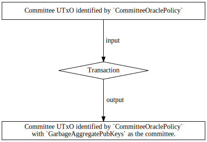
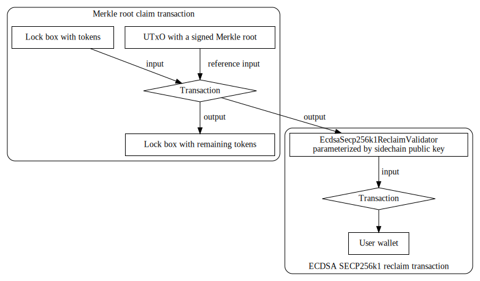
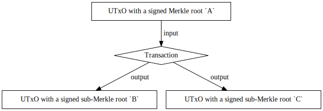
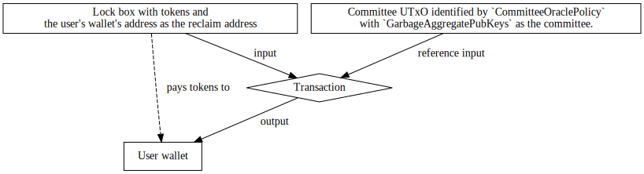

# Fund Reclaim from Defunct Sidechain

## Requirements
> This section is copied from the issue.

### Description
Provide a design document which extends the sidechain bridge with the means of
    reclaiming any locked tokens if the chain can be shown to be defunct.

### Acceptance Criteria

A new module type is created for 'defunct chain reclamation' strategies, the
    default module is no reclamation strategy.
A second module is added which allows for a chain to use oracle-based
    reclamations, where a single oracle will dictate if a chain is defunct, and the
    fund-release distribution, associating assets with cardano layer 1 addresses.
Optionally, funds may be ‘tagged’ ahead of time with the address for release in
    the event of a defunct sidechain. The design document should cover both
    possibilities.

### Out of scope
The means of determining if a sidechain is in fact defunct is out of scope.
Developers will assume a simple oracle message is posted to the Cardano
network.

## Overview
A sidechain is _defunct_ if the sidechain no longer produces blocks.
When a sidechain is defunct, we would like to extend the sidechain to have
    a reclamation strategy such that participants are able to reclaim their
    mainchain assets.
Clearly, this amounts to discussing defunct sidechain reclamation strategies for
    lock/release sidechains where we recall in such a sidechain a native token
    is transferred between mainchain and sidechain via locking/unlocking of
    native tokens in a distinguished validator address called a lock box.
We will not discuss defunct sidechain reclamation strategies for
    mint/burn sidechains as mint/burn sidechains create a wrapped token for a
    sidechain asset, so it isn't clear what should be "reclaimed" on the
    mainchain.

Thus, whenever we refer to a sidechain we will implicitly assume we are discussing a
    lock/release sidechain.

We will discuss the defunct sidechain reclamation strategy in three stages.

1. Dictating that the sidechain is defunct.

2. Creating the final fund-release distribution to reclaim funds just before
   the sidechain is declared defunct.

3. Tagging funds ahead of time with an address for release in the event of a
   defunct sidechain.

## Dictating that the sidechain is defunct.
When a sidechain is defunct, the sidechain should no longer be able to produce
    blocks.
We aim to capture this functionality on the mainchain.

Recall that on the mainchain, a summary of interchain transactions
    from the sidechain are saved in a Merkle root which
    _must_ be signed by the current committee.
Note that this is the method for which the sidechain's new blocks' effects are
    captured on the mainchain.
Recall that the mainchain verifies that the current committee
    has signed such a Merkle root with a _committee certificate minting policy_
    which verifies that the current committee has signed a sequence of bytes.
Moreover, recall that the current committee onchain is a UTxO which is uniquely
    identified by the NFT `CommitteeOraclePolicy` which stores as datum the
    following type.
```haskell
data UpdateCommitteeDatum aggregatePubKeys = UpdateCommitteeDatum
  { aggregateCommitteePubKeys :: aggregatePubKeys
  , sidechainEpoch :: Integer
  }
```

Clearly, if we set the `aggregatePubKeys` to some known "garbage" value, then
    none of the committee certificate minting policies will be able to verify
    that the garbage value has signed a Merkle root.
Thus, this would prevent the mainchain signing any new Merkle roots of
    transactions from the sidechain, and hence none of the sidechain's new
    blocks' effects may affect the mainchain.

So, dictating that the sidechain is defunct amounts to the committee
    changing the onchain `UpdateCommitteeDatum aggregatePubKeys`'s
    aggregate public keys identified by the `CommitteeOraclePolicy`
    to some garbage value.

To this end, we must define a data type as follows.
```haskell
data GarbageAggregatePubKeys = GarbageAggregatePubKeys
```

Then, we recall that updating the committee to a new committee amounts to
    signing the hash of the cbor of
        `UpdateCommitteeHashMessage aggregatePubKeys`
        where `aggregatePubKeys` is instantiated with type of the new
        committee.

But in our case, we will reuse this mechanism and instead sign
    the hash of the cbor of
    `UpdateCommitteeHashMessage GarbageAggregatePubKeys`
    which will update the committee saved onchain to `GarbageAggregatePubKeys`.
Then, exactly like the committee update, a committee update transaction
    should be submitted to the blockchain which updates the committee
    with the `UpdateCommitteeHashMessage GarbageAggregatePubKeys` message.

The following diagram depicts this transaction.



**Workflow: Dictating that the sidechain is defunct**
1. Committee members sign `UpdateCommitteeHashMessage GarbageAggregatePubKeys`
2. An update committee transaction is submitted to the blockchain using
   the previous `UpdateCommitteeHashMessage GarbageAggregatePubKeys` message.

**Workflow: Observing whether a sidechain is defunct**
1. Any mainchain observer may look at the UTxO uniquely identified by
   `CommitteeOraclePolicy`, and verify whether the datum's
    `aggregateCommitteePubKeys` field is `GarbageAggregatePubKeys`.

### Alternatives
An alternative would be to allow burning of the `CommitteeOraclePolicy`
    so all committee certificate minting policies will always fail to
    "lookup" what the current committee is, and hence fail to certify
    that the current committee has signed a Merkle root.
But, this has the disadvantage of being difficult for onchain code
    to prove that the sidechain is now defunct, as it's hard for onchain code
    to prove that _no_ UTxO contains `CommitteeOraclePolicy`.

## Creating the final fund-release distribution to reclaim funds just before the sidechain is declared defunct.
In the case of a lock/release sidechain, when
    tokens are transferred from mainchain to sidechain,
        and wallets in the sidechain hold a representative of the token on the
        mainchain.
We call such a mainchain token the _original token_, and we call such a
    representative a _wrapped token_.
The wrapped token may of course be traded on the sidechain,
    and hence the owner of the wrapped token may change.
Moreover, the wrapped token may be transferred back from sidechain to mainchain
    for which a specified mainchain recipient would receive the
    original token on the mainchain.

Before the sidechain is declared defunct,
    we would like the current owners of the wrapped tokens on the sidechain to
    receive their corresponding tokens on the mainchain.

We first describe an "ideal" functionality.
Ideally, just before the sidechain is declared defunct, all sidechain users _could_
    create transaction from sidechain to mainchain to transfer their wrapped
    token back to the mainchain to some mainchain participant.
Then, as the sidechain does normally, it will bundle up all such transactions
    in a Merkle root and submit that to the mainchain.
So, on the mainchain, participants may individually claim their original tokens
    from the signed Merkle root.
Finally, the sidechain could submit a transaction to make the sidechain defunct
    (as described in the previous section).

We now describe how this proposal will emulate that behavior.
Certainly, the sidechain nodes are aware of the distribution of wrapped tokens
    on the sidechain, so all that remains is to ensure that the mainchain
    receives transactions that return the original tokens to the sidechain
    owners.
We propose for the sidechain nodes to create a Merkle root which uses the
    sidechain's distribution of wrapped tokens to pay the original token back
    to the corresponding mainchain public keys.
One wrinkle in this is that sidechain nodes are not aware of each sidechain
    user's corresponding public key on the mainchain (and indeed such a
    correspondence may not always exist); but we make the reasonable assumption
    that every sidechain user knows the private key of their own public key
    (and the mainchain supports the same cryptographic primitives that the
    sidechain does).
In which case, instead of paying to a mainchain public key, the sidechain
    creates transactions which pay to a validator address which succeeds only
    if the sidechain's public key has signed the transaction in a reasonable
    sense.

To this end, this means we need to create a family of validators which validates
    only if a sidechain public key has signed the transaction in a reasonable sense.
Without loss of generality, we will assume that the sidechain uses ECDSA
SECP256k1 keys.
We will create a validator, `EcdsaSecp256k1ReclaimValidator`, which will
    be parametrized by the ECDSA SECP256k1 public key of a sidechain user,
        and the original token's currency symbol and token name.
`EcdsaSecp256k1ReclaimValidator` will have the trivial datum, and
    as redeemer will take
```haskell
data EcdsaSecp256k1ReclaimValidatorRedeemer =
    EcdsaSecp256k1ReclaimValidatorRedeemer
        { message :: EcdsaSecp256k1ReclaimValidatorMessage
        , signature :: BuiltinByteString
        }
```
where
```haskell
newtype EcdsaSecp256k1ReclaimValidatorMessage =
    EcdsaSecp256k1ReclaimValidatorMessage
        { recipient :: PubKeyHash
        , reclaimTxOutRef :: TxOutRef
        }
```

`EcdsaSecp256k1ReclaimValidator` validates only if all of the following
are satisfied.

- `signature` shows that `blake2b_256(cbor(message))` is signed by the public
  key `EcdsaSecp256k1ReclaimValidator` is parametrized by.

- The current `EcdsaSecp256k1ReclaimValidator` in the transaction inputs has the
  same `TxOutRef` as `reclaimTxOutRef`. This is to prevent replay attacks.

- `recipient` has signed the transaction.

In other words, this verifies that the sidechain user trusts the given
    recipient and the entire transaction has been signed by the recipient.

**Workflow: Creating the final fund release distribution**
1. Sidechain nodes make note of the current wrapped token distribution,
   and for each sidechain user with the wrapped token create a
   `MerkleTreeEntry` which pays to the sidechain user's corresponding
   `EcdsaSecp256k1ReclaimValidator` address.
2. The Merkle root with all of the aforementioned transactions is created and
   submitted to the blockchain
3. Via the previous section, the sidechain is declared defunct.
4. Participants claim their funds the usual way from the lock boxes from the
   Merkle root which pays their tokens to the `EcdsaSecp256k1ReclaimValidator`
   address.
5. Sidechain participants (with a mainchain public key) claim the transactions by
   signing `blake2b_256(cbor(EcdsaSecp256k1ReclaimValidatorMessage))` and claim
   their tokens from `EcdsaSecp256k1ReclaimValidator`.

The following diagram depicts the transactions for this entire workflow (some
    details regarding claiming from a lock box are omitted).


### Alternate designs
One could instead change the signed message to be
```haskell
newtype EcdsaSecp256k1ReclaimValidatorMessage =
    EcdsaSecp256k1ReclaimValidatorMessage
        { recipient :: Address
        , reclaimTxOutRef :: TxOutRef
        }
```
and instead validate that there are at least as many tokens with the currency
symbol and token name `EcdsaSecp256k1ReclaimValidator` is paratmerized by at
the address `recipient`, and there is a unique `EcdsaSecp256k1ReclaimValidator`
in the transaction inputs.

This would allow someone to reclaim the tokens for someone else (provided the
    signature is provided) but is most likely more computationally expensive
    as it must sift through all the transaction outputs to verify this.

### Challenges: Large Merkle trees to reclaim tokens
Potentially, the size of the Merkle tree to reclaim all funds could be very very large, and the Merkle proofs
    could be far too large to be claimed onchain.
In other words, the size of the Merkle proofs and hence the number of execution
    units needed to verify the Merkle proofs could exceeed the execution budget of
    Plutus scripts making it impossible for participants to claim their tokens.
Thus, we will need testing to find upper bounds.

We discuss some solutions this.

#### Polynomial commitment schemes
There is some nice recent work to use polynomials as a commitment scheme[^polycommittmentscheme]
    which have proof sizes and verification time independent of the number of
    elements committed to i.e., proof size and verification time is
    essentially constant.
This would require some offchain book keeping of maintaining some
    read only data.

Currently, Cardano is missing the cryptographic primitives (e.g. bilinear pairing) to implement
    polynomial commitment schemes, but it appears that in (the not so far) future
    Cardano will support such cryptographic primitives.

[^polycommittmentscheme]: See
  <https://cacr.uwaterloo.ca/techreports/2010/cacr2010-10.pdf>, and Section 6.2
  of <https://eprint.iacr.org/2019/099.pdf>.

#### Bundling up the sidechain's distribution of wrapped tokens over multiple Merkle trees to reclaim all funds.
Instead of bundling up _all_ of the sidechain's distribution of wrapped tokens,
    in a single Merkle root, the sidechain nodes could instead bundle up
    several subsets of the sidechain's distbution of wrapped tokens as distinct
    Merkle roots to submit to the mainchain.

A disadvantage of this approach is latency since it takes more time to submit
    several Merkle roots to the mainchain instead of a single Merkle root.
But, it has the perk of essentially being already implemented.

#### Allowing splitting of Merkle roots
Recall that a Merkle root, say `merkleRoot`, is either:

- constructed from a leaf, in which case
  `merkleRoot = blake2b_256("0" ++ byteString)` for some bytestring `byteString`; or

- constructed from a two children nodes, say `childL` and `childR`, so
  `merkleRoot = blake2b_256("1" ++ childL ++ "1" ++ childR)`.

It may be of interest to recall that we prepend "0" or "1" to each leaf or
    child to give the Merkle tree a notion of 2nd preimage resistance i.e.,
    Merkle proofs are only able to show that Merkle leaves are in a Merkle
    tree (as opposed to internal nodes).

Recall (informally) a Merkle proof for a Merkle tree, say `merkleTree`, and
    a bytestring, say `leaf`, is a list of the path of the siblings from
    the `leaf` up to the Merkle root of `merkleTree`;
    and a Merkle proof verifies `leaf` is in the Merkle tree iff the
        Merkle proof provides the siblings of `leaf` in `merkleTree`.

We have an easy claim.

_Claim 1._
Suppose we have a Merkle tree as follows.
```
        A
       / \
      B   C
     ..    ..
```
where without loss of generality, we assume that a bytestring `leaf`
is in the subtree `B`.
Then, a Merkle proof `proof` verifies that `leaf`
    is in the Merkle tree `A` iff  there exists a Merkle proof `proof'`
        that verifies `leaf` is in the Merkle (sub)tree `B`.

_Proof sketch._
For the only if direction, it's easy to see that the Merkle proof `proof`
with the last sibling removed satisfies the requirements.

As for the if direction, one may append the sibling `C` to `proof'`
to satisfy the requirements.

QED

Thus, we may repeatedly apply the claim to show that it suffices to show that a
    leaf is in a subtree of the original Merkle tree to show that a leaf is in
    the Merkle tree.

Then, to reduce the size of Merkle proofs, one could allow "splitting" of
    Merkle roots into its subtrees, and allow Merkle proofs to claim against
    any of the subtrees.

Recall that on the blockchain, a Merkle root `merkleRoot` is stored at
    a `MerkleRootTokenValidator` for which the Merkle root, say `A` is stored
    as the token name of `MerkleRootTokenMintingPolicy`.
Then, if we assume that the Merkle root `A` has as children `B` and `C`,
    we would like to create a transaction which does the following.



So, participants now only need to verify that their tokens are in
    `B` or `C`, and hence participants require shorter Merkle proofs in order to
    claim their tokens.

This requires the following changes.

- `MerkleRootTokenValidator` must be (indirectly) parametrized by the currency
  symbol of `MerkleRootTokenMintingPolicy`, and should succeed only if
  `MerkleRootTokenMintingPolicy` succeeds.

- `MerkleRootTokenMintingPolicy` will take as redeemer a sum type to distinguish
  whether to verify one of the following two cases.

    - **Submitting a Merkle root to the blockchain.** Recall that it is
      currently implemented s.t. `MerkleRootTokenMintingPolicy` mints only if
      its unique token name is a Merkle root signed by the current committee,
      and it is paid to `MerkleRootTokenValidator`.

      This is the same as before.

    - **Splitting an already existing Merkle root.** In this case,
      `MerkleRootTokenMintingPolicy` mints only if all of the following are
      satisfied.

       - There is a unique `MerkleRootTokenMintingPolicy` in the transaction
          inputs with token name say `A` (must be consumed to prevent double
          spending).

        - There exists exactly 2 `MerkleRootTokenValidator` transaction outputs
          each with exactly one `MerkleRootTokenMintingPolicy` with token names
          `B`, and `C` for which `A = blake2b_256("1" ++ B ++ "1" ++ C)` i.e.,
            `B` and `C` are Merkle roots of the internal nodes of the Merkle
            tree that are children of `A`

        - The `MerkleRootTokenValidator` transaction outputs are relatively
          small.

### Extensions: Enforcing committee updates to by default enable a fund reclamation.
We describe an extension to the final fund release distribution.
We will describe how a by default "return tokens back to users unless the
    committee is updated" may be implemented in the case that the sidechain
    just "dies out" i.e., sidechain block producers become lazy and simply
    quit, and hence the sidechain is defunct.
It's unclear if this is a "real problem" given the original cryptographic
    assumptions of the PoS protocol Ouroboros[^Ouroboros] which assumed that
    stakeholders do _not_ remain offline for long periods of time.
Nevertheless, this idea may be of interest.

[^Ouroboros]: See <https://eprint.iacr.org/2016/889.pdf>.

Recall that every committee handover spends a UTxO uniquely identified by the
`CommitteeOraclePolicy` which contains the following data.

-  The aggregated public key of the new committee.

-  The sidechain epoch.

This extension suggests to include the following signed data in every
    committee handover.

- A Merkle root which contains the final fund distribution at the beginning of
  the sidechain epoch for which the new committee starts at.

- A `POSIXTime` which is the latest time a new committee must be submitted
  before the sidechain defaults to being defunct. We call this `POSIXTime` the
  _committee end of life_.
  Note that this time must be _at least_ the time when the new committee should
  be submitted plus the liveness parameter of the mainchain to ensure that this
  provides sufficient time for the new committee to be posted to the
  mainchain.

Then, when consuming the committee UTxO with the aforementioned data, we have
two cases:

- **Committee update.** As before, we do a committee update where the UTxO
  uniquely identified by the `CommitteeOraclePolicy` is consumed, and a UTxO
  with a new datum (identified by `CommitteeOraclePolicy`) that contains:
    - The new aggregated public key of the committee.
    - The new sidechain epoch.
    - A new Merkle root which contrains the final fund distribution at the
      beginning of the sidechain epoch this new committee starts at.
    - A `POSIXTime` for how long the new committee exist for i.e., the committee end of life.

  Note that the last two fields are optional if we want to recover the original
  committee update behavior.

- **Defunct sidechain reclaim.** Otherwise, the transaction which consumes the
  committee UTxO must satisfy all of the following conditions.

    - The transaction's valid range's _start_ `POSIXTime` is strictly greater than
    the committee end of life.

    - There's a new committee UTxO with datum `GarbageAggregatePubKeys` (as
    identified by `CommitteeOraclePolicy`)

    - A new token, `FanoutToken`, is minted which has as token name the signed
      Merkle root of the final fund distribution.
    `FanoutToken` may be used similarly to `MerkleRootTokenMintingPolicy` to
    unlock tokens from lock boxes (note that this requires changes to the lock box to allow claiming from either `MerkleRootTokenMintingPolicy` or `FanoutToken`).
    Alternative designs suggest to modify `MerkleRootTokenMintingPolicy` directly.

To this end, we will modify the existing validator address `UpdateCommitteeValidator`
    to permit claiming the validator when the new committee failed to create
    another new committee UTxO.
So, we will add an optional `FundReclaimParams` to the `UpdateCommitteeValidator` data type.
```diff
+ data FundReclaimParams = FundReclaimParams
+     , committeeEndOfLife :: POSIXTime
+     , fundReclaimDistribution :: MerkleRoot
+     }
+
  data UpdateCommitteeDatum aggregatePubKeys = UpdateCommitteeDatum
      { aggregateCommitteePubKeys :: aggregatePubKeys
      , sidechainEpoch :: Integer
+     , fundReclaimParams :: Maybe FundReclaimParams
      }
```

The datum always contain the aggregated committee public keys and sidechain epoch (as before),
    but optionally may include the committee end of life and the Merkle root of
    the fund reclaim distribution.

We also must modify the redeemer as follows.
```diff
- newtype UpdateCommitteeHashRedeemer = UpdateCommitteeHashRedeemer
+ data UpdateCommitteeHashRedeemer
+   = UpdateCommittee
        { previousMerkleRoot :: Maybe LedgerBytes
        }
+   | DefunctCommittee
```

Note that `UpdateCommitteeHashRedeemer` needs enough information to distinguish
on whether we are "updating the committee" or the "declaring the sidechain to
be defunct".

Moreover, we will modify the `UpdateCommitteeMessage` type to (optionally)
    allow the committee to sign the committee end of life, and the final fund
    distribution.
```diff
  data UpdateCommitteeMessage aggregatePubKeys = UpdateCommitteeMessage
        { sidechainParams :: SidechainParams
        , newAggregateCommitteePubKeys :: aggregatePubKeys
        , previousMerkleRoot :: Maybe ByteString
        , newSidechainEpoch :: Integer
        , newValidatorAddress :: Address
+       , fundReclaimParams :: Maybe FundReclaimParams
        }
```

Then, `UpdateCommitteeValidator`'s verifications correspond to the following
    cases.
- **Committee update.**  If the redeemer is has `UpdateCommittee`, we are in the
  committee update case which is essentially identical to the current
  implementation of `UpdateCommitteeValidator` except it verifies that the new
  `UpdateCommitteeValidator`'s datum includes the signed `committeeEndOfLife`
  and `fundReclaimMerkleRoot` (if it exists).

  So, we need the committee certificate verification minting policy to mint with
  token name `tn` for which `tn` satisfies `tn == blake2b(cbor(msg))` for some
  `msg :: UpdateCommitteeMessage BuiltinData`, and this transaction
   corresponds to the signed `msg`.

   More precisely, the correspondence to this transaction and the signed
   message `msg` means all of the following must be satisfied.

    - The `sidechainParams` in the signed `msg` are the same sidechain
    parameters that the validator is parameterized by.

    - The unique script output at address `addr` identified by the NFT
    `CommitteeOraclePolicy` has as datum
    `newUpdateCommitteeDatum :: UpdateCommitteeDatum BuiltinData`
    (defined below).

    - `addr` is `newValidatorAddress` in the signed `msg`.

    - `newUpdateCommitteeDatum`'s `sidechainEpoch` is `newSidechainEpoch`
    in the signed `msg`, and `sidechainEpoch` is strictly less than
    `newSidechainEpoch` (this prevents replay attacks).

    - `newUpdateCommitteeDatum`'s `aggregateCommitteePubKeys` is
    `newAggregateCommitteePubKeys` in the signed `msg`.

    - `previousMerkleRoot` provided in the redeemer is `previousMerkleRoot` in
    the signed `msg`, and this Merkle root is referenced in this transaction.

    - If the `fundReclaimParams` field of the `msg` is `Just FundReclaimParams`
      with `committeeEndOfLife` and `fundReclaimDistribution` field, then this
      must match the corresponding fields in `newUpdateCommitteeDatum`.

- **Defunct sidechain reclaim.** If the redeemer is `DefunctCommittee`, then
  we are in the case when the sidechain is defunct since no new committee has
  been created.

  In this case, we would like transaction to only occur _after_ the new
    committee should have been submited.
  Moreover, we would like the sidechain to be declared defunct (with
    `GarbageAggregatePubKeys`), and we need to mint the `FanoutToken` so
    participants may reclaim their tokens.

  More precisely, we need to verify all of the following conditions.

    - The transaction's `txInfoValidRange` start time is strictly greater than
    the current committee's `committeeEndOfLife` field (where the current
    committee is identified by the NFT `CommitteeOraclePolicy`)

    - The unique transaction output identified by `CommitteeOraclePolicy` has
      as datum
    ```haskell
    UpdateCommitteeDatum
      { aggregateCommitteePubKeys = GarbageAggregatePubKeys
      , sidechainEpoch = {- the current committee's sidechainEpoch -}
      }
    ```
    Note that the `sidechainEpoch` could be any value.

    - The `FanoutToken` mints.

- In all other cases, this should not validate.

The defunct sidechain reclaim case is depicted below.


Now we discuss `FanoutToken` which will be the Merkle root
    that allows claiming from lock boxes.
`FanoutToken` will mint only if all of the following are satisfied.

- The unique transaction input identified by `CommitteeOraclePolicy` has datum
  with `committeeEndOfLife` and `fundReclaimDistribution`.

- The transaction's `txInfoValidRange` start time is strictly greater than the
  current committee's `committeeEndOfLife` field.

- `FanoutToken` mints a unique with token name which matches
  `fundReclaimDistribution`.

Finally, the lock box must be changed so that it allows claiming from either
    `MerkleRootTokenMintingPolicy` or `FanoutToken`.

**Workflow: The committee is not updated and the sidechain is defaulted to being defunct**
1. The previous committee created an committee which has the
   `fundReclaimDistribution` and `committeeEndOfLife` fields.
2. The current committee never updates the current committee onchain.
3. Any sidechain participant may submit a transaction to initiate the defunct
   sidechain reclaim.

#### Optimization: better data encodings
Instead of adding a new `fundReclaimParams :: Maybe FundReclaimParams` to
    `UpdateCommitteeDatum` and `UpdateCommitteeMessage`, we could make these sum
    types with two arms each. As an example an `UpdateCommitteeDatum` could be:
```diff
- data UpdateCommitteeDatum aggregatePubKeys = UpdateCommitteeDatum
+ data UpdateCommitteeDatum aggregatePubKeys
+  = UpdateCommitteeDatum
      { aggregateCommitteePubKeys :: aggregatePubKeys
      , sidechainEpoch :: Integer
      }
+  | UpdateCommitteeWithFundReclaimDatum
+     { aggregateCommitteePubKeys :: aggregatePubKeys
+     , sidechainEpoch :: Integer
+     , committeeEndOfLife :: POSIXTime
+     , fundReclaimDistribution :: MerkleRoot
+     }
```

With this design, the arms of the sum types `UpdateCommitteeDatum`,
    `UpdateCommitteeMessage`, and `UpdateCommitteeHashRedeemer` all have different
    lengths and hence one may encode each arm of the sum type as simply a list
    where the length of the list is used to distinguish which arm of the sum
    type is provided.

#### Alternative: removing `FanoutToken`
There really is no need for `FanoutToken` and its verifications could be merged
    directly into `MerkleRootTokenMintingPolicy`.
This would simplify the lock box situation and require no changes to the lock box.

#### Design choices.
Early drafts of this idea suggested that we have a separate `FanoutValidator`
    which would be produced and consumed every committee handover.
The reason why this wasn't chased out was because it became clear that the fund
    reclaim distribution was so closely related to the committee handover, so
    it's much simpler (and hence we have smaller script sizes) to directly
        augment this functionality directly in the `UpdateCommitteeValidator`.

Of course, some may argue that this adds a cost -- if a sidechain _never_ uses
    the fund reclaim, then they would have to pay for the extra bloat of allowing
    fund reclaiming.
This can be amended by providing two validators: the original
    `UpdateCommitteeValidator`, and a new `UpdateCommitteeWithFundReclaimValidator`
    as described here.
In fact, at any point during the sidechain's lifetime, they may update the
    committee to either of the cases, so we can recover the original system
    entirely.

## Tagging funds ahead of time with an address for release in the event of a defunct sidechain.
We describe how to tag funds ahead of time with an address for release in the
    event of a defunct sidechain.
Tagging funds initially for reclamation has some challenges and may actually
    not be the desired behavior.
We first discuss these challenges and attempts to remedy them.

- **Unbounded number of lock boxes.**
  Currently, mainchain assets that are transferred to the sidechain are stored
  in a small fixed number of lock boxes.
  Clearly, if we want participants to be able to arbitrarily tag their assets
    s.t. their assets can be released to a particular address in the case of a
    defunct sidechain, we will be forced to store this address somewhere with
    their assets.
  In which case, it's easy to see that having a finite number of lock boxes is
    simply not enough to tag each mainchain asset transferred for each
    mainchain participant.
  A way to fix this is to go back to an earlier design which did allow an
    unbounded number of lock boxes (lock boxes were identified by their validator
    address only instead of their validator address + a special token),
    and the lock box can store as datum the address to return the tokens to.
  For the rest of this section, we will assume that we went back to the
    previous design which allowed an unbounded number of lock boxes which
    were only identified only by their validator address, and hence can as
    datum store the address for release in the event of a defunct sidechain.

- **Claim blindness.**
  A possibly unintended behavior is that when a mainchain asset is transferred
    from mainchain to sidechain and back from sidechain to mainchain;
    the claiming back from sidechain to mainchain may choose _any_ lock box to
    reclaim the mainchain assets back.
  Consider the following example.
  Suppose that the mainchain asset being transferred between sidechain and
    mainchain is `McToken`.
  Suppose that we have mainchain participants `A` and `B` with 10 and 5
    `McToken`s respectively.
  Suppose `A` and `B` both transfer all of their `McToken`s to the sidechain s.t.
    we have a lock box `LA` with 10 `McToken`s tagged with `A`'s address,
        and a lock box `LB` with 5 `McToken`s tagged with `B`'s address.
  Then, suppose that `B` transfers his 5 tokens back from sidechain to
    mainchain.
  `B` may then claim his 5 tokens from either `LA` or `LB`.
  Suppose `B` claims his 5 `McToken`s from `LA`, so `B` has 5 `McToken`s,
    and `LA` has 5 `McToken`s and `LB` has 5 `McToken`s.
  Finally, suppose the sidechain is declared defunct, and the remaining tokens in `LA` and `LB` are returned to `A` and `B` respectively -- resulting in
  `A` having only 5 `McToken`s and `B` having 10 `McToken`s.
  In such a scenario, we probably would like `A` to have 10 `McToken`s (the
    amount that was originally transferred over from `A`), and `B` to have only 5
    `McToken`s.

  At first glance, a way to fix this would be to make the wrapped
    tokens in the sidechain to be also tagged with the address that it should
    be returned to.
  Then, when transferring such a token from sidechain to mainchain, the
    mainchain participant can _only_ claim the mainchain asset from the lock box
    that the token originated from.

  Unfortunately, this disregards the fact that the wrapped tokens on the
    sidechain may have been traded to someone else, so it can be argued that
    returning the token back to the tagged address would be "incorrect" in this
    scenario.
  It's unclear how to avoid this issue by only tagging funds ahead of time, and
    indeed the solutions in the previous sections avoid issue entirely.

Ignoring the issues with tagging funds ahead of time, we proceed with
    describing how one may implement this.
Again, we assume that we went back to an initial design with the lock box which
    had an unbounded number of lock boxes which were identified _only_ by their
    validator address by sidechain nodes.

The functionality of a lock box with tagging will be slightly different from
    the original lock box, so we will create another validator address, say
    `LockBoxWithTaggingValidator`, whose functionality will be identical to the
    unbounded lock box design with the following changes.

- **Extra book keeping so lock boxes know who to return funds to.**
  We must modify the datum that sits at `LockBoxWithTaggingValidator` s.t. it
  contains extra information for who may reclaim the tokens.
  As such, we require the following datum to sit at
  `LockBoxWithTaggingValidator`.
  ```haskell
  data LockBoxWithTaggingDatum
      = LockBoxWithTaggingDatum
          { lockBoxMcCurrencySymbol ::  CurrencySymbol
          , lockBoxMcTokenName :: TokenName
          , reclaimAddress :: Address
          }
  ```

- **Claiming from `LockBoxWithTaggingValidator`.**
  There are three cases where one may reclaim tokens from
  `LockBoxWithTaggingValidator` for which the redeemer must be a sum type to
  distinguish which case to verify.

    - When a participant is adding more tokens to the
      `LockBoxWithTaggingValidator`.
    Then, `LockBoxWithTaggingValidator` succeeds only if it is the unique
        transaction input which is `LockBoxWithTaggingValidator` and
        the unique transaction output at the `LockBoxWithTaggingValidator`
        address contains the same datum with strictly more tokens with
        currency symbol `lockBoxMcCurrencySymbol` and `lockBoxMcTokenName`.
    Of course, this transaction output must be relatively small.

    - When someone is claiming tokens from sidechain to mainchain, this
    is the usual case with the old lock box design for which
    burning `k` of some distinguished intermediate token (which would be
    uniquely claimed from signed Merkle roots) allowed moving at most `k`
    tokens from the lock box to any address i.e.,
    If `LockBoxWithTaggingValidator` is the unique transaction input
        with `n` tokens with `lockBoxMcCurrencySymbol` and `lockBoxMcTokenName`,
        then burning of `k` distinguished tokens means that there must exist a
        unique transaction output with the same datum which contains at least  `n - k`
        tokens with currency symbol `lockBoxMcCurrencySymbol` and token name
        `lockBoxMcTokenName`.
    Of course, this transaction output must be relatively small.

    - When the sidechain has been dictated as defunct.
    Then, `LockBoxWithTaggingValidator` succeeds only if all of the following
    are satisfied.

        - As reference input the current committee (as identified by the
          `CommitteeOraclePolicy` NFT) is `GarbageAggregatePubKeys`.

        - This is the unique `LockBoxWithTaggingValidator` in the transaction
          inputs with `k` tokens with currency symbol `lockBoxMcCurrencySymbol`
          and token name `lockBoxMcTokenName`.

        - `reclaimAddress` has at least `k` tokens with currency symbol
          `lockBoxMcCurrencySymbol` and token name `lockBoxMcTokenName`.

The final case can be depicted with the following transaction.

