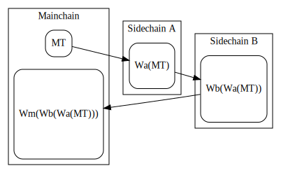
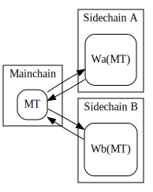
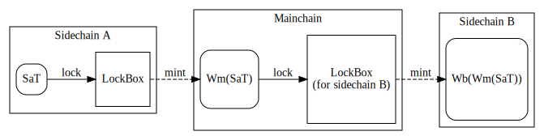
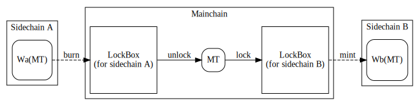
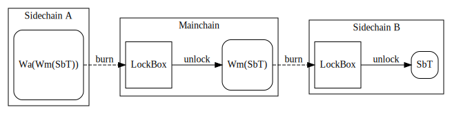
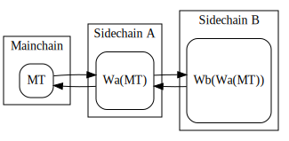
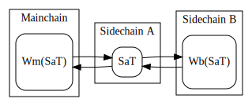
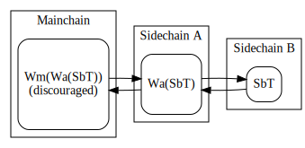

# Sidechain-to-sidechain Token Transfer

## Background

Our current implementations and specifications only cover token transfers between
mainchain and sidechain. In this document, we want to discover options to move
tokens between sidechains.

We will use abbreviations to refer to different types of tokens. Tokens owned by
Sidechain A will be depicted as `SaT`, the ones owned by Sidechain B as `SbT`
and the ones owned by Mainchain as `MT`. In case of wrapped tokens, we will use
the format of `Wx(Y)` where `x` is the abbreviation of the chain minting the
wrapped token, and `Y` is the original token (e.g. `Wm(SaT)` for a Sidechain A
token wrapped by the Mainchain). If a token is relayed through multiple chains,
we can depict it as `Wx(Wx'(Wx''(Y)))` where `x`, `x'`, and `x''` are
abbreviations of the chain minting the wrapped token.

It's important to note however that although we can see the origins of a token
with this notation, in real life we can only observe whether the token is wrapped
`Wa(...)` or not `SaT`. In order to identify a token, we must know the original
currency symbol.

## Problem statement

Sidechain-to-sidechain token transfer is not trivial, and has a lot of pitfalls.
The biggest problem to solve is the case of a circular transfer:

`mainchain -> sidechain A -> sidechain B -> mainchain`

With each transfer, the target chain mints a wrapped token, and if no special
measures are taken, by the time the token is transferred back, the origin chain
is not able to identify it, so it just wraps it again, resulting in a 'triple wrap'.



Such circular transfer could make it difficult, if not impossible, to unroll
a token to their original form.

## Proposal 1: tokens relayed through mainchain



The simplest solution is to just avoid direct sidechain to sidechain transactions
by relaying everything through the mainchain. In its simplest form this solution
does not require any additional implementation to the sidechain, bridge or
mainchain contract implementations.

In this scenario however the end-user has to manually trigger the following
steps:
- transfer tokens from sidechain A to mainchain
- claim using the Merkle proof
- mainchain -> sidechain B transfer

We can improve user experience by introducing some automation. This could be as
simple as an additional argument to the CLI claim comment, so it can issue two
transactions in succession: one for claim, and one for transfer to Sidechain B.
A more complex way could be to involve on-chain verifications, however this
would introduce an undesirable computational and complexity overhead on the
claiming transaction.

In case of a relaying mechanism, we have to consider 3 different scenarios,
depending on the token ownership.

#### Tokens owned by Sidechain A: Transfer from Sidechain A to Mainchain to Sidechain B

**Workflow:**
1. Sidechain A locks `SaT` tokens
2. Mainchain mints `Wm(SaT)` tokens
2. Mainchain locks `Wm(SaT)` tokens to LockBox connected to Sidechain B
3. Sidechain B mints `Wb(Wm(SaT))` tokens



#### Tokens owned by Mainchain: Transfer wrapped token from Sidechain A to Mainchain to Sidechain B

**Workflow:**
1. Sidechain A burns `Wa(MT)` tokens
2. Mainchain unlocks `MT` tokens
2. Mainchain locks `MT` tokens to LockBox connected to Sidechain B
3. Sidechain B mints `Wb(MT)` tokens



#### Tokens owned by Sidechain B: Transfer wrapped wrapped token from Sidechain A to Mainchain to Sidechain B

**Workflow:**
1. Sidechain A burns `Wa(Wm(SbT))` tokens
2. Mainchain unlocks `Wm(SbT)` tokens
2. Mainchain burns `Wm(SbT)` tokens
3. Sidechain B unlocks `SbT` tokens



We could implement some convenience features to the claim CLI endpoint, to
automatically issue the token transfer to Sidechain B as a second transaction
after the claim succeeds.

Considering the above 3 scenarios, we need to implement 2 different arguments:
if the original token is owned by Sidechain B, we have to burn `Wm(SbT)`.
In any other case (`MT` and `Wm(SaT)`) we have to lock the tokens to the LockBox
of Sidechain B.

**Claim with burn:**

```bash
nix run .#sidechain-main-cli -- claim \
    --combined-proof COMBINED_PROOF \
    --target-origin-sidechain
```

**Claim with lock:**

```bash
nix run .#sidechain-main-cli -- claim \
    --combined-proof COMBINED_PROOF \
    --target-other-sidechain SIDECHAIN_LOCKBOX_ADDRESS
```

Alternatively we could use a `SidechainRef` ([see SIP-08][SIP08]) to automatically
find the proper method and to find the LockBox address of the given sidechain if
locking is used.

```bash
nix run .#sidechain-main-cli -- claim \
    --combined-proof COMBINED_PROOF \
    --target-sidechain-ref SIDECHAIN_REF
```

Using a `SidechainRef` we can determine whether the given currency symbol belongs
to the target sidechain or not, by verifying whether the `ScToken` currency symbol
stored in the given sidechain's `VersionOracle` is the same as the claimed token.
If it's not a wrapped token, we can also query the addresses of `LockBox`es, and
automatically assign it as the target address.

**Pros:**
- Simplicity
- Low implementation cost
- Maintained security guarantees
- Small effect on the current implementation
- No on-chain implementation required

**Cons:**
- User interaction required
- Slow
- Not cost effective (transaction fee)
- An invalid user input could still cause a circular wrap

## Proposal 2: direct sidechain-to-sidechain swap with mainchain unrolling

An alternative design would allow direct token swaps between sidechains. A direct
sidechain to sidechain token swap could utilise direct observation or sidechain
certificates, or some other way of swapping tokens. This depends on the specific
implementation of the sidechains and out of scope of this document.

We must consider three basic scenarios:
- tokens owned by mainchain (`MT`)
- tokens owned by sidechain directly swapping (`SaT`)
- tokens owned by some other sidechain (`Wa(Y)`)

In case of a token owned by the mainchain, these **must** be unrolled (`Wa(MT)`),
such that we can use a simple claim command to swap them.



If the token is owned by the sidechain we are trading with, we can also just use
a simple claim.



In the last scenario, we end up double wrapping the original token. This should
be discouraged or forbidden as there's no way to get back to the original
`SbT` without relaying through Sidechain A.



**Pros:**
- Reduced fees for sidechain-to-sidechain transactions (no mainchain transaction
  involved)
- Potentially quicker (depending on the sidechain-to-sidechain consensus)
- No changes required for the claim endpoint

**Cons:**
- Requires some sidechain-to-sidechain consensus mechanism
- Risk of losing some security guarantees
- Hard to defend against user errors
- Could easily end up in unclaimable tokens due to impossible unroll

## Conclusions

We proposed two different strategies to implement sidechain to sidechain
transfers. Both of them are off-chain only solutions, with low impact on
security and complexity of our current solution. Also, these proposal could
be used side by side, or as a modular option.

Although both solutions have advantages, Proposal 1 provides a more robust
solution by avoiding multiple wraps. It's easy to see that multiple wrapping can
end up in difficult situations, where it's not easy to roll back to the original
form. Not to mention that all the sidechains that wrapped the original token
must be functional at the time of unwrapping.

On the other hand, some situations would greatly benefit from the more effortless
direct swap: if two sidechains cooperate with each other in a close-knit fashion,
and these sidechains frequently swap tokens, it might make sense, to build a
direct channel.

[SIP08]: ./08-CrossChainVerification.md
[SIP09]: ./09-Generalizing-Token-Transfer-From-Sidechain-to-Mainchain.md
