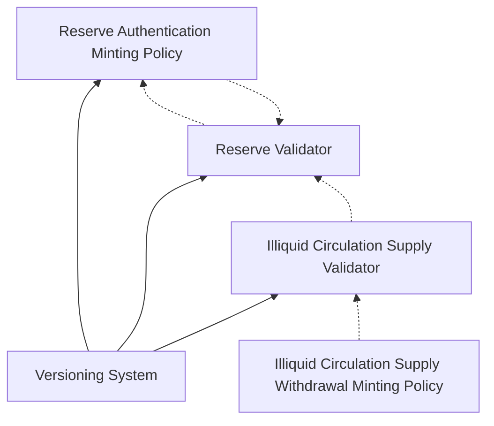

Conceptually there are two relevant entities in the feature requirements: reserve and illiquid circulation supply. Those two concepts translate directly into validators and can be described rather independently.

Following scripts will be defined by us:
- *reserve validator* that is used for reserve utxos
- *reserve authentication minting policy* used for proving that reserve utxos were correctly initialized
- *illiquid circulation supply validator* that is used for illiquid circulation supply utxos

All three scripts will be kept under the versioning system. Having then under the versioning system makes mutual dependencies possible because compile time dependencies are lifted into runtime dependencies which then can be even circular.

Two scripts will be defined by a parter chain developer:
- *illiquid circulation supply withdrawal minting policy*
- *V(t) minting policy* that provides `V(t)` function

Moreover in scope of this feature a generic governance mechanism for trusless sidechain will be implemented. The governance minting policy will be stored under versioning system and all the aforementioned scripts will access the governance currency symbol using the versioning system. It is assumed that the process of governance approval verification boils down to checking that exactly one governance token is minted in the transaction. That token can be then discarded by sending it to an arbitrary address. The design for governance is not subject of this document.

From now on *transfer* stands for *transfer from reserve to illiquid circulation supply*.

# Reserve

## Definitions and high level concepts

### V(t) function

`V(t)` function represents the totality of accrued tokens from `t_0` up until time `t` (now).

### Transfers

Transfers should be allowed only when the transferred amount is exactly equal to `V(t)` or, if reserve is too small to cover `V(t)`, the whole reserve.

`V(t)` by definition is equal to the number of `V(t)` tokens minted in the transfer transaction. `V(t)`'s currency symbol will be obtained from datum.

### Time handling and transfer throttling

Feature requirements say that tokens are to be moved from reserve to circulating supply “no earlier than” the required time. The time requirement is tricky because a script is not provided with an exact time onchain. The only time related information at our disposal is `txInfoValidRange` from `TxInfo` type. That field describes a time range in which the transaction may be accepted by the node. In principle the transaction can be created in a way that `txInfoValidRange` is sufficiently narrow for an onchain script to determine the approximate time.

Assuming that `lastTransfer` is the timestamp of last transfer and that `minTransferInterval` is the minimum time required between consecutive transfers then following check is needed: $\text{txInfoValidRange} \subseteq [\text{lastTransfer} + \text{minTransferInterval}, \infty]$. That's sufficient to ensure that transfers are throttled. As follows from the constraint the right bound of `txInfoValidRange` is not relevant. It may be relevant for more sophisticated `V(t)` implementation though.

Note on throttling. If `V(t)` was implemented in the way that it accures rewards continously with time then, without throttling, transfers could be performaned with arbitrary frequency potentially causing malicious contention.

### A transfer incentitive parameter

A transfer incentitive parameter is not described in the design since it's implementation does not seem to pose any difficulties and can easily be implemented without detailed description.

## Tokenomics

### Reserve validator

In general tokens of different kinds can be stored in the reserve. Let's assume that a single reserve utxo is allowed to store tokens of exactly one kind. That will be enforced onchain. Such design facilitates varying V(t) function per token kind. On the other hand it's allowed for multiple reserve utxos to store the same token kind. All reserve utxos will belong to the same validator.

The reserve validator will be parametrized by `VersionOracleConfig`.

The datum for reserve utxos will be of the type `Datum` which must can be inline datum:
```

data ImmutableSettings = ImmutableSettings
  { t0 :: POSIXTime
  , tokenKind :: CurrencySymbol
  }

data MutableSettings = MutableSettings
  { vFunctionTotalAccrued :: CurrencySymbol
  , minTransferInterval :: Milliseconds
  }

data Stats = Stats
  { tokenTotalAmountTransferred :: Integer
  , lastTransfer :: POSIXTime
  }

data Datum =
    Bootstraping
     { immutableSettings :: ImmutableSettings
     , mutableSettings :: MutableSettings
     , stats :: Stats
     }
```

The reserve utxos represent a reserve in bootstraping phase. When handover operation is applied a reserve utxo is consumed but it's not recreated. In other words: handover operation executed on a reserve utxo performs transfer of remaining funds and destroys that utxo.

Description of reserve state in `Bootstraping` phase follows:
- `ImmutableSettings` represents settings that cannot be changed during reserve lifetime:
	- `t0` is a posix timestamp of the moment the reserve is launched
	- `tokenKind` is the currency symbol of tokens that a reserve is allowed to store
- `MutableSettings` represents settings that can be changed using governance referred by`VersionOracleConfig`
	- `vFunctionTotalAccrued` is a currency symbol of tokens minted in a transfer transaction. The number of tokens minted is equal to the totality of `tokenKind` tokens accrued from `t_0` till now. In other words the number of `vFunctionTotalAccrued` tokens minted in a transfer transaction is equal to `V(t)` 
	- `minTransferInterval` is the minimum time required between two consecutive transfers
- `Stats` provides data that is supposed to by used by `V(t)` computation
	- `tokenTotalAmountTransferred` is the total amount of tokens that has been transferred from `t0` to now
	- `lastTransfer` is a approximate timestamp of the most recent transfer

The redeemer for reserve utxos will be of the type `Redeemer`:
```
data Redeemer =
    Deposit
  | TransferToIlliquidCirculationSupply
  | Update
  | Handover
```
---
We say that a reserve utxo in a transaction is *propagated* if following conditions are met:
- a single utxo at the reserve validator address is consumed
- that utxo carries the reserve authentication token
- a single utxo at the reserve validator address is produced
- that utxo carries the reserve authentication token
---
Following checks are performed on reserve utxos consumed with `Deposit` redeemer:
- governance token is minted
- no other tokens are minted or burnt
- reserve utxo is propagated
- datum does not change
- propagated assets can change only by a positive amount of `tokenKind`
---
Following checks are performed on reserve utxos consumed with `TransferToIlliquidCirculationSupply` redeemer:
- reserve utxo is propagated
- `V(t) := vFunctionTotalAccrued` tokens are minted (must be positive)
- no other tokens are minted or burnt
- $\text{txInfoValidRange} \subseteq [\text{lastTransfer} + \text{minTransferInterval}, \infty]$ where `lastTransfer` is taken from input datum
- `txInfoValidRange` is narrow
- propagated assets can change only by a negative amount of `tokenKind` that must be equal to `tokenTotalAmountTransferred - V(t)` 
- propagated datum must change only by `Stats` in the following way:
	- `tokenTotalAmountTransferred = V(t)`
	- $\text{lastTransfer} \in \text{txInfoValidRange}$
- output utxos that contains `tokenKind` tokens must be on illiquid circulation supply validator's address (besides propagated utxo)
---
Following checks are performed on reserve utxos consumed with `Update` redeemer:
- governance token is minted
- no other tokens are minted or burnt
- reserve utxo is propagated
- datum can change only by `MutableSettings`
- propagated assets do not change
---
Following checks are performed on reserve utxos consumed with `Handover` redeemer:
- governance token is minted
- reserve utxo is propagated
- datum must be set to `Steady`
- all `tokenKind` tokens must be sent to outputs on illiquid circulation supply validator's address
---

### Reserve authentication token

This token will be carried around by reserve utxos and provides a proof that a reserve utxo has been initialized in a correct way.

Reserve authentication minting policy will be parametrized by `VersionOracleConfig`. 

Reserve authentication token minting policy will extract following data from the versioning system:
- address of reserve validator
- currency symbol of governance minting policy

Following checks are performed in the reserve authentication token minting policy:
- exactly one governance token is minted
- exactly one reserve authentication token is minted
- that token is placed on a utxo that is on the address of reserve validator
- additionally that utxo carries ADA and tokens of `tokenKind` kind only
- that utxo carries datum of type `Datum` and
- that datum satisfies
	- `minTransferInterval > 0`
	- `lastTransfer = t0 - minTransferInterval`
	- 	`tokenTotalAmountTransferred == 0`
	- `tokenKind` and `vFunctionTotalAccrued` are valid currency symbols
	- optionally some relation of `t0`  and `txInfoValidRange` may be examined

# Illiquid circulation supply

Illiquid circulation supply validator will be parametrized by `VersionOracleConfig`.

Illiquid circulation supply will consist of possibly many utxos and those utxos won't be protected by any authentication token. That means that anyone will be allowed to deposit any tokens to illiquid circulation supply. In a context of observability it's the partner chain's responsibility to lookup all illiquid circulation supply utxos, total their assets and filter only relevant tokens.

## Tokenomics

### Illiquid circulation supply validator

The datum will be of type `()`.

The redeemer will be of type:
`data Redeemer =
    DepositMoreToExistingUtxo
  | Withdraw`
  
Following checks are performed on reserve utxos consumed with `DepositMoreToExistingUtxo` redeemer:
- only one input utxo at own address is consumed and carries `()` datum
- only one output utxo at own address is produced and carries `()` datum
- assets of the propagated utxo increase

`DepositMoreToExistingUtxo` is used to deposit more assets to an existing utxos. That are no restrictions on who can do it and what can be deposited.

Following checks are performed on reserve utxos consumed with `Withdraw` redeemer:
- exactly one *illiquid circulation supply withdrawal minting policy* token is minted

That effectively delegates validation of `Withdraw` transaction to an external script that is provided by a partner chain developer in versioning system.

# Script compile time and runtime dependency diagram

Dotted lines denote runtime dependencies - access through versioning system.
Solid lines denote compile time dependencies - parametrization of script by currency symbol of another.

For the sake of clarity runtime dependencies of versioning system on the all remaning scripts is not presented. In fact all the script being subject of this design are tracked by the versioning system.



