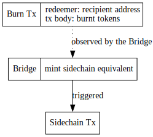
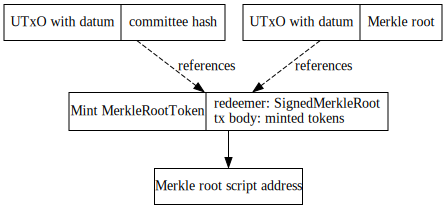
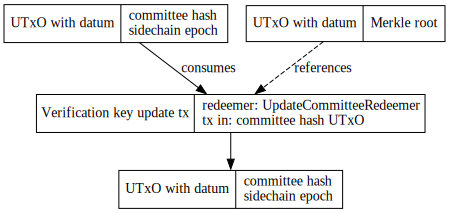
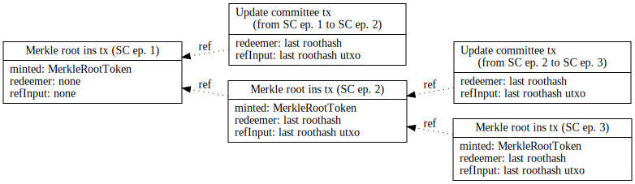
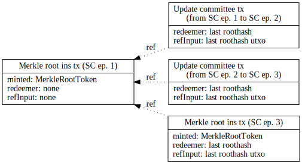
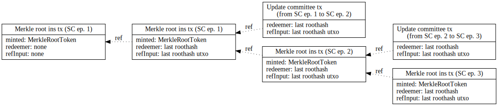

# Trustless sidechain - main chain contract specification

This specification details the main chain contract of a trustless sidechain system. The work relies on the BLS ATMS signature scheme, but this might not be available in time for Cardano, so we decided to implement the contract in two phases:

- [phase 1](https://github.com/mlabs-haskell/trustless-sidechain/milestone/1): MVP using append only signature scheme
- [phase 1.5](https://github.com/mlabs-haskell/trustless-sidechain/milestone/3): script optimisations and security improvements
- [phase 2](https://github.com/mlabs-haskell/trustless-sidechain/milestone/2): using ATMS signature scheme

Mainchain utilizes the following components to handle interactions with a sidechain:

- `FUELMintingPolicy`: minting policy validating the mint or burn of FUEL tokens on mainchain ([2.](#2-transfer-fuel-tokens-from-mainchain-to-sidechain), [3.2.](#32-individual-claiming))
- `MerkleRootTokenMintingPolicy`: minting policy for storing cross-chain transaction bundles' Merkle roots ([3.1.](#31-merkle-root-insertion))
- `CommitteeCandidateValidator`: script address for committee candidates ([4.](#4-register-committee-candidate), [5.](#5-deregister-committee-membercandidate))
- `MerkleRootTokenValidator`: script address for storing `MerkleRootToken`s ([3.1.](#31-merkle-root-insertion))
- `CommitteeHashValidator`: script address for the committee members' hash ([1.](#1-initialise-contract), [6.](#6-committee-handover))
- `CommitteeHashPolicy`: oneshot token pointing to the current valid committee hash ([6.1](#61-update-committee-hash))
- `DsConfValidator`: validator holding the distributed set configuration ([Distributed Set](./DistributedSet.md))
- `DsConfPolicy`: oneshot token identifying the UTxO holding the distributed set configuration ([Distributed Set](./DistributedSet.md))
- `DsInsertValidator`: validator handling distributed set entry ([Distributed Set](./DistributedSet.md)
- `DsKeyPolicy`: tokens identifying the distributed set entries ([Distributed Set](./DistributedSet.md))

All of these policies/validators are parameterised by the sidechain parameters, so we can get unique minting policy and validator script hashes.

```haskell
data SidechainParams = SidechainParams
  { chainId :: Integer
  , genesisHash :: GenesisHash
    -- ^ 'GenesisHash' is a type alias for ByteString
  , genesisUtxo :: TxOutRef
    -- ^ 'genesisUtxo' is an arbitrary 'TxOutRef' used to identify internal
    -- 'AssetClass's (e.g. see [6.](#6-update-committee-hash)) of the
    -- sidechain
  , thresholdNumerator :: Integer
    -- ^ 'thresholdNumerator' is the numerator for the ratio of the committee
    -- needed to sign off committee handovers / merkle roots
  , thresholdDenominator :: Integer
    -- ^ 'thresholdDenominator' is the denominator for the ratio of the
    -- committee needed to sign off committee handovers / merkle roots
  }
```

### 1. Initialise contract

For initialisation, we use an NFT (consuming some arbitrary utxo) to uniquely identify the current committee members by storing the hash of the concatenated public keys on chain (see [6.1](#61-update-committee-hash)). This committee is used to verify signatures for sidechain to mainchain transfers (see [3.1](#31-merkle-root-insertion)).

**Workflow:**

1. Call the initialize sidechain endpoint to generate the `SidechainParams` for a new
   sidechain.
2. Use the given sidechain parameters for the rest of the endpoints to work
   with _this_ particular sidechain.

**Endpoint params:**

```haskell
data InitSidechainParams = InitSidechainParams
  { initChainId :: Integer
  , initGenesisHash :: GenesisHash
    -- ^ 'GenesisHash' is a type alias for ByteString
  , initUtxo :: TxOutRef
    -- ^ 'initUtxo' is used for creating the committee NFT
  , initCommittee :: [PubKey]
    -- ^ 'initCommittee' is the initial committee of the sidechain
  , initSidechainEpoch :: Integer
    -- ^ 'initSidechainEpoch' is the initial sidechain epoch of the sidechain
  , thresholdNumerator :: Integer
    -- ^ 'thresholdNumerator' is the numerator for the ratio of the committee
    -- needed to sign off committee handovers / merkle roots
  , thresholdDenominator :: Integer
    -- ^ 'thresholdDenominator' is the denominator for the ratio of the
    -- committee needed to sign off committee handovers / merkle roots
  }
```

### 2. Transfer FUEL tokens from mainchain to sidechain

FUEL tokens on the Cardano network represent locked native assets on the sidechain network. When a certain amount of tokens are locked on a certain sidechain contract, we can mint the equivalent amount on Cardano ([2.](#2-transfer-fuel-tokens-from-mainchain-to-sidechain), [3.2.](#32-individual-claiming)). Conversely burning these tokens on the Cardano network ([3.](#3-transfer-fuel-tokens-from-sidechain-to-mainchain)) will release these tokens and send them to the owner. For more details, refer to the [High level technical specifications](https://docs.google.com/d-ocument/d/1UJs4ews1wnKIv4RMyPjFtJcyniyRHi7GmU2JPdUfbQk).

**Workflow:**

1. Call the burn endpoint of the contract with BurnParams
2. A transaction will be submitted to mainchain burning the specified amount of FUEL tokens and the corresponding sidechain address in the redeemer
3. The Bridge component observing the mainchain where the given minting policy is handled, verifies the transaction and creates an appropriate sidechain transaction

**Endpoint params:**

```haskell
data BurnParams = BurnParams
  { recipient :: SidechainAddress
    -- ^ 'SidechainAddress' is a type alias for a ByteString (e.g. 0x112233aabbcc)
  , amount :: Integer
  }
```



<figcaption align = "center"><i>Mainchain to Sidechain transaction (burning FUEL tokens)</i></figcaption><br />

### 3. Transfer FUEL tokens from sidechain to mainchain

**Workflow:**

1. Sidechain collects unhandled transactions and bundles them at the end of each sidechain epoch
2. Sidechain block producers compute `txs = outgoing_txs.map(tx => blake2b(cbor(MerkleTreeEntry(tx)))` for each transaction (see `MerkleTreeEntry`), and create a Merkle-tree from these. The root of this tree is signed by at least `t` (multisig threshold) of the committee members with an appended signature scheme
3. Bridge broadcasts Merkle root to chain
4. Txs can be claimed [individually](#32-individual-claiming)

#### 3.1. Merkle root insertion

**Endpoint params for merkle root insertion:**

```haskell
data SaveRootParams = SaveRootParams
  { sidechainParams :: SidechainParams
    -- ^ Parameters identifying the Sidechain
  , merkleRoot :: ByteString
  , previousMerkleRoot :: Maybe ByteString
    -- ^ Chaining the Merkle roots to ensure ordering. The first root will have Nothing here.
  , committeeSignatures :: [(SidechainPubKey, Maybe ByteString)]
    -- ^ Public keys of all committee members with their corresponding signatures if there's one
  }
```

Merkle roots are stored on-chain, using `MerkleRootToken`s, where the `tokenName` is the Merkle root. These tokens must be at the `MerkleRootTokenValidator` script address.

**Redeemer:**

```haskell
data SignedMerkleRoot = SignedMerkleRoot
  { merkleRoot :: ByteString
  , previousMerkleRoot :: Maybe ByteString -- Last Merkle root hash
  , signatures :: [ByteString] -- Current committee signatures ordered as their corresponding keys
  , beneficiary :: SidechainAddress
  , committeePubKeys :: [SidechainPubKey] -- Lexicographically sorted public keys of all committee members
  }
```

Minting policy verifies the following:

- verifies that hash of committeePublicKeys matches the hash saved on chain
- verifies that all the provided signatures are valid
- verifies that size(signatures) > 2/3 \* size(committeePubKeys)
- list of public keys does not contain duplicates
- if `previousMerkleRoot` is specified, the UTxO with the given roothash is referenced in the transaction as a reference input

Validator script verifies the following:

- UTxOs containing an `MerkleRootToken` cannot be unlocked from the script address



<figcaption align = "center"><i>Merkle root token minting</i></figcaption><br />

The merkle tree has to be constructed in the exact same way as it is done by the following [merkle tree implementation](https://github.com/mlabs-haskell/trustless-sidechain/blob/master/src/TrustlessSidechain/MerkleTree.hs). Entries in the tree should be calculated as follow:

```haskell
data MerkleTreeEntry = MerkleTreeEntry
  { index :: Integer -- 32 bit unsigned integer, used to provide uniqueness among transactions within the tree
  , amount :: Integer -- 256 bit unsigned integer that represents amount of tokens being sent out of the bridge
  , recipient :: ByteString -- arbitrary length bytestring that represents decoded bech32 cardano address
  , previousMerkleRoot :: Maybe ByteString -- previousMerkleRoot is added to make sure that the hashed entry is unique
  }
```

```
entry = blake2b(cbor(MerkleTreeEntry))
```

Signatures for merkle tree should be constructed as follow:

```haskell
data MerkleRootInsertionMessage = MerkleRootInsertionMessage
  { sidechainParams :: SidechainParams
    -- ^ Parameters identifying the Sidechain
  , merkleRoot :: ByteString
  , previousMerkleRoot :: Maybe ByteString
  }
```

```
signature = ecdsa.sign(data: blake2b(cbor(MerkleRootInsertionMessage)), key: committeeMemberPrvKey)
```

#### 3.2. Individual claiming

**Endpoint params for claiming:**

```haskell
data MintParams = MintParams
  { amount :: Integer
  , recipient :: ByteString
  , merkleProof :: MerkleProof
  , index :: Integer
  , previousMerkleRoot:: Maybe ByteString
  }
```

Minting policy verifies the following:

- `MerkleRootToken` with the name of the Merkle root of the transaction (calculated from from the proof) can be found in the `MerkleRootTokenValidator` script address
- recipient, amount, index and previousMerkleRoot combined with merkleProof match against merkleRootHash
- `claimTransactionHash` of the transaction is NOT included in the distributed set (more details about the distributed set can be found [here](./DistributedSet.md))
- a new entry with the `claimTransactionHash` of the transaction is created in the distributed set
- the transaction is signed by the recipient
- the amount matches the actual tx body contents

where the `claimTransactionHash` is a `blake2(cbor(MerkleTreeEntry))`, uniquely identifying a cross chain transaction by pointing to a Merkle tree and the index of the transaction in the tree


<figcaption align = "center"><i>Sidechain to Mainchain transaction (claiming tokens)</i></figcaption><br />

**Minting policy redeemer:**

```haskell
data FUELRedeemer
  = MainToSide ByteString ByteString
  -- ^ Recipient address on the sidechain and the signature of its owner (see 2.)
  | SideToMain MerkleTreeEntry MerkleProof
```

### 4. Register committee candidate

**Workflow:**

1. An SPO registering as a block producer (commitee member) for the sidechain sends BlockProducerRegistration and its signature (where the signed message contains the sidechain parameters, sidechain public key and the input utxo in CBOR format)
2. The Bridge monitoring the committee candidate script address is validating the SPO credentials, chainId, and the consumed inputUtxo

**Datum:**

```haskell
data BlockProducerRegistration = BlockProducerRegistration
  { bprSpoPubKey :: PubKey -- own public key
  , bprInputUtxo :: TxOutRef -- a utxo that must be spent with the transaction
  , bprSidechainPubKey :: ByteString -- public key in the sidechain's desired format
  , bprSpoSignature :: Signature -- Signature of the SPO private key
  , bprSidechainSignature :: ByteString -- Signature of the sidechain private key
  , bprOwnPkh :: PubKeyHash -- payment public key hash of the wallet owner (who is allowed to deregister)
  }
```

### 5. Deregister committee member/candidate

**Workflow:**

1. The UTxO with the registration information can be redeemed by the original sender (doesn't have to check the inputUtxo)
2. The Bridge monitoring the committee candidate script address interprets this as a deregister action

### 6. Committee handover

In the current implementation of the sidechain, a [Merkle root insertion (3.1)](#31-merkle-root-insertion) can only occur once per sidechain epoch at the time of the committee handover. We expose an endpoint which can handle this action, however the underlying implementation is detached, so in theory, we could do Merkle root insertion and Committee Hash Update actions independently.

We have to be careful about the order of these actions. If the transaction inserting the merkle root for sidechain epoch 1 gets submitted _after_ the committee handover from `committee of epoch 1` to `committee of epoch 2` transaction, the signature would become invalid, since it is signed by the `committee of epoch 1`. To mitigate this issue, we introduce `merkle root chain`, for details see: [6.2](#62-merkle-root-chaining)

#### 6.1 Update committee hash

1. Bridge component triggers the Cardano transaction. This tx does the following:

**Endpoint params:**

```haskell
data UpdateCommitteeHashParams = UpdateCommitteeHashParams
  { newCommitteePubKeys :: [SidechainPubKey]
    -- ^ The public keys of the new committee.
  , committeeSignatures :: [(SidechainPubKey, Maybe ByteString)]
    -- ^ Public keys of all committee members with their corresponding signatures if there's one
  , sidechainParams :: SidechainParams
    -- ^ Parameters identifying the Sidechain
  , previousMerkleRoot :: Maybe ByteString
    -- ^ last merkle root inserted on chain, unless there is no Merkle root inserted yet
  , sidechainEpoch :: Integer
    -- ^ sidechain epoch of the new committee
  }
```

Validator script verifies the following:

- verifies that hash of committeePublicKeys matches the hash saved on chain
- verifies that all the provided signatures are valid
- verifies that size(signatures) > 2/3 \* size(committeePubKeys)
- verifies the oneshot token `CommitteeHashPolicy` of the UTxO holding the old verification key at the script address
- consumes the above mentioned UTxO
- verifies that (sidechain epoch of the new committee hash > sidechain epoch of the consumed committee hash utxo)
- outputs a new UTxO with the updated committee hash containing the oneshot token `CommitteeHashPolicy` to the same script address
- reference to the last Merkle root is referenced in the transaction

**Datum:**

```haskell
data UpdateCommitteeHash = UpdateCommitteeHash
  { committeePubKeysHash :: ByteString
    -- ^ Hash of all lexicographically sorted public keys of the current committee members
  , sidechainEpoch :: Integer
    -- ^ sidechain epoch of the committee
  }
```

```
committeePubKeys = sort([key1, key2, ..., keyN])
committeePubKeysHash = blake2b(concat(committeePubKeys))
keyN - 33 bytes compressed ecdsa public key of a committee member
```



<figcaption align = "center"><i>Committee handover (updating committee hash)</i></figcaption><br />

**Redeemer:**

```haskell
data UpdateCommitteeRedeemer = UpdateCommitteeRedeemer
  { signatures :: [ByteString]
  , newCommitteePubKeys :: [SidechainPubKey]
  , committeePubKeys :: [SidechainPubKey]
  , previousMerkleRoot :: Maybe ByteString
    -- ^ last merkle root inserted on chain, unless there is no Merkle root inserted yet
  }
```

Signatures are constructed as follow:

```
SidechainPubKey - 33 bytes compressed ecdsa public key
```

```haskell
data UpdateCommitteeMessage = UpdateCommitteeMessage
  { sidechainParams :: SidechainParams
  , newCommitteePubKeys :: [SidechainPubKey] -- sorted lexicographically
  , previousMerkleRoot :: Maybe ByteString
    -- ^ last Merkle root inserted on chain (Merkle root for the last sidechain epoch)
  , sidechainEpoch :: Integer
    -- ^ sidechain epoch of the newly registered committee
  }
```

```
signature = ecdsa.sign(data: blake2b(cbor(UpdateCommitteeMessage)), key: committeeMemberPrvKey)
```

#### 6.2. Merkle root chaining

As described in [6. Committee handover](#6-committee-handover), we have to maintain the correct order of Merkle root insertions and committee hash updates. We introduce a new Merkle root chain, where each Merkle root has a reference to its predecessor (if one exists), furthermore all committee hash updates reference the last Merkle root inserted (if one exists).



<figcaption align = "center"><i>Merkle root chaining (SC ep = sidechain epoch)</i></figcaption><br />

As seen in the graph above, the first Merkle root has no reference, which is completely valid. We do not enforce the existence of the last Merkle root.

In case a sidechain epoch passed without any cross-chain transactions, no Merkle root is inserted, resulting in two committee hash updates referencing the same Merkle root.



<figcaption align = "center"><i>Merkle root chaining - epoch without Merkle root (SC ep = sidechain epoch)</i></figcaption><br />

In the future, we want to support multiple Merkle roots per sidechain epoch, so the result could look like the following:



<figcaption align = "center"><i>Merkle root chaining - multiple Merkle roots per epoch (SC ep = sidechain epoch)</i></figcaption><br />
